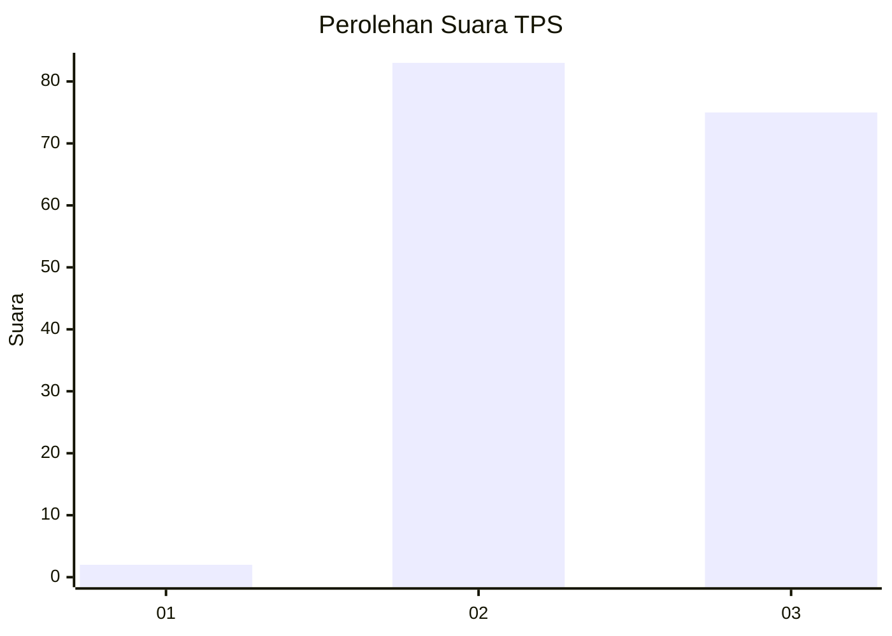
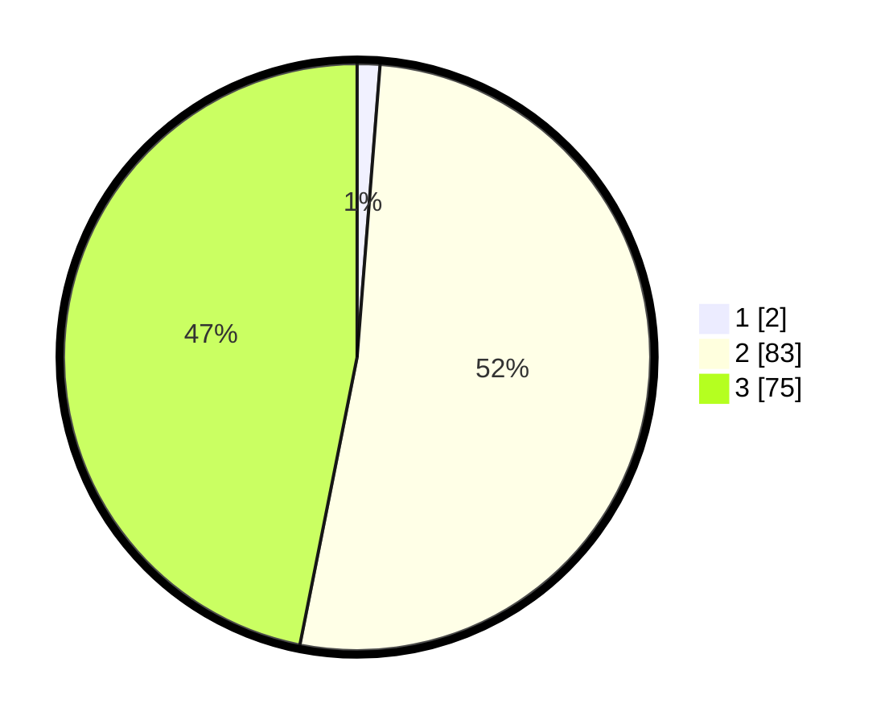

# Hasil

## Grafik

## Tabel

| No. | Nama Paslon    | Suara | Suara (raw) | Persentase |
|:--- |:-------------- | -----:| -----------:| ----------:|
| 1   | ANIES MUHAIMIN | 2     | [2][p-1]    | 1,25       |
| 2   | PRABOWO GIBRAN | 83    | [83][p-2]   | 51,88      |
| 3   | GANJAR MAHFUD  | 75    | [75][p-3]   | 46,88      |

[p-1]: https://github.com/gigit-pemilu/pemilu-2024-51-bali/blob/main/pilpres/hitung-suara/sub/51-bali/sub/08-buleleng/sub/07-sawan/sub/2005-sudaji/sub/021-tps/sub/paslon-1.txt
[p-2]: https://github.com/gigit-pemilu/pemilu-2024-51-bali/blob/main/pilpres/hitung-suara/sub/51-bali/sub/08-buleleng/sub/07-sawan/sub/2005-sudaji/sub/021-tps/sub/paslon-2.txt
[p-3]: https://github.com/gigit-pemilu/pemilu-2024-51-bali/blob/main/pilpres/hitung-suara/sub/51-bali/sub/08-buleleng/sub/07-sawan/sub/2005-sudaji/sub/021-tps/sub/paslon-3.txt

## Foto C Plano

https://sirekap-obj-formc.kpu.go.id/288d/pemilu/ppwp/51/08/07/20/05/5108072005021-20240214-221000--a05ffca0-d261-4b54-bc82-fa8fce3e56c5.jpg

https://sirekap-obj-formc.kpu.go.id/288d/pemilu/ppwp/51/08/07/20/05/5108072005021-20240214-221055--0e3f9a7b-c030-4c95-a1f3-9a2ccb5dbd17.jpg

https://sirekap-obj-formc.kpu.go.id/288d/pemilu/ppwp/51/08/07/20/05/5108072005021-20240214-221117--4ebfc26a-509a-4943-90c6-08e5deef0820.jpg

## Metadata

| Key        | Value               |
| ---------- | ------------------- |
| Time Stamp | 2024-02-24 22:31:28 |

