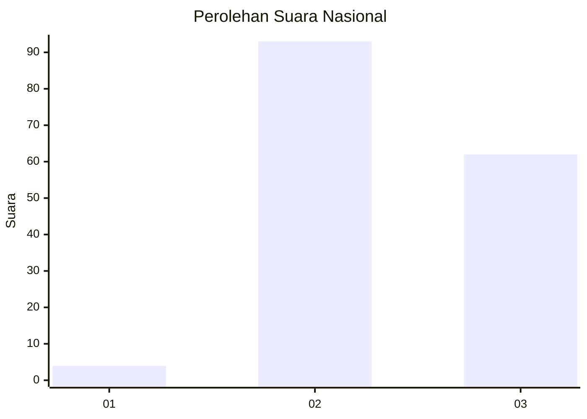
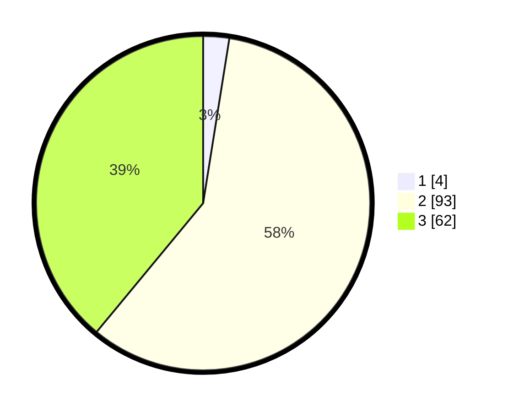

# Hasil

## Grafik

## Tabel

| No. | Nama Paslon    | Suara | Suara (raw) | Persentase |
|:--- |:-------------- | -----:| -----------:| ----------:|
| 1   | ANIES MUHAIMIN | 4     | [4][p-1]    | 2,52       |
| 2   | PRABOWO GIBRAN | 93    | [93][p-2]   | 58,49      |
| 3   | GANJAR MAHFUD  | 62    | [62][p-3]   | 38,99      |

[p-1]: https://github.com/gigit-pemilu/pemilu-2024/blob/main/pilpres/hitung-suara/sub/51-bali/sub/08-buleleng/sub/07-sawan/sub/2005-sudaji/sub/023-tps/sub/paslon-1.txt
[p-2]: https://github.com/gigit-pemilu/pemilu-2024/blob/main/pilpres/hitung-suara/sub/51-bali/sub/08-buleleng/sub/07-sawan/sub/2005-sudaji/sub/023-tps/sub/paslon-2.txt
[p-3]: https://github.com/gigit-pemilu/pemilu-2024/blob/main/pilpres/hitung-suara/sub/51-bali/sub/08-buleleng/sub/07-sawan/sub/2005-sudaji/sub/023-tps/sub/paslon-3.txt

## Foto C Plano

https://sirekap-obj-formc.kpu.go.id/09eb/pemilu/ppwp/51/08/07/20/05/5108072005023-20240214-235525--d9dee7cb-b3a3-4799-a2e6-f2fade475898.jpg

https://sirekap-obj-formc.kpu.go.id/09eb/pemilu/ppwp/51/08/07/20/05/5108072005023-20240214-232037--53528d13-feb5-4ba4-a54d-d0d577d03e24.jpg

https://sirekap-obj-formc.kpu.go.id/09eb/pemilu/ppwp/51/08/07/20/05/5108072005023-20240214-235952--93b2eeee-5a5a-44a6-bd9b-30ec5907f3b2.jpg

## Metadata

| Key        | Value               |
| ---------- | ------------------- |
| Time Stamp | 2024-02-25 13:00:00 |

