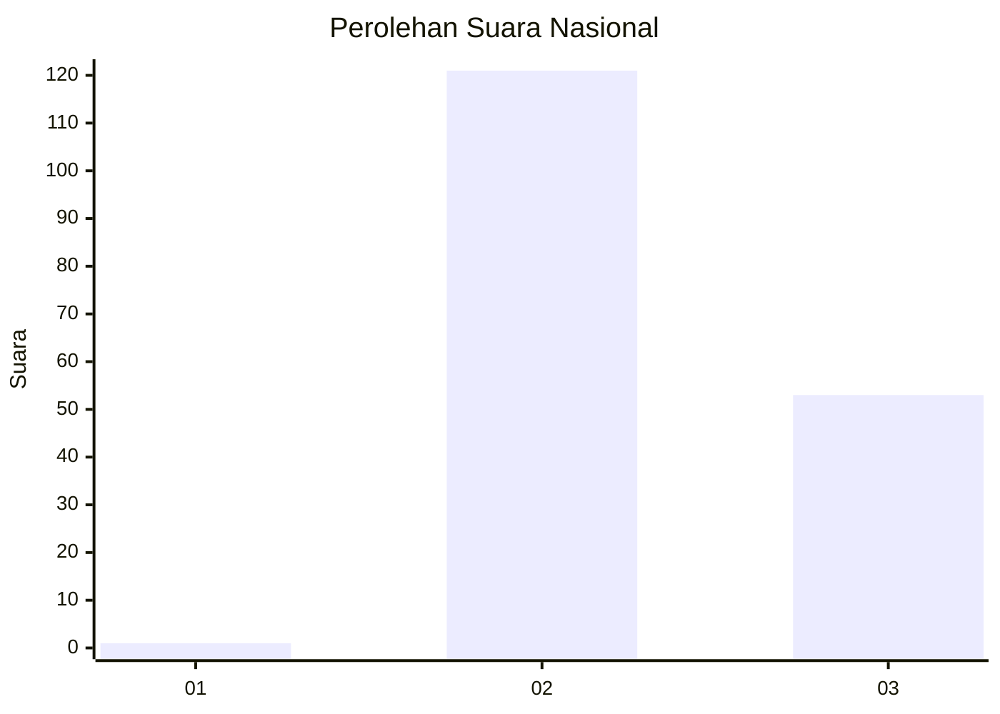
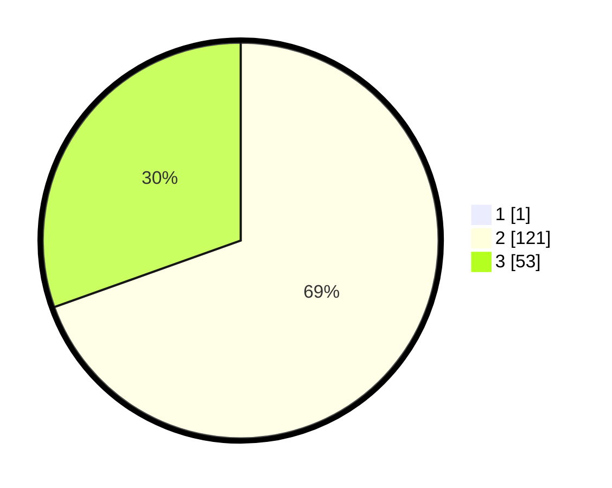

# Hasil

## Grafik

## Tabel

| No. | Nama Paslon    | Suara | Suara (raw) | Persentase |
|:--- |:-------------- | -----:| -----------:| ----------:|
| 1   | ANIES MUHAIMIN | 1     | [1][p-1]    | 0,57       |
| 2   | PRABOWO GIBRAN | 121   | [121][p-2]  | 69,14      |
| 3   | GANJAR MAHFUD  | 53    | [53][p-3]   | 30,29      |

[p-1]: https://github.com/gigit-pemilu/pemilu-2024/blob/main/pilpres/hitung-suara/sub/51-bali/sub/08-buleleng/sub/07-sawan/sub/2005-sudaji/sub/024-tps/sub/paslon-1.txt
[p-2]: https://github.com/gigit-pemilu/pemilu-2024/blob/main/pilpres/hitung-suara/sub/51-bali/sub/08-buleleng/sub/07-sawan/sub/2005-sudaji/sub/024-tps/sub/paslon-2.txt
[p-3]: https://github.com/gigit-pemilu/pemilu-2024/blob/main/pilpres/hitung-suara/sub/51-bali/sub/08-buleleng/sub/07-sawan/sub/2005-sudaji/sub/024-tps/sub/paslon-3.txt

## Foto C Plano

https://sirekap-obj-formc.kpu.go.id/37fd/pemilu/ppwp/51/08/07/20/05/5108072005024-20240214-231919--139eb9fa-0022-4f82-a72c-6b08d1bbec9f.jpg

https://sirekap-obj-formc.kpu.go.id/37fd/pemilu/ppwp/51/08/07/20/05/5108072005024-20240214-232155--30cd526f-85b4-4b84-8325-9a660b819183.jpg

https://sirekap-obj-formc.kpu.go.id/37fd/pemilu/ppwp/51/08/07/20/05/5108072005024-20240214-232316--e1b367a5-cccb-4fb8-86a1-1907c363dff6.jpg

## Metadata

| Key        | Value               |
| ---------- | ------------------- |
| Time Stamp | 2024-02-24 22:31:28 |

