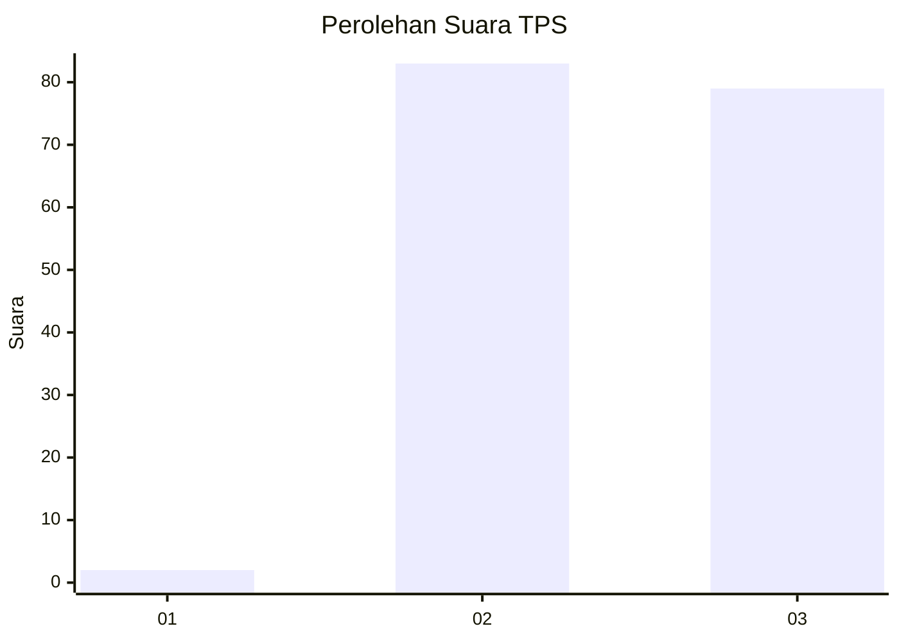
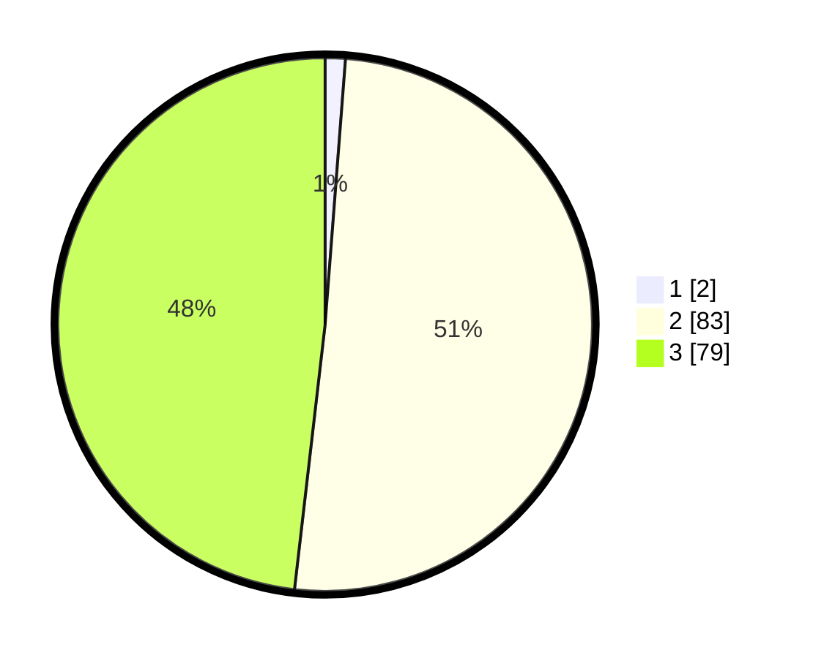

# Hasil

## Grafik

## Tabel

| No. | Nama Paslon    | Suara | Suara (raw) | Persentase |
|:--- |:-------------- | -----:| -----------:| ----------:|
| 1   | ANIES MUHAIMIN | 2     | [2][p-1]    | 1,22       |
| 2   | PRABOWO GIBRAN | 83    | [83][p-2]   | 50,61      |
| 3   | GANJAR MAHFUD  | 79    | [79][p-3]   | 48,17      |

[p-1]: https://github.com/gigit-pemilu/pemilu-2024-51-bali/blob/main/pilpres/hitung-suara/sub/51-bali/sub/08-buleleng/sub/07-sawan/sub/2005-sudaji/sub/026-tps/sub/paslon-1.txt
[p-2]: https://github.com/gigit-pemilu/pemilu-2024-51-bali/blob/main/pilpres/hitung-suara/sub/51-bali/sub/08-buleleng/sub/07-sawan/sub/2005-sudaji/sub/026-tps/sub/paslon-2.txt
[p-3]: https://github.com/gigit-pemilu/pemilu-2024-51-bali/blob/main/pilpres/hitung-suara/sub/51-bali/sub/08-buleleng/sub/07-sawan/sub/2005-sudaji/sub/026-tps/sub/paslon-3.txt

## Foto C Plano

https://sirekap-obj-formc.kpu.go.id/c684/pemilu/ppwp/51/08/07/20/05/5108072005026-20240215-000712--2b3e4732-a8a1-480e-ba76-41801a3306e2.jpg

https://sirekap-obj-formc.kpu.go.id/c684/pemilu/ppwp/51/08/07/20/05/5108072005026-20240215-000735--14b04b91-8316-4f91-a6b5-df32d52aa37e.jpg

https://sirekap-obj-formc.kpu.go.id/c684/pemilu/ppwp/51/08/07/20/05/5108072005026-20240215-000812--6a296d23-027a-480d-b7e5-175def12d513.jpg

## Metadata

| Key        | Value               |
| ---------- | ------------------- |
| Time Stamp | 2024-02-15 15:00:29 |

