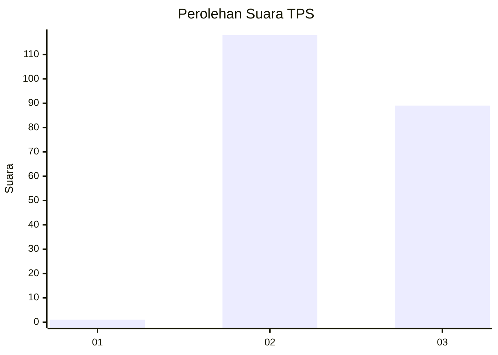
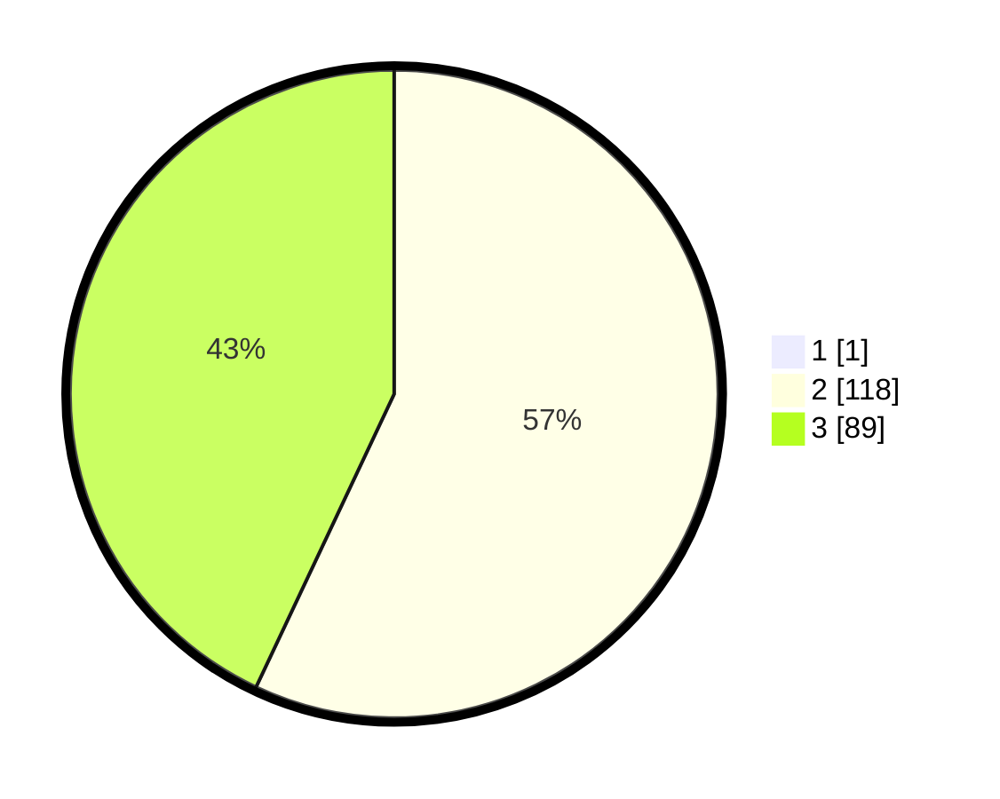

# Hasil

## Grafik

## Tabel

| No. | Nama Paslon    | Suara | Suara (raw) | Persentase |
|:--- |:-------------- | -----:| -----------:| ----------:|
| 1   | ANIES MUHAIMIN | 1     | [1][p-1]    | 0,48       |
| 2   | PRABOWO GIBRAN | 118   | [118][p-2]  | 56,73      |
| 3   | GANJAR MAHFUD  | 89    | [89][p-3]   | 42,79      |

[p-1]: https://github.com/gigit-pemilu/pemilu-2024-51-bali/blob/main/pilpres/hitung-suara/sub/51-bali/sub/08-buleleng/sub/07-sawan/sub/2006-sawan/sub/001-tps/sub/paslon-1.txt
[p-2]: https://github.com/gigit-pemilu/pemilu-2024-51-bali/blob/main/pilpres/hitung-suara/sub/51-bali/sub/08-buleleng/sub/07-sawan/sub/2006-sawan/sub/001-tps/sub/paslon-2.txt
[p-3]: https://github.com/gigit-pemilu/pemilu-2024-51-bali/blob/main/pilpres/hitung-suara/sub/51-bali/sub/08-buleleng/sub/07-sawan/sub/2006-sawan/sub/001-tps/sub/paslon-3.txt

## Foto C Plano

https://sirekap-obj-formc.kpu.go.id/d829/pemilu/ppwp/51/08/07/20/06/5108072006001-20240215-005542--8d4b8fb5-e06f-4d69-87f2-420a0d0ff1b7.jpg

https://sirekap-obj-formc.kpu.go.id/d829/pemilu/ppwp/51/08/07/20/06/5108072006001-20240215-010159--157022c8-6716-4cbb-a4a9-1fe625a85f69.jpg

https://sirekap-obj-formc.kpu.go.id/d829/pemilu/ppwp/51/08/07/20/06/5108072006001-20240215-010612--09408a88-fa24-4da9-b022-06708477e7b6.jpg

## Metadata

| Key        | Value               |
| ---------- | ------------------- |
| Time Stamp | 2024-02-25 13:00:00 |

