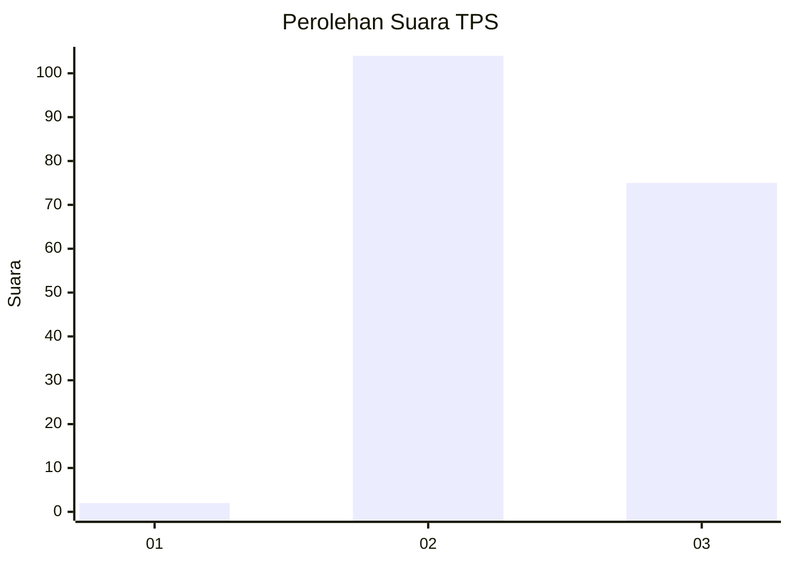
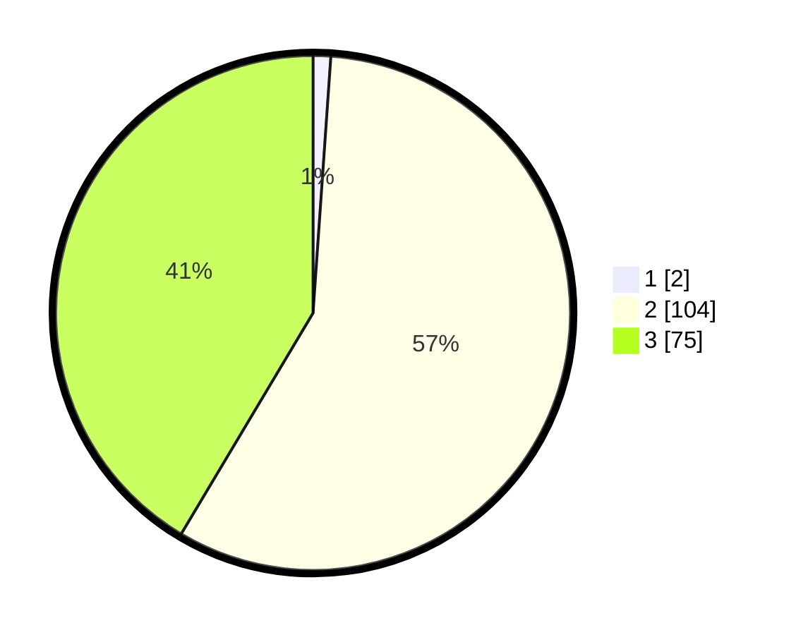

# Hasil

## Grafik

## Tabel

| No. | Nama Paslon    | Suara | Suara (raw) | Persentase |
|:--- |:-------------- | -----:| -----------:| ----------:|
| 1   | ANIES MUHAIMIN | 2     | [2][p-1]    | 1,10       |
| 2   | PRABOWO GIBRAN | 104   | [104][p-2]  | 57,46      |
| 3   | GANJAR MAHFUD  | 75    | [75][p-3]   | 41,44      |

[p-1]: https://github.com/gigit-pemilu/pemilu-2024-51-bali/blob/main/pilpres/hitung-suara/sub/51-bali/sub/08-buleleng/sub/07-sawan/sub/2006-sawan/sub/002-tps/sub/paslon-1.txt
[p-2]: https://github.com/gigit-pemilu/pemilu-2024-51-bali/blob/main/pilpres/hitung-suara/sub/51-bali/sub/08-buleleng/sub/07-sawan/sub/2006-sawan/sub/002-tps/sub/paslon-2.txt
[p-3]: https://github.com/gigit-pemilu/pemilu-2024-51-bali/blob/main/pilpres/hitung-suara/sub/51-bali/sub/08-buleleng/sub/07-sawan/sub/2006-sawan/sub/002-tps/sub/paslon-3.txt

## Foto C Plano

https://sirekap-obj-formc.kpu.go.id/be24/pemilu/ppwp/51/08/07/20/06/5108072006002-20240214-214437--809bcb29-1f4a-4e80-9edb-47a58d8681b3.jpg

https://sirekap-obj-formc.kpu.go.id/be24/pemilu/ppwp/51/08/07/20/06/5108072006002-20240214-214616--b6a0a2c3-7b30-49a2-875f-d747b9f9f0ab.jpg

https://sirekap-obj-formc.kpu.go.id/be24/pemilu/ppwp/51/08/07/20/06/5108072006002-20240214-214940--757b4971-f328-43e3-b04b-435c86b03b7d.jpg

## Metadata

| Key        | Value               |
| ---------- | ------------------- |
| Time Stamp | 2024-02-25 11:00:00 |

