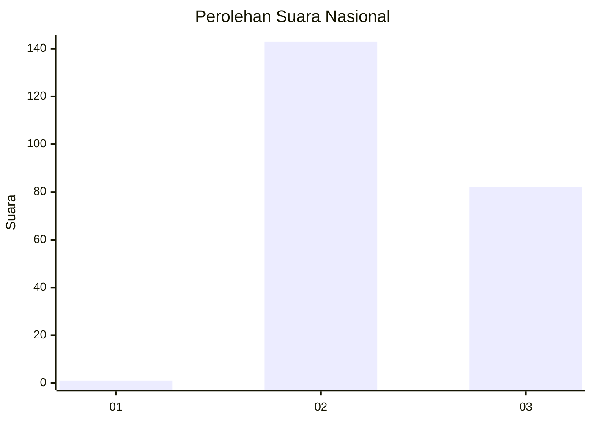
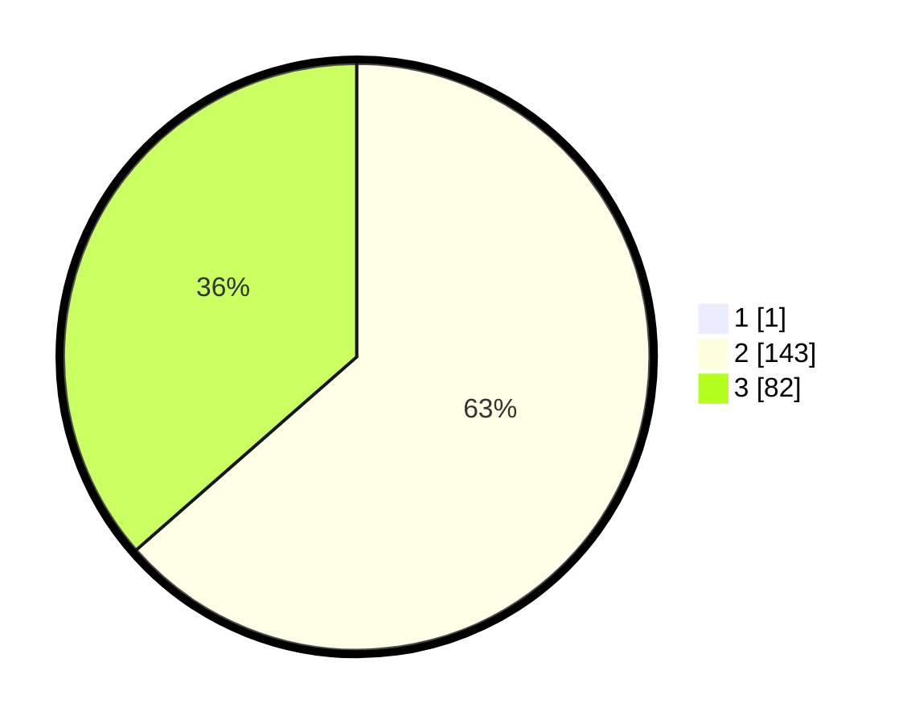

# Hasil

## Grafik

## Tabel

| No. | Nama Paslon    | Suara | Suara (raw) | Persentase |
|:--- |:-------------- | -----:| -----------:| ----------:|
| 1   | ANIES MUHAIMIN | 1     | [1][p-1]    | 0,44       |
| 2   | PRABOWO GIBRAN | 143   | [143][p-2]  | 63,27      |
| 3   | GANJAR MAHFUD  | 82    | [82][p-3]   | 36,28      |

[p-1]: https://github.com/gigit-pemilu/pemilu-2024/blob/main/pilpres/hitung-suara/sub/51-bali/sub/08-buleleng/sub/07-sawan/sub/2006-sawan/sub/004-tps/sub/paslon-1.txt
[p-2]: https://github.com/gigit-pemilu/pemilu-2024/blob/main/pilpres/hitung-suara/sub/51-bali/sub/08-buleleng/sub/07-sawan/sub/2006-sawan/sub/004-tps/sub/paslon-2.txt
[p-3]: https://github.com/gigit-pemilu/pemilu-2024/blob/main/pilpres/hitung-suara/sub/51-bali/sub/08-buleleng/sub/07-sawan/sub/2006-sawan/sub/004-tps/sub/paslon-3.txt

## Foto C Plano

https://sirekap-obj-formc.kpu.go.id/22f8/pemilu/ppwp/51/08/07/20/06/5108072006004-20240214-141037--14cff260-5d58-4e36-a28a-ac27bbfe5699.jpg

https://sirekap-obj-formc.kpu.go.id/22f8/pemilu/ppwp/51/08/07/20/06/5108072006004-20240214-141447--12d52d8a-be63-4f40-a637-940443b48b48.jpg

https://sirekap-obj-formc.kpu.go.id/22f8/pemilu/ppwp/51/08/07/20/06/5108072006004-20240214-141717--5737e350-2a3b-47f2-b548-e225d16d6471.jpg

## Metadata

| Key        | Value               |
| ---------- | ------------------- |
| Time Stamp | 2024-02-14 21:46:01 |

