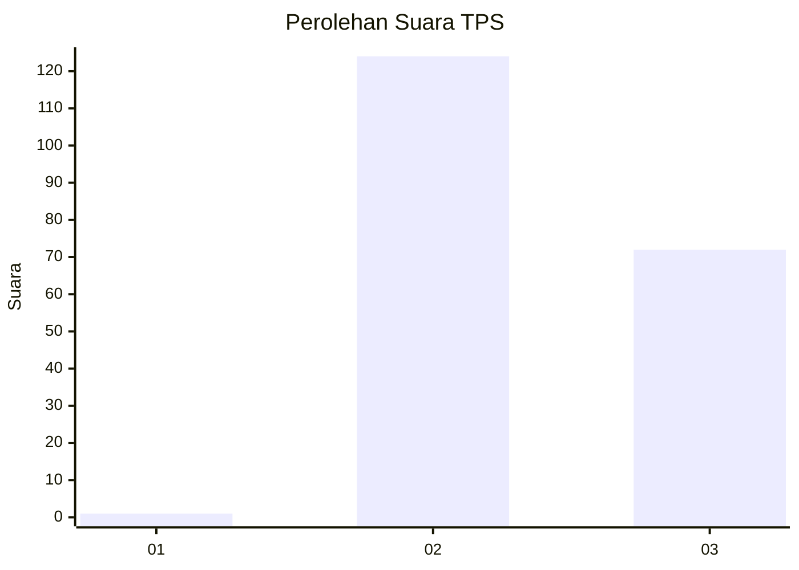
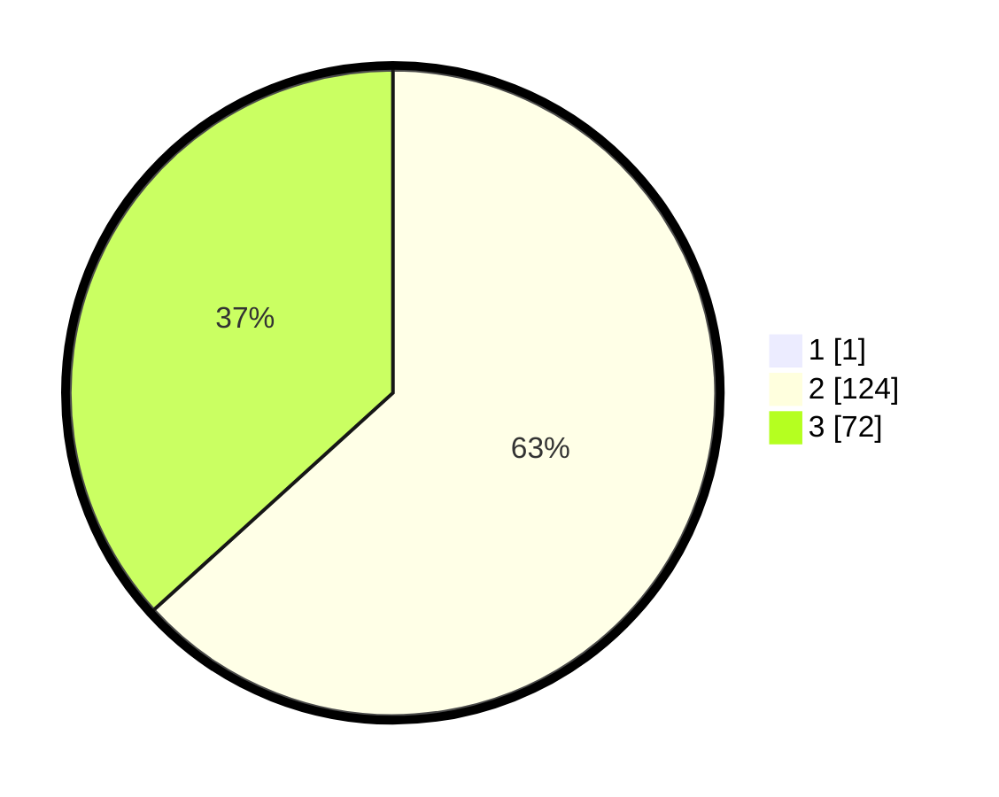

# Hasil

## Grafik

## Tabel

| No. | Nama Paslon    | Suara | Suara (raw) | Persentase |
|:--- |:-------------- | -----:| -----------:| ----------:|
| 1   | ANIES MUHAIMIN | 1     | [1][p-1]    | 0,51       |
| 2   | PRABOWO GIBRAN | 124   | [124][p-2]  | 62,94      |
| 3   | GANJAR MAHFUD  | 72    | [72][p-3]   | 36,55      |

[p-1]: https://github.com/gigit-pemilu/pemilu-2024-51-bali/blob/main/pilpres/hitung-suara/sub/51-bali/sub/08-buleleng/sub/07-sawan/sub/2006-sawan/sub/005-tps/sub/paslon-1.txt
[p-2]: https://github.com/gigit-pemilu/pemilu-2024-51-bali/blob/main/pilpres/hitung-suara/sub/51-bali/sub/08-buleleng/sub/07-sawan/sub/2006-sawan/sub/005-tps/sub/paslon-2.txt
[p-3]: https://github.com/gigit-pemilu/pemilu-2024-51-bali/blob/main/pilpres/hitung-suara/sub/51-bali/sub/08-buleleng/sub/07-sawan/sub/2006-sawan/sub/005-tps/sub/paslon-3.txt

## Foto C Plano

https://sirekap-obj-formc.kpu.go.id/ceed/pemilu/ppwp/51/08/07/20/06/5108072006005-20240214-214503--513cd1ec-d06f-438a-806b-37a9aec00ed8.jpg

https://sirekap-obj-formc.kpu.go.id/ceed/pemilu/ppwp/51/08/07/20/06/5108072006005-20240214-221620--eff5c258-c307-4fda-b826-09634ef3714a.jpg

https://sirekap-obj-formc.kpu.go.id/ceed/pemilu/ppwp/51/08/07/20/06/5108072006005-20240214-221910--bc8762b3-0717-49a6-8a10-25e1cbede5e8.jpg

## Metadata

| Key        | Value               |
| ---------- | ------------------- |
| Time Stamp | 2024-02-25 22:00:00 |

