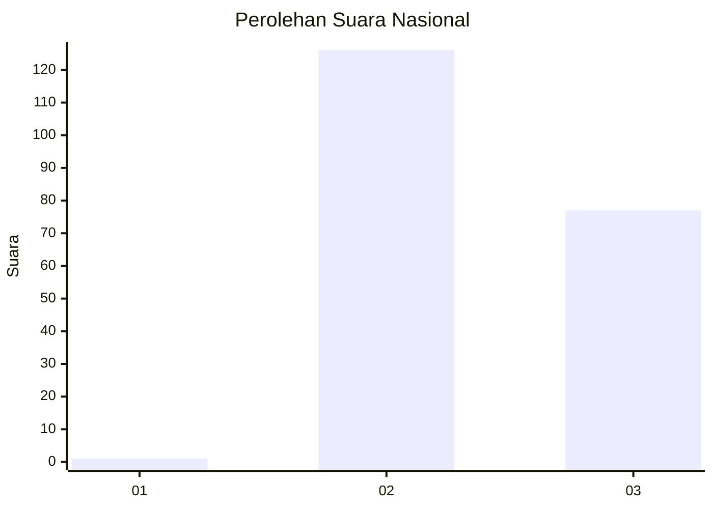
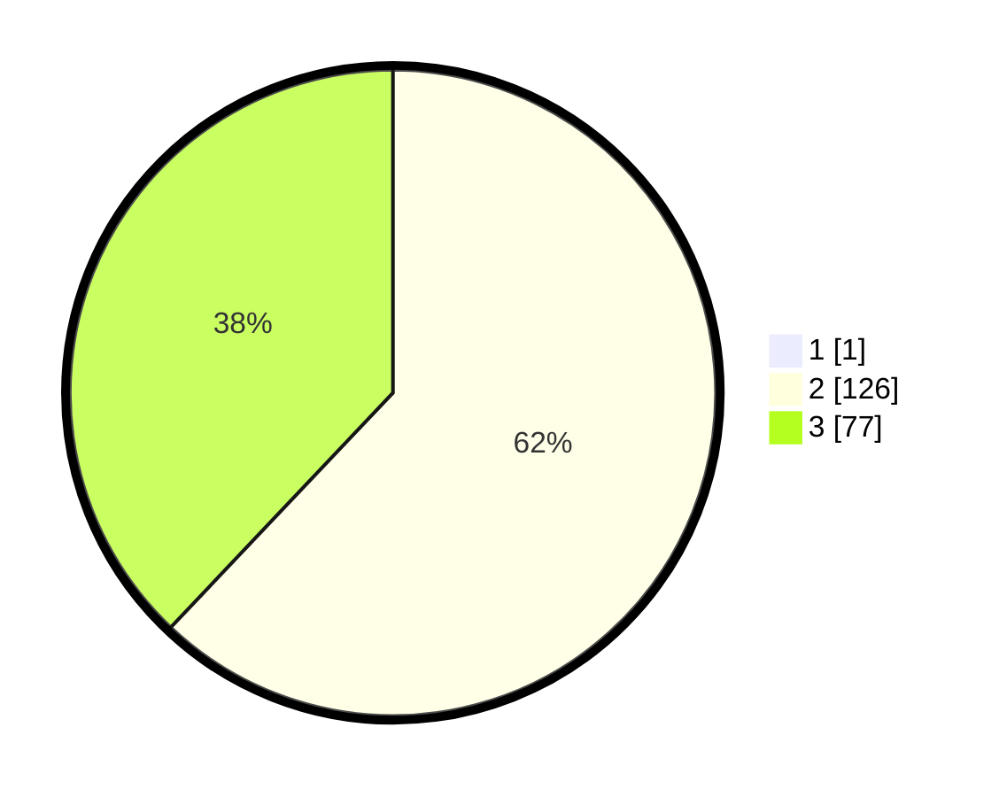

# Hasil

## Grafik

## Tabel

| No. | Nama Paslon    | Suara | Suara (raw) | Persentase |
|:--- |:-------------- | -----:| -----------:| ----------:|
| 1   | ANIES MUHAIMIN | 1     | [1][p-1]    | 0,49       |
| 2   | PRABOWO GIBRAN | 126   | [126][p-2]  | 61,76      |
| 3   | GANJAR MAHFUD  | 77    | [77][p-3]   | 37,75      |

[p-1]: https://github.com/gigit-pemilu/pemilu-2024/blob/main/pilpres/hitung-suara/sub/51-bali/sub/08-buleleng/sub/07-sawan/sub/2007-menyali/sub/005-tps/sub/paslon-1.txt
[p-2]: https://github.com/gigit-pemilu/pemilu-2024/blob/main/pilpres/hitung-suara/sub/51-bali/sub/08-buleleng/sub/07-sawan/sub/2007-menyali/sub/005-tps/sub/paslon-2.txt
[p-3]: https://github.com/gigit-pemilu/pemilu-2024/blob/main/pilpres/hitung-suara/sub/51-bali/sub/08-buleleng/sub/07-sawan/sub/2007-menyali/sub/005-tps/sub/paslon-3.txt

## Foto C Plano

https://sirekap-obj-formc.kpu.go.id/f3fe/pemilu/ppwp/51/08/07/20/07/5108072007005-20240214-222057--70ccf37c-c891-4898-b231-63d81282c224.jpg

https://sirekap-obj-formc.kpu.go.id/f3fe/pemilu/ppwp/51/08/07/20/07/5108072007005-20240214-222037--38d36ad3-3eec-411e-9392-b88a804ad6de.jpg

https://sirekap-obj-formc.kpu.go.id/f3fe/pemilu/ppwp/51/08/07/20/07/5108072007005-20240214-222153--04e1b1eb-f9b0-4d7b-bdde-6aa5564c894a.jpg

## Metadata

| Key        | Value               |
| ---------- | ------------------- |
| Time Stamp | 2024-02-24 22:31:28 |

