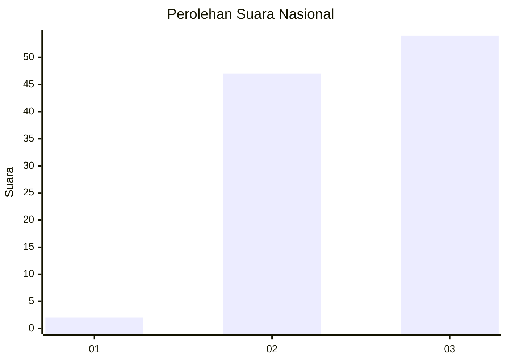
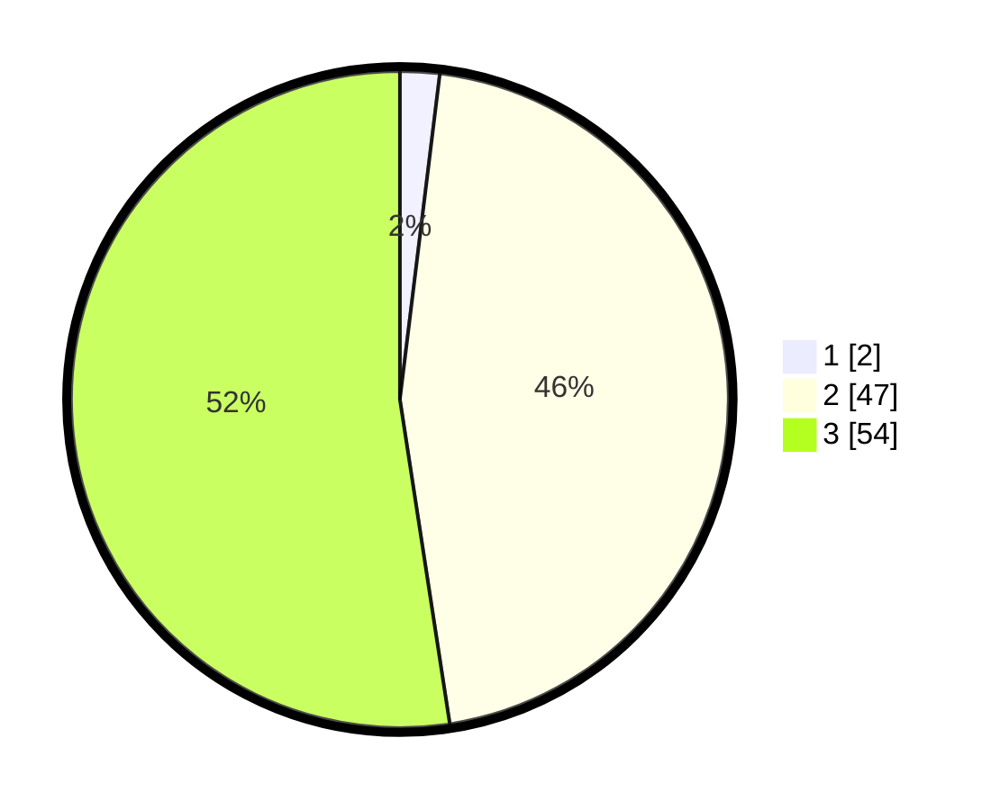

# Hasil

## Grafik

## Tabel

| No. | Nama Paslon    | Suara | Suara (raw) | Persentase |
|:--- |:-------------- | -----:| -----------:| ----------:|
| 1   | ANIES MUHAIMIN | 2     | [2][p-1]    | 1,94       |
| 2   | PRABOWO GIBRAN | 47    | [47][p-2]   | 45,63      |
| 3   | GANJAR MAHFUD  | 54    | [54][p-3]   | 52,43      |

[p-1]: https://github.com/gigit-pemilu/pemilu-2024/blob/main/pilpres/hitung-suara/sub/51-bali/sub/08-buleleng/sub/07-sawan/sub/2007-menyali/sub/006-tps/sub/paslon-1.txt
[p-2]: https://github.com/gigit-pemilu/pemilu-2024/blob/main/pilpres/hitung-suara/sub/51-bali/sub/08-buleleng/sub/07-sawan/sub/2007-menyali/sub/006-tps/sub/paslon-2.txt
[p-3]: https://github.com/gigit-pemilu/pemilu-2024/blob/main/pilpres/hitung-suara/sub/51-bali/sub/08-buleleng/sub/07-sawan/sub/2007-menyali/sub/006-tps/sub/paslon-3.txt

## Foto C Plano

https://sirekap-obj-formc.kpu.go.id/740f/pemilu/ppwp/51/08/07/20/07/5108072007006-20240214-185433--86440637-15e0-4462-98ad-f07d4cfb974a.jpg

https://sirekap-obj-formc.kpu.go.id/740f/pemilu/ppwp/51/08/07/20/07/5108072007006-20240214-190005--28be6c20-a7b6-4b4d-9cb4-9fc9364b48ad.jpg

https://sirekap-obj-formc.kpu.go.id/740f/pemilu/ppwp/51/08/07/20/07/5108072007006-20240214-185320--138024f8-f240-4ce5-8753-549a418a9e9e.jpg

## Metadata

| Key        | Value               |
| ---------- | ------------------- |
| Time Stamp | 2024-02-15 20:30:46 |

## DATA PEMILIH TETAP

Jumlah pemilih dalam DPT: **106**.
 * L: **53**.
 * P: **53**.

## DATA PENGGUNA HAK PILIH

Jumlah pengguna hak pilih dalam DPT: **106**.
 * L: **53**.
 * P: **53**.

Jumlah pengguna hak pilih dalam DPTb: **0**.
 * L: **0**.
 * P: **0**.

Jumlah pengguna hak pilih dalam DPK: **0**.
 * L: **0**.
 * P: **0**.

Jumlah pengguna hak pilih: **106**.
 * L: **53**.
 * P: **53**.

## JUMLAH SUARA SAH DAN TIDAK SAH

JUMLAH SELURUH SUARA SAH: **103**.

JUMLAH SUARA TIDAK SAH: **3**.

JUMLAH SELURUH SUARA SAH DAN SUARA TIDAK SAH: **106**.

