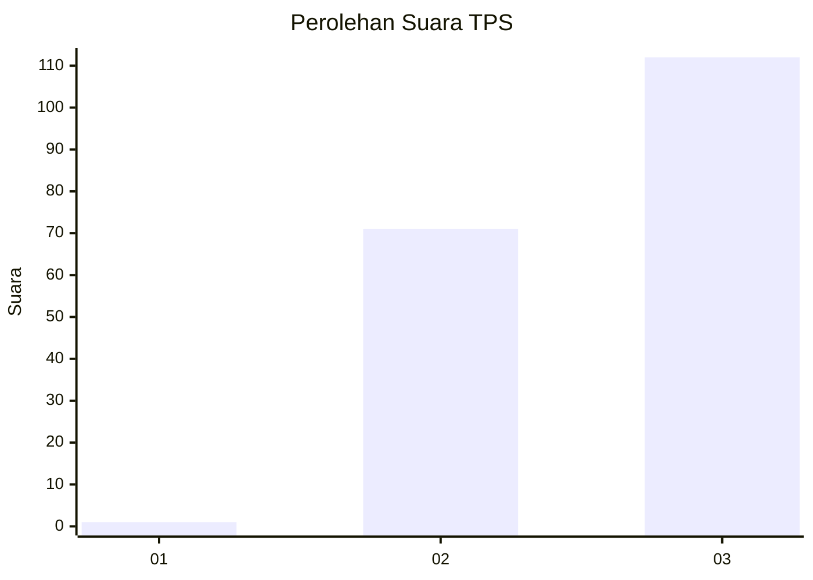
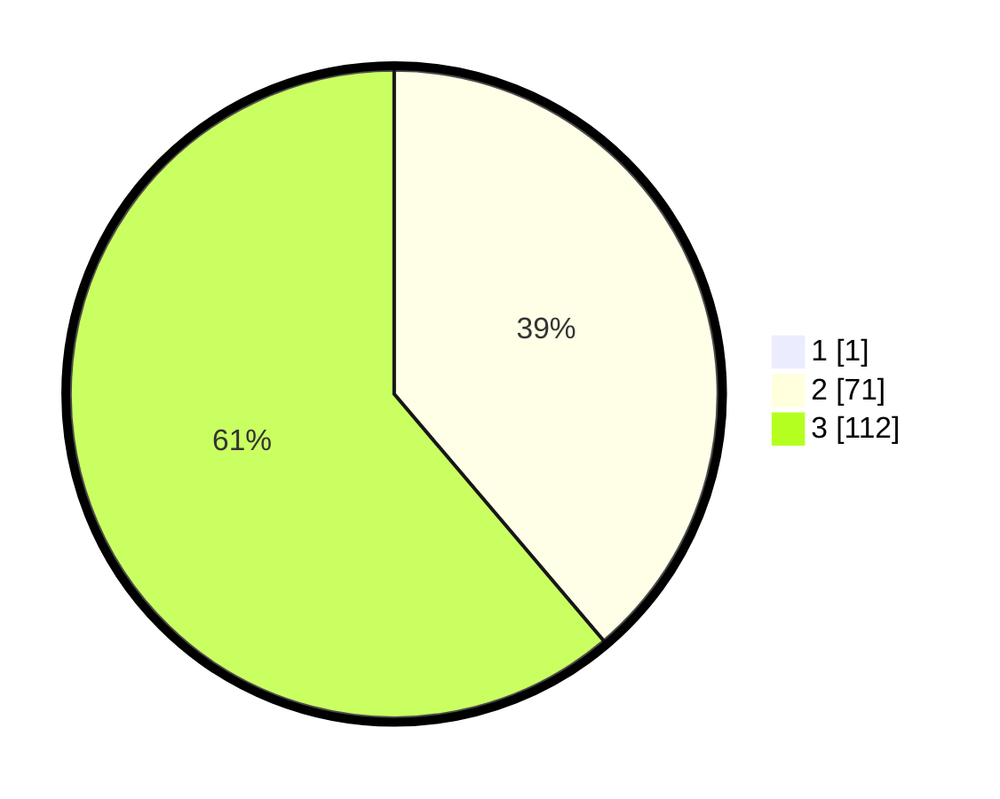

# Hasil

## Grafik

## Tabel

| No. | Nama Paslon    | Suara | Suara (raw) | Persentase |
|:--- |:-------------- | -----:| -----------:| ----------:|
| 1   | ANIES MUHAIMIN | 1     | [1][p-1]    | 0,54       |
| 2   | PRABOWO GIBRAN | 71    | [71][p-2]   | 38,59      |
| 3   | GANJAR MAHFUD  | 112   | [112][p-3]  | 60,87      |

[p-1]: https://github.com/gigit-pemilu/pemilu-2024-51-bali/blob/main/pilpres/hitung-suara/sub/51-bali/sub/08-buleleng/sub/07-sawan/sub/2007-menyali/sub/008-tps/sub/paslon-1.txt
[p-2]: https://github.com/gigit-pemilu/pemilu-2024-51-bali/blob/main/pilpres/hitung-suara/sub/51-bali/sub/08-buleleng/sub/07-sawan/sub/2007-menyali/sub/008-tps/sub/paslon-2.txt
[p-3]: https://github.com/gigit-pemilu/pemilu-2024-51-bali/blob/main/pilpres/hitung-suara/sub/51-bali/sub/08-buleleng/sub/07-sawan/sub/2007-menyali/sub/008-tps/sub/paslon-3.txt

## Foto C Plano

https://sirekap-obj-formc.kpu.go.id/8a4d/pemilu/ppwp/51/08/07/20/07/5108072007008-20240214-230109--d88c2599-ba1d-4e71-a9c3-577f0d3199d8.jpg

https://sirekap-obj-formc.kpu.go.id/8a4d/pemilu/ppwp/51/08/07/20/07/5108072007008-20240214-230410--fdc07063-2855-4f5f-85a3-d601f21309d9.jpg

https://sirekap-obj-formc.kpu.go.id/8a4d/pemilu/ppwp/51/08/07/20/07/5108072007008-20240214-230514--135e1878-f8a5-4554-9ff6-9a58bb6fa087.jpg

## Metadata

| Key        | Value               |
| ---------- | ------------------- |
| Time Stamp | 2024-02-24 22:31:28 |

