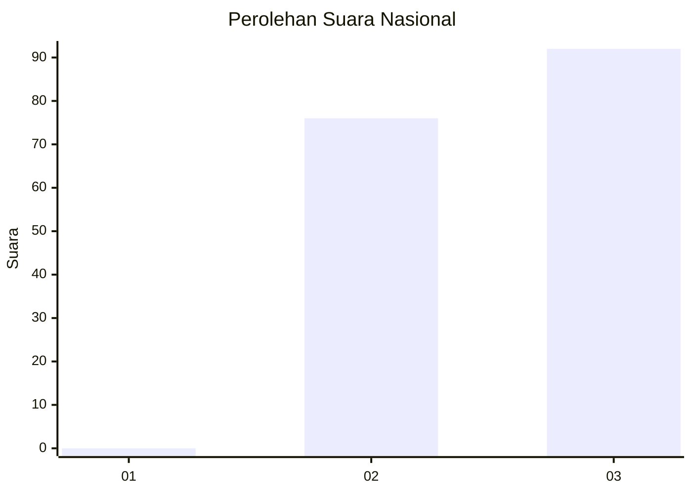
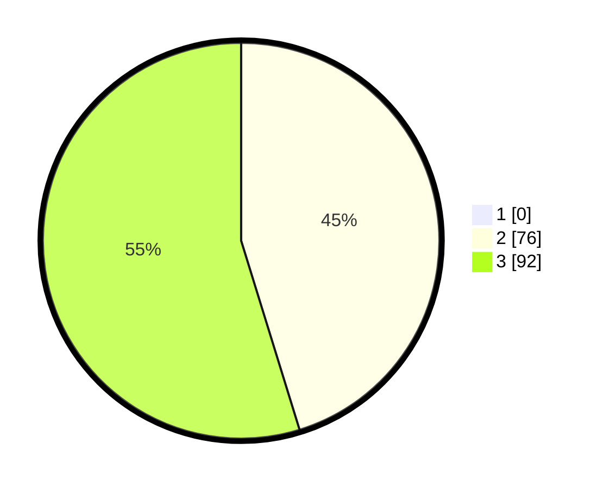

# Hasil

## Grafik

## Tabel

| No. | Nama Paslon    | Suara | Suara (raw) | Persentase |
|:--- |:-------------- | -----:| -----------:| ----------:|
| 1   | ANIES MUHAIMIN | 0     | [0][p-1]    | 0,00       |
| 2   | PRABOWO GIBRAN | 76    | [76][p-2]   | 45,24      |
| 3   | GANJAR MAHFUD  | 92    | [92][p-3]   | 54,76      |

[p-1]: https://github.com/gigit-pemilu/pemilu-2024/blob/main/pilpres/hitung-suara/sub/51-bali/sub/08-buleleng/sub/07-sawan/sub/2007-menyali/sub/013-tps/sub/paslon-1.txt
[p-2]: https://github.com/gigit-pemilu/pemilu-2024/blob/main/pilpres/hitung-suara/sub/51-bali/sub/08-buleleng/sub/07-sawan/sub/2007-menyali/sub/013-tps/sub/paslon-2.txt
[p-3]: https://github.com/gigit-pemilu/pemilu-2024/blob/main/pilpres/hitung-suara/sub/51-bali/sub/08-buleleng/sub/07-sawan/sub/2007-menyali/sub/013-tps/sub/paslon-3.txt

## Foto C Plano

https://sirekap-obj-formc.kpu.go.id/53af/pemilu/ppwp/51/08/07/20/07/5108072007013-20240215-032805--a83108a1-fc34-4e77-b176-391978be5d49.jpg

https://sirekap-obj-formc.kpu.go.id/53af/pemilu/ppwp/51/08/07/20/07/5108072007013-20240215-032810--c0fcaec0-976f-4d29-b6a4-e35926bfbfbf.jpg

https://sirekap-obj-formc.kpu.go.id/53af/pemilu/ppwp/51/08/07/20/07/5108072007013-20240215-032824--d5380d50-553e-4b2a-8805-d26d76c90113.jpg

## Metadata

| Key        | Value               |
| ---------- | ------------------- |
| Time Stamp | 2024-02-25 11:00:00 |

