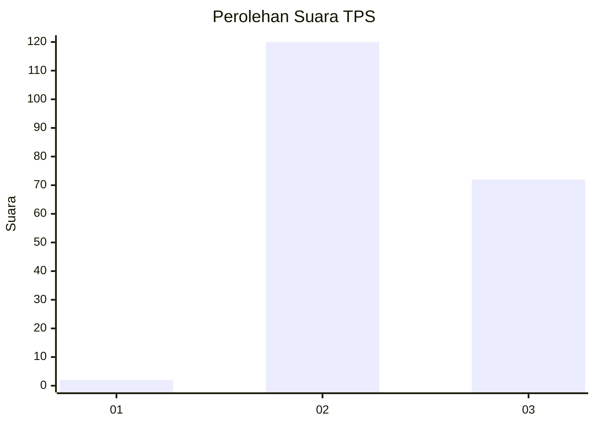
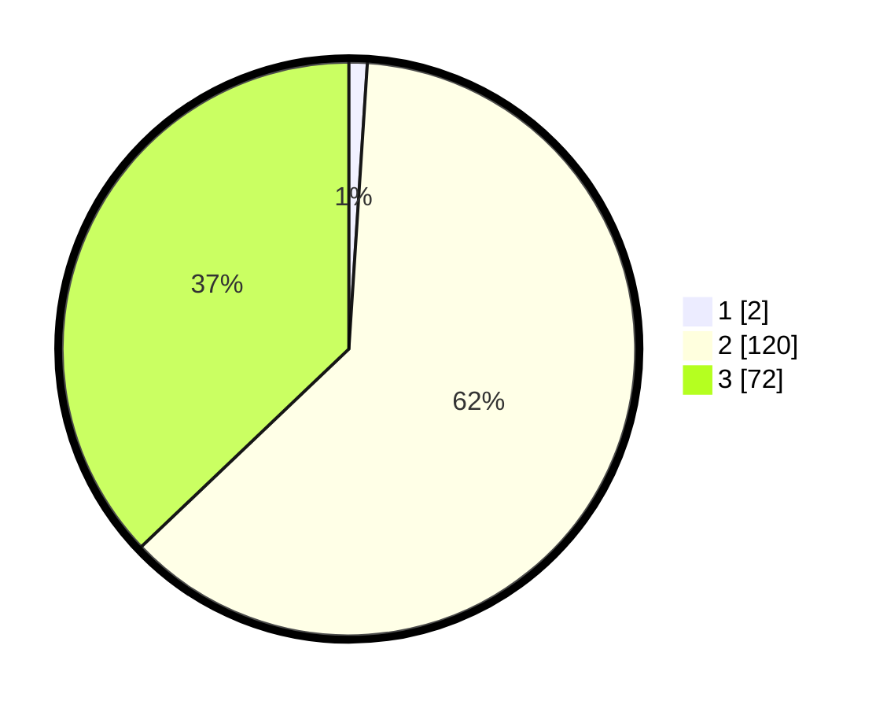

# Hasil

## Grafik

## Tabel

| No. | Nama Paslon    | Suara | Suara (raw) | Persentase |
|:--- |:-------------- | -----:| -----------:| ----------:|
| 1   | ANIES MUHAIMIN | 2     | [2][p-1]    | 1,03       |
| 2   | PRABOWO GIBRAN | 120   | [120][p-2]  | 61,86      |
| 3   | GANJAR MAHFUD  | 72    | [72][p-3]   | 37,11      |

[p-1]: https://github.com/gigit-pemilu/pemilu-2024-51-bali/blob/main/pilpres/hitung-suara/sub/51-bali/sub/08-buleleng/sub/07-sawan/sub/2007-menyali/sub/014-tps/sub/paslon-1.txt
[p-2]: https://github.com/gigit-pemilu/pemilu-2024-51-bali/blob/main/pilpres/hitung-suara/sub/51-bali/sub/08-buleleng/sub/07-sawan/sub/2007-menyali/sub/014-tps/sub/paslon-2.txt
[p-3]: https://github.com/gigit-pemilu/pemilu-2024-51-bali/blob/main/pilpres/hitung-suara/sub/51-bali/sub/08-buleleng/sub/07-sawan/sub/2007-menyali/sub/014-tps/sub/paslon-3.txt

## Foto C Plano

https://sirekap-obj-formc.kpu.go.id/251e/pemilu/ppwp/51/08/07/20/07/5108072007014-20240215-002117--92b551a1-57d6-4e71-b151-ca6c1e1daafb.jpg

https://sirekap-obj-formc.kpu.go.id/251e/pemilu/ppwp/51/08/07/20/07/5108072007014-20240218-063424--f2a145b2-36ff-4362-a6fd-f230564cc23f.jpg

https://sirekap-obj-formc.kpu.go.id/251e/pemilu/ppwp/51/08/07/20/07/5108072007014-20240215-020536--a9f59ef4-7248-48e5-9450-564c083d94e1.jpg

## Metadata

| Key        | Value               |
| ---------- | ------------------- |
| Time Stamp | 2024-02-19 06:16:00 |

