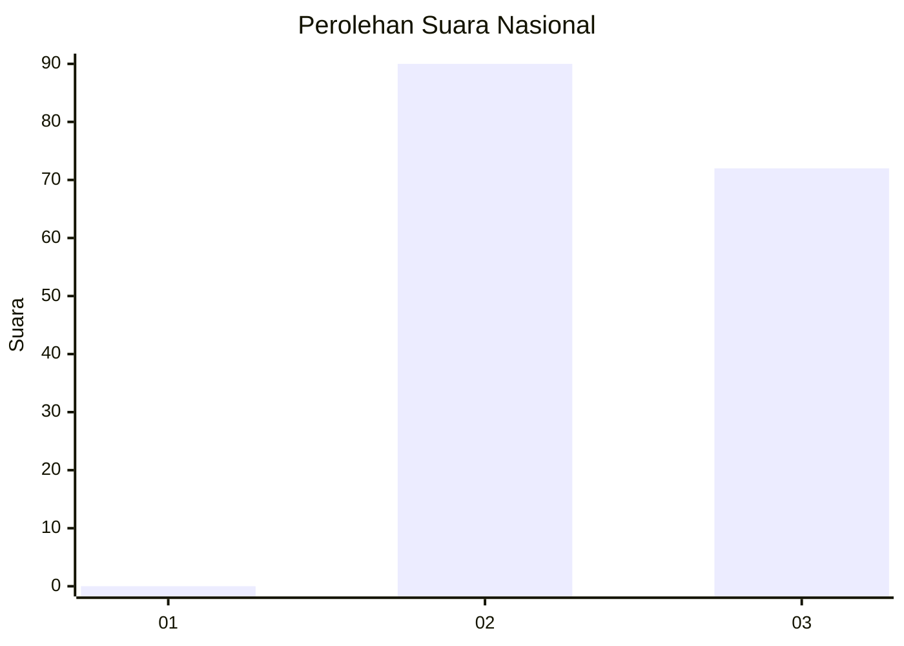
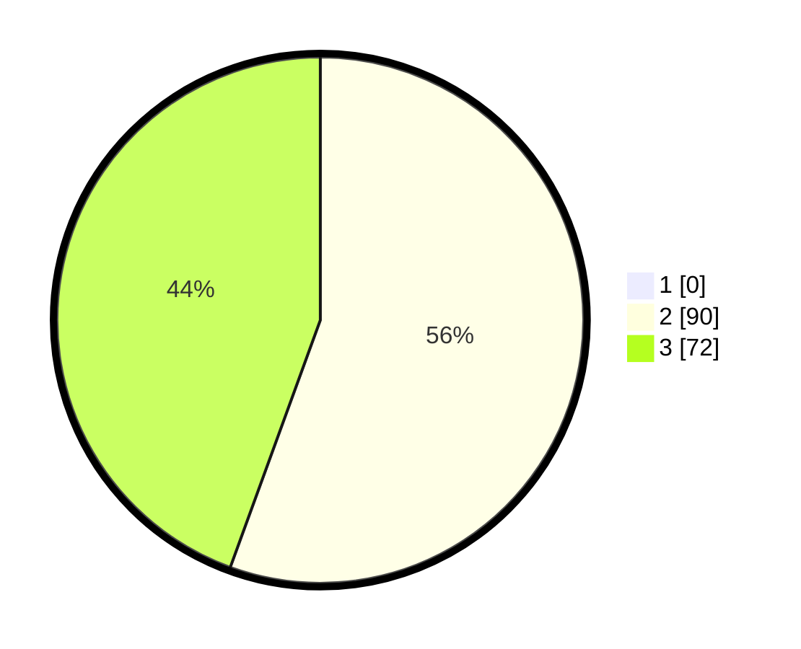

# Hasil

## Grafik

## Tabel

| No. | Nama Paslon    | Suara | Suara (raw) | Persentase |
|:--- |:-------------- | -----:| -----------:| ----------:|
| 1   | ANIES MUHAIMIN | 0     | [0][p-1]    | 0,00       |
| 2   | PRABOWO GIBRAN | 90    | [90][p-2]   | 55,56      |
| 3   | GANJAR MAHFUD  | 72    | [72][p-3]   | 44,44      |

[p-1]: https://github.com/gigit-pemilu/pemilu-2024/blob/main/pilpres/hitung-suara/sub/51-bali/sub/08-buleleng/sub/07-sawan/sub/2008-suwug/sub/006-tps/sub/paslon-1.txt
[p-2]: https://github.com/gigit-pemilu/pemilu-2024/blob/main/pilpres/hitung-suara/sub/51-bali/sub/08-buleleng/sub/07-sawan/sub/2008-suwug/sub/006-tps/sub/paslon-2.txt
[p-3]: https://github.com/gigit-pemilu/pemilu-2024/blob/main/pilpres/hitung-suara/sub/51-bali/sub/08-buleleng/sub/07-sawan/sub/2008-suwug/sub/006-tps/sub/paslon-3.txt

## Foto C Plano

https://sirekap-obj-formc.kpu.go.id/282f/pemilu/ppwp/51/08/07/20/08/5108072008006-20240214-224451--68c1f6fb-ba04-42c4-831f-039db2f7e23e.jpg

https://sirekap-obj-formc.kpu.go.id/282f/pemilu/ppwp/51/08/07/20/08/5108072008006-20240214-224727--a55c685d-5144-46b7-b02b-617a38962061.jpg

https://sirekap-obj-formc.kpu.go.id/282f/pemilu/ppwp/51/08/07/20/08/5108072008006-20240214-224948--a08401ce-2dab-47b1-83ed-80f3b5ce6ffc.jpg

## Metadata

| Key        | Value               |
| ---------- | ------------------- |
| Time Stamp | 2024-02-24 22:31:28 |

