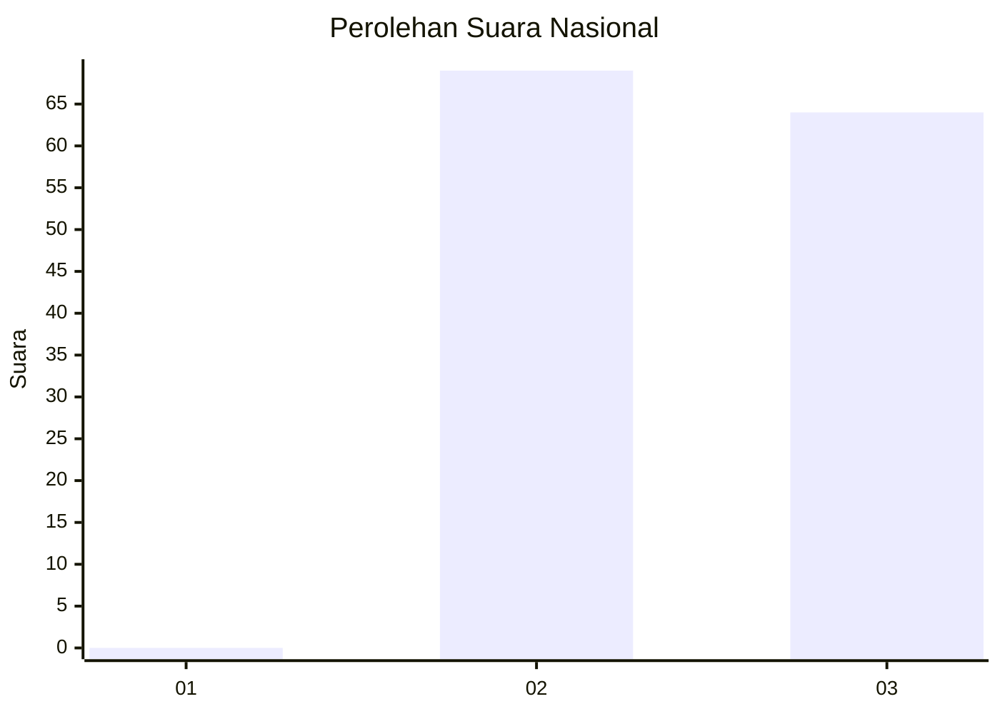
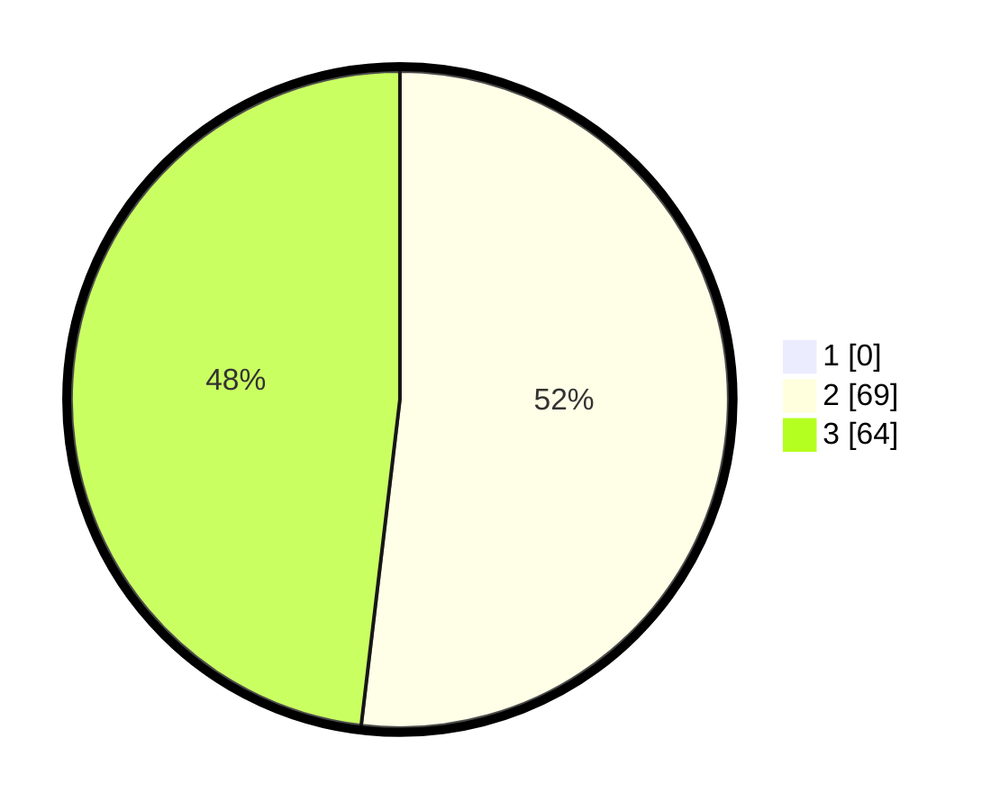

# Hasil

## Grafik

## Tabel

| No. | Nama Paslon    | Suara | Suara (raw) | Persentase |
|:--- |:-------------- | -----:| -----------:| ----------:|
| 1   | ANIES MUHAIMIN | 0     | [0][p-1]    | 0,00       |
| 2   | PRABOWO GIBRAN | 69    | [69][p-2]   | 51,88      |
| 3   | GANJAR MAHFUD  | 64    | [64][p-3]   | 48,12      |

[p-1]: https://github.com/gigit-pemilu/pemilu-2024/blob/main/pilpres/hitung-suara/sub/51-bali/sub/08-buleleng/sub/07-sawan/sub/2008-suwug/sub/008-tps/sub/paslon-1.txt
[p-2]: https://github.com/gigit-pemilu/pemilu-2024/blob/main/pilpres/hitung-suara/sub/51-bali/sub/08-buleleng/sub/07-sawan/sub/2008-suwug/sub/008-tps/sub/paslon-2.txt
[p-3]: https://github.com/gigit-pemilu/pemilu-2024/blob/main/pilpres/hitung-suara/sub/51-bali/sub/08-buleleng/sub/07-sawan/sub/2008-suwug/sub/008-tps/sub/paslon-3.txt

## Foto C Plano

https://sirekap-obj-formc.kpu.go.id/82fe/pemilu/ppwp/51/08/07/20/08/5108072008008-20240214-223307--7e343fa8-e446-4154-aba6-2ce9d94fe408.jpg

https://sirekap-obj-formc.kpu.go.id/82fe/pemilu/ppwp/51/08/07/20/08/5108072008008-20240214-223415--274ad3f8-0990-4144-98fe-1736e8088f02.jpg

https://sirekap-obj-formc.kpu.go.id/82fe/pemilu/ppwp/51/08/07/20/08/5108072008008-20240214-223451--686cc441-bdc8-4fab-8807-e2f9af8eedcc.jpg

## Metadata

| Key        | Value               |
| ---------- | ------------------- |
| Time Stamp | 2024-02-25 15:00:00 |

