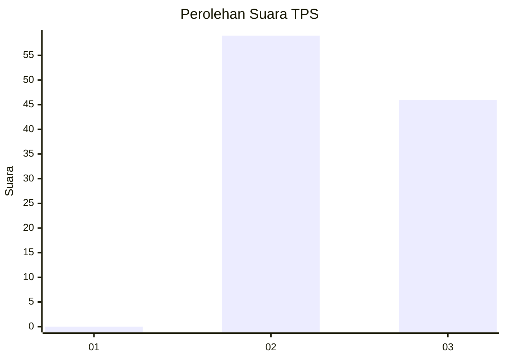
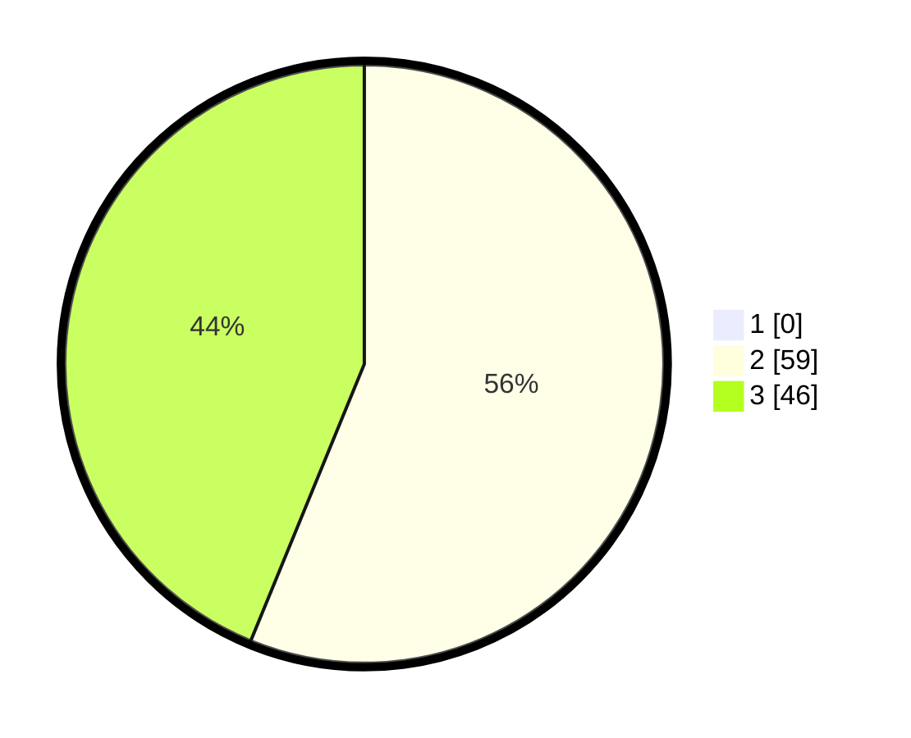

# Hasil

## Grafik

## Tabel

| No. | Nama Paslon    | Suara | Suara (raw) | Persentase |
|:--- |:-------------- | -----:| -----------:| ----------:|
| 1   | ANIES MUHAIMIN | 0     | [0][p-1]    | 0,00       |
| 2   | PRABOWO GIBRAN | 59    | [59][p-2]   | 56,19      |
| 3   | GANJAR MAHFUD  | 46    | [46][p-3]   | 43,81      |

[p-1]: https://github.com/gigit-pemilu/pemilu-2024-51-bali/blob/main/pilpres/hitung-suara/sub/51-bali/sub/08-buleleng/sub/07-sawan/sub/2008-suwug/sub/011-tps/sub/paslon-1.txt
[p-2]: https://github.com/gigit-pemilu/pemilu-2024-51-bali/blob/main/pilpres/hitung-suara/sub/51-bali/sub/08-buleleng/sub/07-sawan/sub/2008-suwug/sub/011-tps/sub/paslon-2.txt
[p-3]: https://github.com/gigit-pemilu/pemilu-2024-51-bali/blob/main/pilpres/hitung-suara/sub/51-bali/sub/08-buleleng/sub/07-sawan/sub/2008-suwug/sub/011-tps/sub/paslon-3.txt

## Foto C Plano

https://sirekap-obj-formc.kpu.go.id/40d8/pemilu/ppwp/51/08/07/20/08/5108072008011-20240214-130954--00fbf93e-00e6-4920-9a9c-b8a7becfd775.jpg

https://sirekap-obj-formc.kpu.go.id/40d8/pemilu/ppwp/51/08/07/20/08/5108072008011-20240214-130748--f8fcbde5-e224-4f83-b42d-22789dafeb2b.jpg

https://sirekap-obj-formc.kpu.go.id/40d8/pemilu/ppwp/51/08/07/20/08/5108072008011-20240214-130922--ab1aa801-6272-49be-970c-15e22ca528a0.jpg

## Metadata

| Key        | Value               |
| ---------- | ------------------- |
| Time Stamp | 2024-02-15 00:56:54 |

## DATA PEMILIH TETAP

Jumlah pemilih dalam DPT: **235**.
 * L: **119**.
 * P: **116**.

## DATA PENGGUNA HAK PILIH

Jumlah pengguna hak pilih dalam DPT: **113**.
 * L: **63**.
 * P: **50**.

Jumlah pengguna hak pilih dalam DPTb: **0**.
 * L: **0**.
 * P: **0**.

Jumlah pengguna hak pilih dalam DPK: **0**.
 * L: **0**.
 * P: **0**.

Jumlah pengguna hak pilih: **113**.
 * L: **63**.
 * P: **50**.

## JUMLAH SUARA SAH DAN TIDAK SAH

JUMLAH SELURUH SUARA SAH: **105**.

JUMLAH SUARA TIDAK SAH: **8**.

JUMLAH SELURUH SUARA SAH DAN SUARA TIDAK SAH: **113**.

