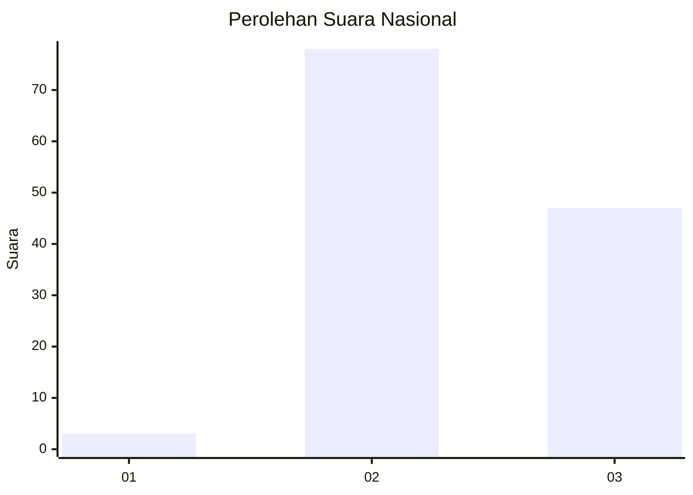
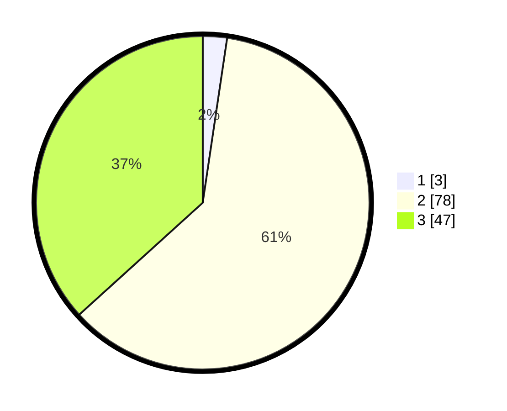

# Hasil

## Grafik

## Tabel

| No. | Nama Paslon    | Suara | Suara (raw) | Persentase |
|:--- |:-------------- | -----:| -----------:| ----------:|
| 1   | ANIES MUHAIMIN | 3     | [3][p-1]    | 2,34       |
| 2   | PRABOWO GIBRAN | 78    | [78][p-2]   | 60,94      |
| 3   | GANJAR MAHFUD  | 47    | [47][p-3]   | 36,72      |

[p-1]: https://github.com/gigit-pemilu/pemilu-2024/blob/main/pilpres/hitung-suara/sub/51-bali/sub/08-buleleng/sub/07-sawan/sub/2008-suwug/sub/012-tps/sub/paslon-1.txt
[p-2]: https://github.com/gigit-pemilu/pemilu-2024/blob/main/pilpres/hitung-suara/sub/51-bali/sub/08-buleleng/sub/07-sawan/sub/2008-suwug/sub/012-tps/sub/paslon-2.txt
[p-3]: https://github.com/gigit-pemilu/pemilu-2024/blob/main/pilpres/hitung-suara/sub/51-bali/sub/08-buleleng/sub/07-sawan/sub/2008-suwug/sub/012-tps/sub/paslon-3.txt

## Foto C Plano

https://sirekap-obj-formc.kpu.go.id/3796/pemilu/ppwp/51/08/07/20/08/5108072008012-20240215-000539--97f2d7b8-8f48-47a4-8415-d321d6c81f09.jpg

https://sirekap-obj-formc.kpu.go.id/3796/pemilu/ppwp/51/08/07/20/08/5108072008012-20240215-000723--fbd566d8-88c6-41a8-afb5-1337727bb496.jpg

https://sirekap-obj-formc.kpu.go.id/3796/pemilu/ppwp/51/08/07/20/08/5108072008012-20240215-000935--5b1ff8c7-1c14-4ccb-89a6-a0a9f24727c6.jpg

## Metadata

| Key        | Value               |
| ---------- | ------------------- |
| Time Stamp | 2024-02-24 22:31:28 |

