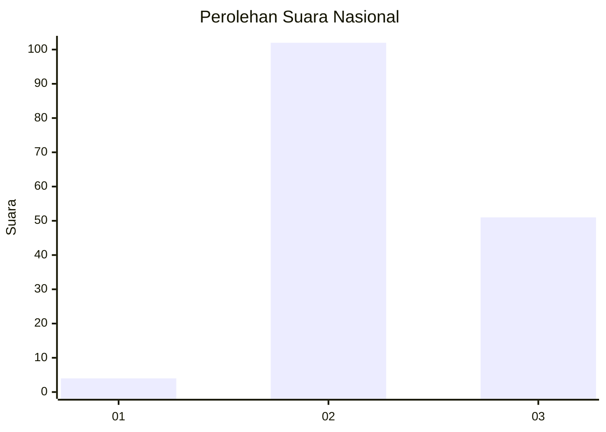
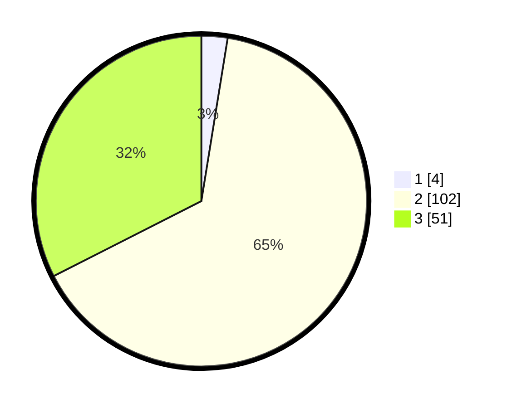

# Hasil

## Grafik

## Tabel

| No. | Nama Paslon    | Suara | Suara (raw) | Persentase |
|:--- |:-------------- | -----:| -----------:| ----------:|
| 1   | ANIES MUHAIMIN | 4     | [4][p-1]    | 2,55       |
| 2   | PRABOWO GIBRAN | 102   | [102][p-2]  | 64,97      |
| 3   | GANJAR MAHFUD  | 51    | [51][p-3]   | 32,48      |

[p-1]: https://github.com/gigit-pemilu/pemilu-2024/blob/main/pilpres/hitung-suara/sub/51-bali/sub/08-buleleng/sub/07-sawan/sub/2008-suwug/sub/014-tps/sub/paslon-1.txt
[p-2]: https://github.com/gigit-pemilu/pemilu-2024/blob/main/pilpres/hitung-suara/sub/51-bali/sub/08-buleleng/sub/07-sawan/sub/2008-suwug/sub/014-tps/sub/paslon-2.txt
[p-3]: https://github.com/gigit-pemilu/pemilu-2024/blob/main/pilpres/hitung-suara/sub/51-bali/sub/08-buleleng/sub/07-sawan/sub/2008-suwug/sub/014-tps/sub/paslon-3.txt

## Foto C Plano

https://sirekap-obj-formc.kpu.go.id/aed8/pemilu/ppwp/51/08/07/20/08/5108072008014-20240214-210242--2abca9a2-55de-4ccf-a676-22d433fcf59a.jpg

https://sirekap-obj-formc.kpu.go.id/aed8/pemilu/ppwp/51/08/07/20/08/5108072008014-20240214-210904--1f1efe5a-575c-4390-a04a-37f461afcf6c.jpg

https://sirekap-obj-formc.kpu.go.id/aed8/pemilu/ppwp/51/08/07/20/08/5108072008014-20240214-211235--e88a72e0-dd7c-452f-b966-d2e7944f4f09.jpg

## Metadata

| Key        | Value               |
| ---------- | ------------------- |
| Time Stamp | 2024-02-15 03:06:03 |

