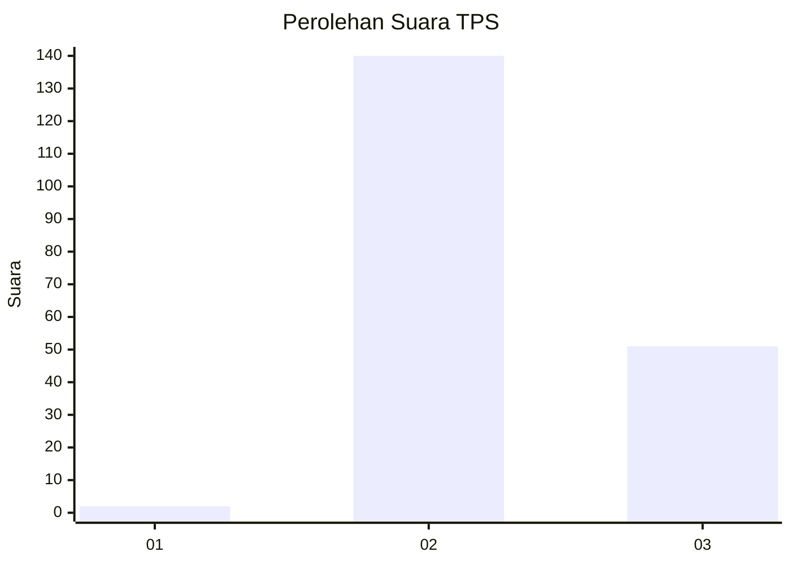
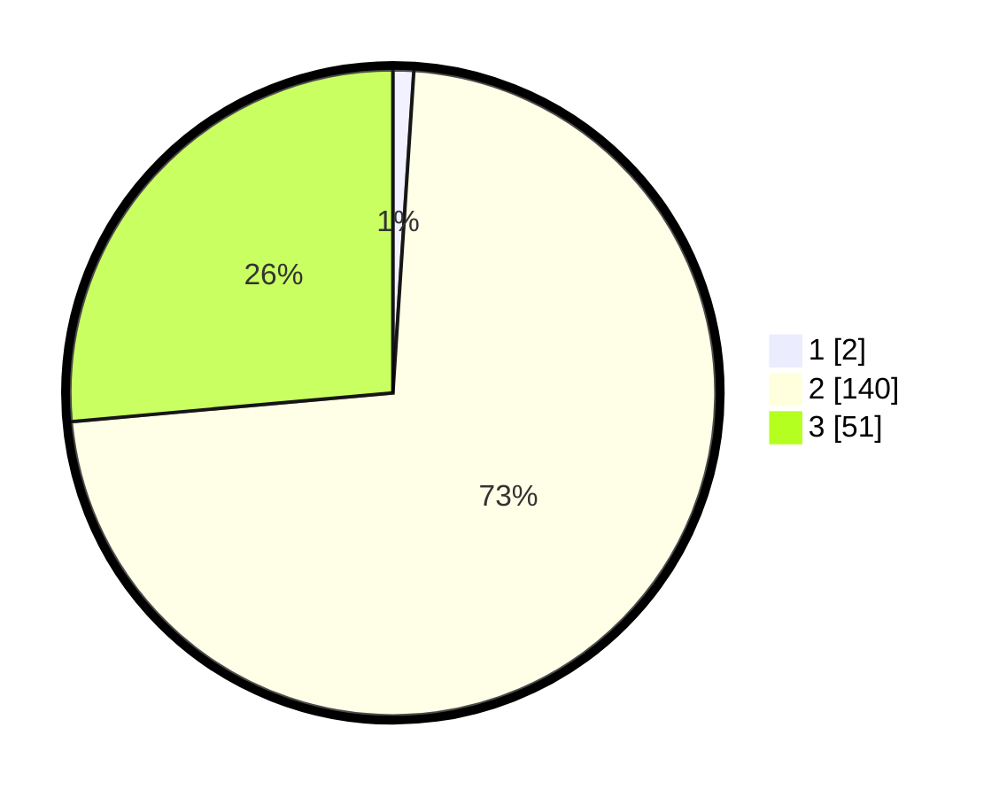

# Hasil

## Grafik

## Tabel

| No. | Nama Paslon    | Suara | Suara (raw) | Persentase |
|:--- |:-------------- | -----:| -----------:| ----------:|
| 1   | ANIES MUHAIMIN | 2     | [2][p-1]    | 1,04       |
| 2   | PRABOWO GIBRAN | 140   | [140][p-2]  | 72,54      |
| 3   | GANJAR MAHFUD  | 51    | [51][p-3]   | 26,42      |

[p-1]: https://github.com/gigit-pemilu/pemilu-2024-51-bali/blob/main/pilpres/hitung-suara/sub/51-bali/sub/08-buleleng/sub/07-sawan/sub/2008-suwug/sub/016-tps/sub/paslon-1.txt
[p-2]: https://github.com/gigit-pemilu/pemilu-2024-51-bali/blob/main/pilpres/hitung-suara/sub/51-bali/sub/08-buleleng/sub/07-sawan/sub/2008-suwug/sub/016-tps/sub/paslon-2.txt
[p-3]: https://github.com/gigit-pemilu/pemilu-2024-51-bali/blob/main/pilpres/hitung-suara/sub/51-bali/sub/08-buleleng/sub/07-sawan/sub/2008-suwug/sub/016-tps/sub/paslon-3.txt

## Foto C Plano

https://sirekap-obj-formc.kpu.go.id/1f76/pemilu/ppwp/51/08/07/20/08/5108072008016-20240214-221501--5c0dbe76-07e5-41da-b62c-36a617a831ab.jpg

https://sirekap-obj-formc.kpu.go.id/1f76/pemilu/ppwp/51/08/07/20/08/5108072008016-20240214-221649--76e377c2-37c0-4424-90a2-8c6002f94988.jpg

https://sirekap-obj-formc.kpu.go.id/1f76/pemilu/ppwp/51/08/07/20/08/5108072008016-20240214-221823--95513850-90e5-44f2-a47d-edb5b50ee4d8.jpg

## Metadata

| Key        | Value               |
| ---------- | ------------------- |
| Time Stamp | 2024-02-24 22:31:28 |

