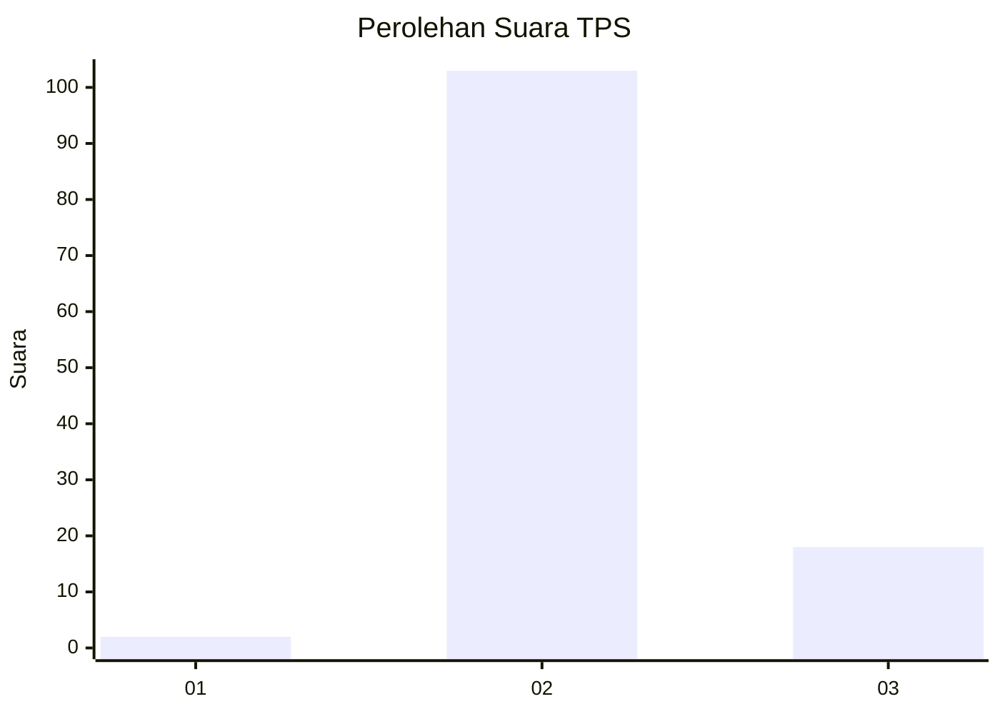
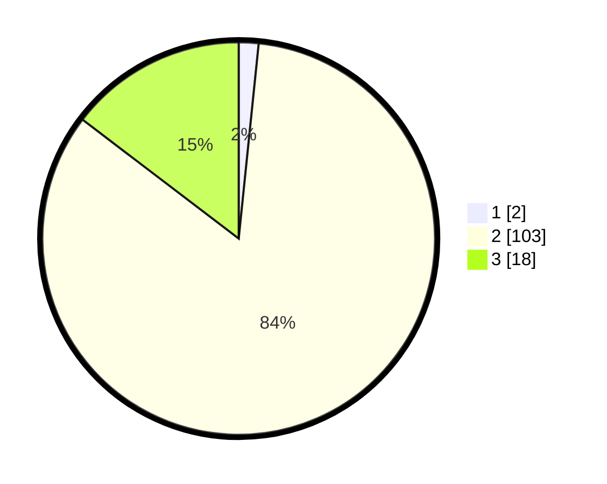

# Hasil

## Grafik

## Tabel

| No. | Nama Paslon    | Suara | Suara (raw) | Persentase |
|:--- |:-------------- | -----:| -----------:| ----------:|
| 1   | ANIES MUHAIMIN | 2     | [2][p-1]    | 1,63       |
| 2   | PRABOWO GIBRAN | 103   | [103][p-2]  | 83,74      |
| 3   | GANJAR MAHFUD  | 18    | [18][p-3]   | 14,63      |

[p-1]: https://github.com/gigit-pemilu/pemilu-2024-51-bali/blob/main/pilpres/hitung-suara/sub/51-bali/sub/08-buleleng/sub/07-sawan/sub/2008-suwug/sub/018-tps/sub/paslon-1.txt
[p-2]: https://github.com/gigit-pemilu/pemilu-2024-51-bali/blob/main/pilpres/hitung-suara/sub/51-bali/sub/08-buleleng/sub/07-sawan/sub/2008-suwug/sub/018-tps/sub/paslon-2.txt
[p-3]: https://github.com/gigit-pemilu/pemilu-2024-51-bali/blob/main/pilpres/hitung-suara/sub/51-bali/sub/08-buleleng/sub/07-sawan/sub/2008-suwug/sub/018-tps/sub/paslon-3.txt

## Foto C Plano

https://sirekap-obj-formc.kpu.go.id/a803/pemilu/ppwp/51/08/07/20/08/5108072008018-20240214-211216--9c1c1e76-a4ab-482e-94ad-b8ee0154e476.jpg

https://sirekap-obj-formc.kpu.go.id/a803/pemilu/ppwp/51/08/07/20/08/5108072008018-20240214-211246--19c22375-9d0f-4a63-aa74-73502c83a5f5.jpg

https://sirekap-obj-formc.kpu.go.id/a803/pemilu/ppwp/51/08/07/20/08/5108072008018-20240214-211050--1ce2c28d-0b13-4d53-88da-3329f6d7dbda.jpg

## Metadata

| Key        | Value               |
| ---------- | ------------------- |
| Time Stamp | 2024-02-25 11:00:00 |

