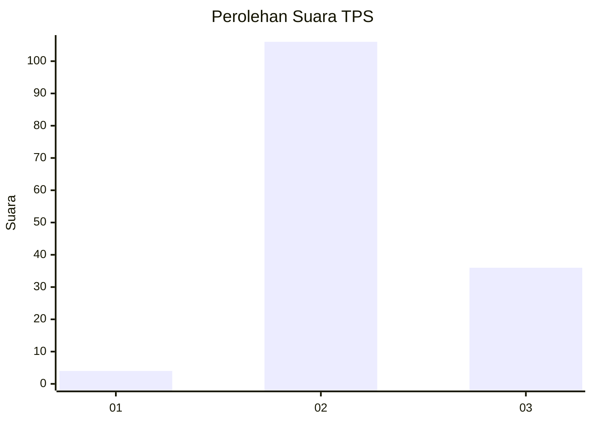
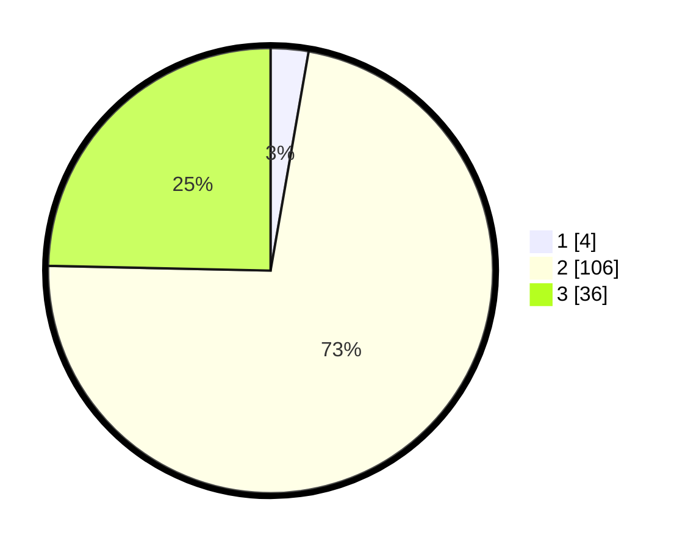

# Hasil

## Grafik

## Tabel

| No. | Nama Paslon    | Suara | Suara (raw) | Persentase |
|:--- |:-------------- | -----:| -----------:| ----------:|
| 1   | ANIES MUHAIMIN | 4     | [4][p-1]    | 2,74       |
| 2   | PRABOWO GIBRAN | 106   | [106][p-2]  | 72,60      |
| 3   | GANJAR MAHFUD  | 36    | [36][p-3]   | 24,66      |

[p-1]: https://github.com/gigit-pemilu/pemilu-2024-51-bali/blob/main/pilpres/hitung-suara/sub/51-bali/sub/08-buleleng/sub/07-sawan/sub/2008-suwug/sub/019-tps/sub/paslon-1.txt
[p-2]: https://github.com/gigit-pemilu/pemilu-2024-51-bali/blob/main/pilpres/hitung-suara/sub/51-bali/sub/08-buleleng/sub/07-sawan/sub/2008-suwug/sub/019-tps/sub/paslon-2.txt
[p-3]: https://github.com/gigit-pemilu/pemilu-2024-51-bali/blob/main/pilpres/hitung-suara/sub/51-bali/sub/08-buleleng/sub/07-sawan/sub/2008-suwug/sub/019-tps/sub/paslon-3.txt

## Foto C Plano

https://sirekap-obj-formc.kpu.go.id/d2d4/pemilu/ppwp/51/08/07/20/08/5108072008019-20240214-133053--0a20f98d-4584-4c7a-933f-d6f0f034a3cb.jpg

https://sirekap-obj-formc.kpu.go.id/d2d4/pemilu/ppwp/51/08/07/20/08/5108072008019-20240215-002937--01c19ca6-a90f-43be-9085-37c9955a6800.jpg

https://sirekap-obj-formc.kpu.go.id/d2d4/pemilu/ppwp/51/08/07/20/08/5108072008019-20240214-133408--c69ad8ab-76b4-487a-ada3-2e3944d35321.jpg

## Metadata

| Key        | Value               |
| ---------- | ------------------- |
| Time Stamp | 2024-02-24 22:31:28 |

