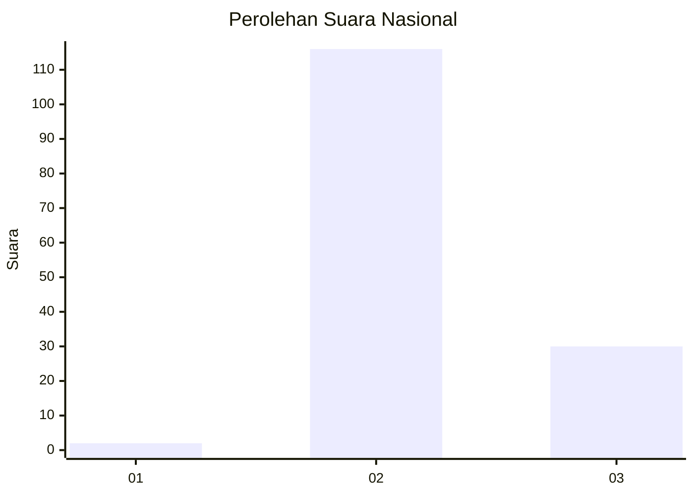

# Hasil

## Grafik

## Tabel

| No. | Nama Paslon    | Suara | Suara (raw) | Persentase |
|:--- |:-------------- | -----:| -----------:| ----------:|
| 1   | ANIES MUHAIMIN | 2     | [2][p-1]    | 1,35       |
| 2   | PRABOWO GIBRAN | 116   | [116][p-2]  | 78,38      |
| 3   | GANJAR MAHFUD  | 30    | [30][p-3]   | 20,27      |

[p-1]: https://github.com/gigit-pemilu/pemilu-2024/blob/main/pilpres/hitung-suara/sub/51-bali/sub/08-buleleng/sub/07-sawan/sub/2008-suwug/sub/020-tps/sub/paslon-1.txt
[p-2]: https://github.com/gigit-pemilu/pemilu-2024/blob/main/pilpres/hitung-suara/sub/51-bali/sub/08-buleleng/sub/07-sawan/sub/2008-suwug/sub/020-tps/sub/paslon-2.txt
[p-3]: https://github.com/gigit-pemilu/pemilu-2024/blob/main/pilpres/hitung-suara/sub/51-bali/sub/08-buleleng/sub/07-sawan/sub/2008-suwug/sub/020-tps/sub/paslon-3.txt

## Foto C Plano

https://sirekap-obj-formc.kpu.go.id/2d33/pemilu/ppwp/51/08/07/20/08/5108072008020-20240214-191925--94b31410-d2be-41c0-95ae-7bf2e3a51d08.jpg

https://sirekap-obj-formc.kpu.go.id/2d33/pemilu/ppwp/51/08/07/20/08/5108072008020-20240214-192114--bb25d693-1e21-4097-8067-973235d4d76b.jpg

https://sirekap-obj-formc.kpu.go.id/2d33/pemilu/ppwp/51/08/07/20/08/5108072008020-20240214-192248--40d8f1cd-f8a8-4bb2-916f-795fa0e9af54.jpg

## Metadata

| Key        | Value               |
| ---------- | ------------------- |
| Time Stamp | 2024-02-14 21:46:01 |

