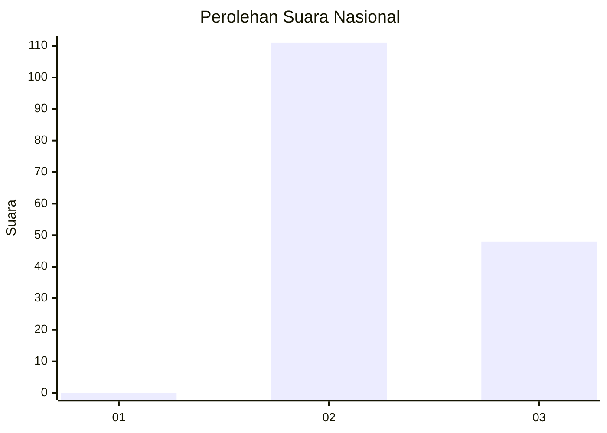
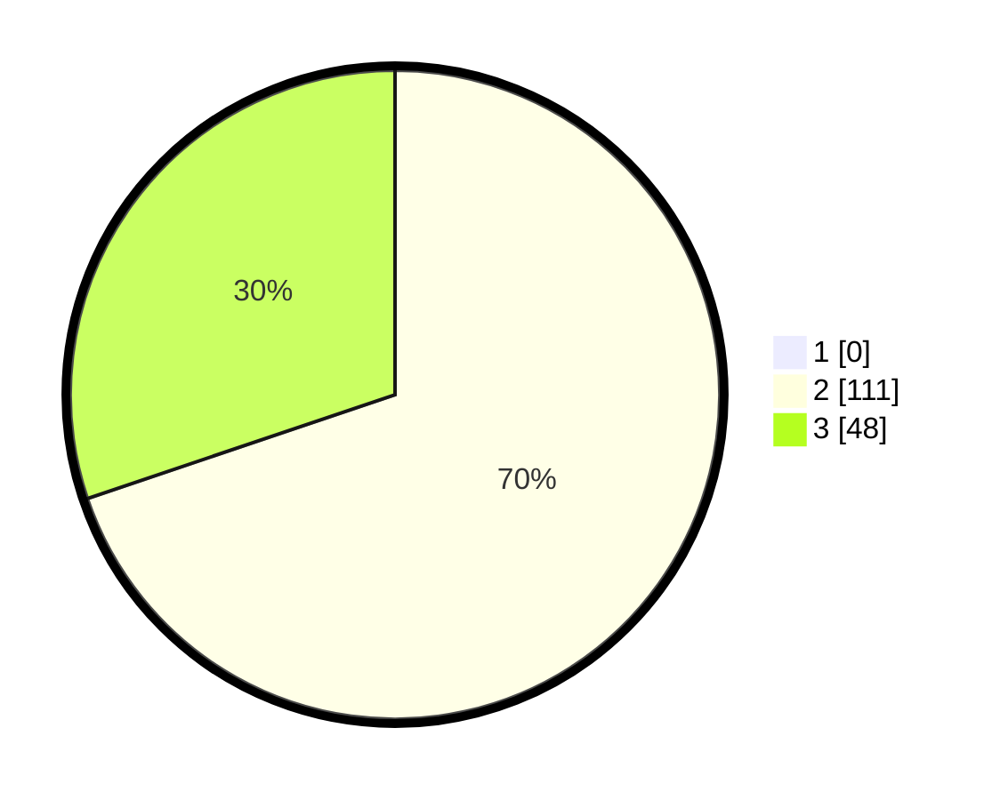

# Hasil

## Grafik

## Tabel

| No. | Nama Paslon    | Suara | Suara (raw) | Persentase |
|:--- |:-------------- | -----:| -----------:| ----------:|
| 1   | ANIES MUHAIMIN | 0     | [0][p-1]    | 0,00       |
| 2   | PRABOWO GIBRAN | 111   | [111][p-2]  | 69,81      |
| 3   | GANJAR MAHFUD  | 48    | [48][p-3]   | 30,19      |

[p-1]: https://github.com/gigit-pemilu/pemilu-2024/blob/main/pilpres/hitung-suara/sub/51-bali/sub/08-buleleng/sub/07-sawan/sub/2008-suwug/sub/022-tps/sub/paslon-1.txt
[p-2]: https://github.com/gigit-pemilu/pemilu-2024/blob/main/pilpres/hitung-suara/sub/51-bali/sub/08-buleleng/sub/07-sawan/sub/2008-suwug/sub/022-tps/sub/paslon-2.txt
[p-3]: https://github.com/gigit-pemilu/pemilu-2024/blob/main/pilpres/hitung-suara/sub/51-bali/sub/08-buleleng/sub/07-sawan/sub/2008-suwug/sub/022-tps/sub/paslon-3.txt

## Foto C Plano

https://sirekap-obj-formc.kpu.go.id/c5a2/pemilu/ppwp/51/08/07/20/08/5108072008022-20240214-193736--6bb830aa-e6de-4843-946c-c3d99c17fd89.jpg

https://sirekap-obj-formc.kpu.go.id/c5a2/pemilu/ppwp/51/08/07/20/08/5108072008022-20240214-204718--f51dbcd9-5554-48b2-8173-f29cec482143.jpg

https://sirekap-obj-formc.kpu.go.id/c5a2/pemilu/ppwp/51/08/07/20/08/5108072008022-20240214-204843--abbb6dd0-11b2-4a9d-8dac-0f55a58971d1.jpg

## Metadata

| Key        | Value               |
| ---------- | ------------------- |
| Time Stamp | 2024-02-24 22:31:28 |

