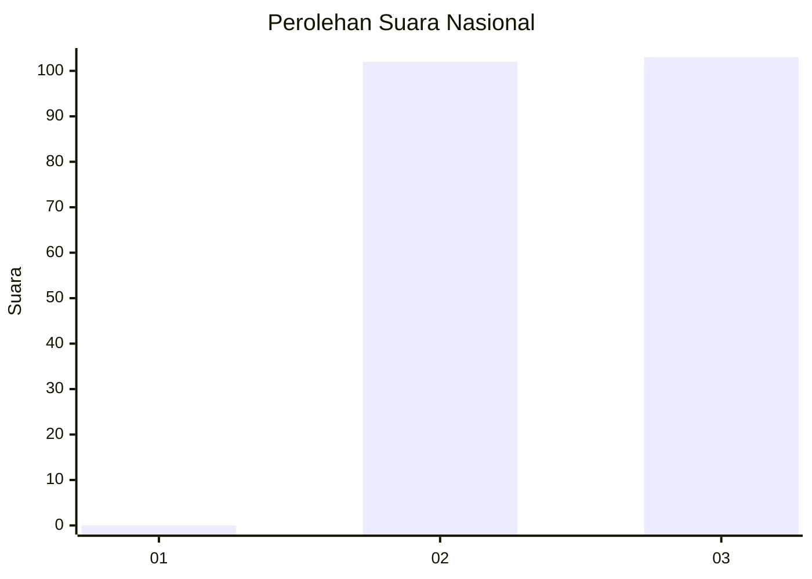
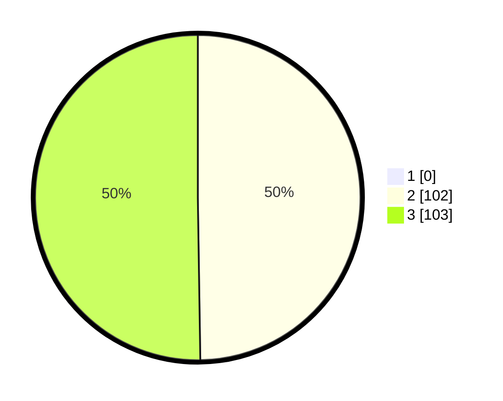

# Hasil

## Grafik

## Tabel

| No. | Nama Paslon    | Suara | Suara (raw) | Persentase |
|:--- |:-------------- | -----:| -----------:| ----------:|
| 1   | ANIES MUHAIMIN | 0     | [0][p-1]    | 0,00       |
| 2   | PRABOWO GIBRAN | 102   | [102][p-2]  | 49,76      |
| 3   | GANJAR MAHFUD  | 103   | [103][p-3]  | 50,24      |

[p-1]: https://github.com/gigit-pemilu/pemilu-2024/blob/main/pilpres/hitung-suara/sub/51-bali/sub/08-buleleng/sub/07-sawan/sub/2009-jagaraga/sub/001-tps/sub/paslon-1.txt
[p-2]: https://github.com/gigit-pemilu/pemilu-2024/blob/main/pilpres/hitung-suara/sub/51-bali/sub/08-buleleng/sub/07-sawan/sub/2009-jagaraga/sub/001-tps/sub/paslon-2.txt
[p-3]: https://github.com/gigit-pemilu/pemilu-2024/blob/main/pilpres/hitung-suara/sub/51-bali/sub/08-buleleng/sub/07-sawan/sub/2009-jagaraga/sub/001-tps/sub/paslon-3.txt

## Foto C Plano

https://sirekap-obj-formc.kpu.go.id/a0a5/pemilu/ppwp/51/08/07/20/09/5108072009001-20240214-224152--57709813-7e8a-4b38-a5dc-8413a2864818.jpg

https://sirekap-obj-formc.kpu.go.id/a0a5/pemilu/ppwp/51/08/07/20/09/5108072009001-20240214-224431--2f08358e-4924-4894-9748-731d468501c5.jpg

https://sirekap-obj-formc.kpu.go.id/a0a5/pemilu/ppwp/51/08/07/20/09/5108072009001-20240214-224542--a44dc07b-e287-4e05-a3d8-01a5087517d0.jpg

## Metadata

| Key        | Value               |
| ---------- | ------------------- |
| Time Stamp | 2024-02-24 22:31:28 |

