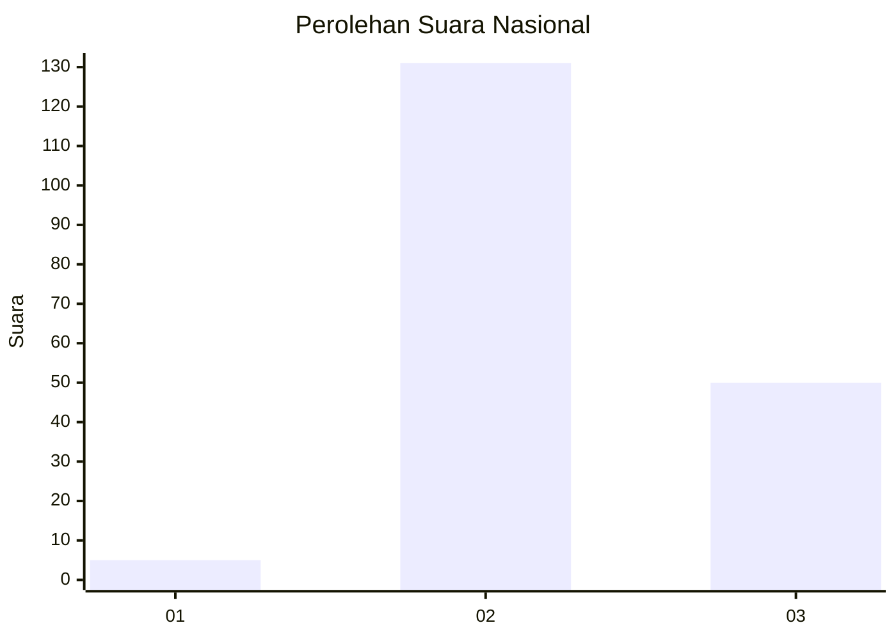
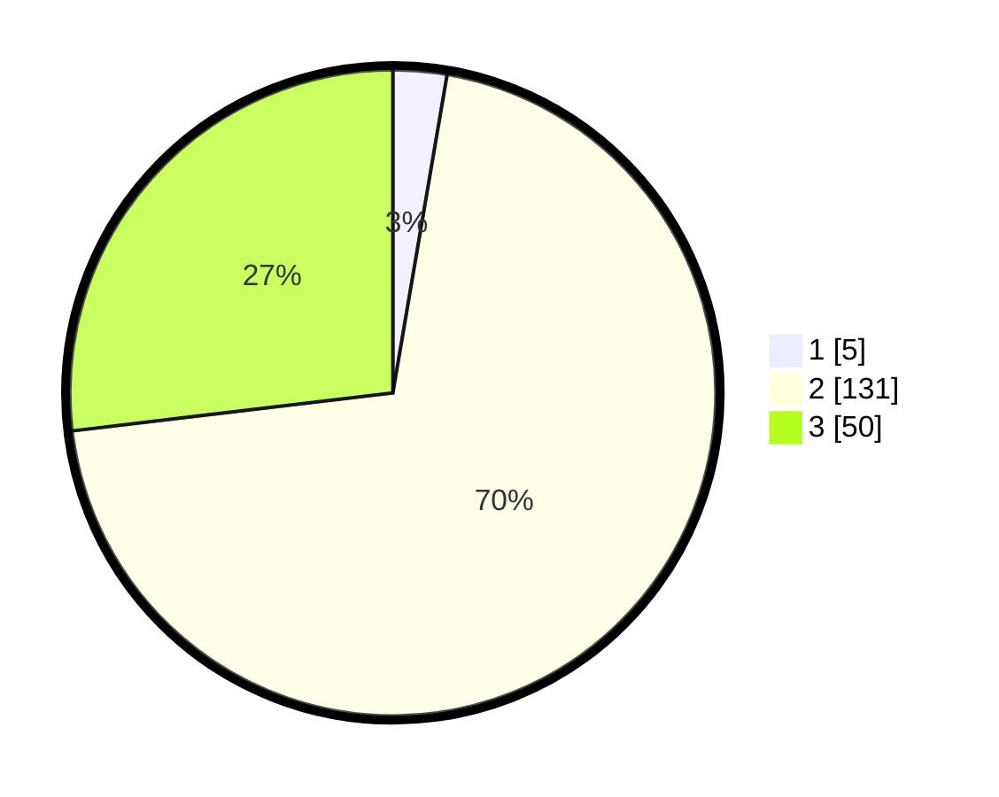

# Hasil

## Grafik

## Tabel

| No. | Nama Paslon    | Suara | Suara (raw) | Persentase |
|:--- |:-------------- | -----:| -----------:| ----------:|
| 1   | ANIES MUHAIMIN | 5     | [5][p-1]    | 2,69       |
| 2   | PRABOWO GIBRAN | 131   | [131][p-2]  | 70,43      |
| 3   | GANJAR MAHFUD  | 50    | [50][p-3]   | 26,88      |

[p-1]: https://github.com/gigit-pemilu/pemilu-2024/blob/main/pilpres/hitung-suara/sub/51-bali/sub/08-buleleng/sub/07-sawan/sub/2009-jagaraga/sub/002-tps/sub/paslon-1.txt
[p-2]: https://github.com/gigit-pemilu/pemilu-2024/blob/main/pilpres/hitung-suara/sub/51-bali/sub/08-buleleng/sub/07-sawan/sub/2009-jagaraga/sub/002-tps/sub/paslon-2.txt
[p-3]: https://github.com/gigit-pemilu/pemilu-2024/blob/main/pilpres/hitung-suara/sub/51-bali/sub/08-buleleng/sub/07-sawan/sub/2009-jagaraga/sub/002-tps/sub/paslon-3.txt

## Foto C Plano

https://sirekap-obj-formc.kpu.go.id/f728/pemilu/ppwp/51/08/07/20/09/5108072009002-20240215-004528--50a08861-e26b-4162-b40c-dea8199ea5f0.jpg

https://sirekap-obj-formc.kpu.go.id/f728/pemilu/ppwp/51/08/07/20/09/5108072009002-20240215-004739--575341ac-a308-44a7-8e19-3b177d3170b1.jpg

https://sirekap-obj-formc.kpu.go.id/f728/pemilu/ppwp/51/08/07/20/09/5108072009002-20240215-005338--b5134574-1b74-4690-aa10-13d110ed04dc.jpg

## Metadata

| Key        | Value               |
| ---------- | ------------------- |
| Time Stamp | 2024-02-24 22:31:28 |

