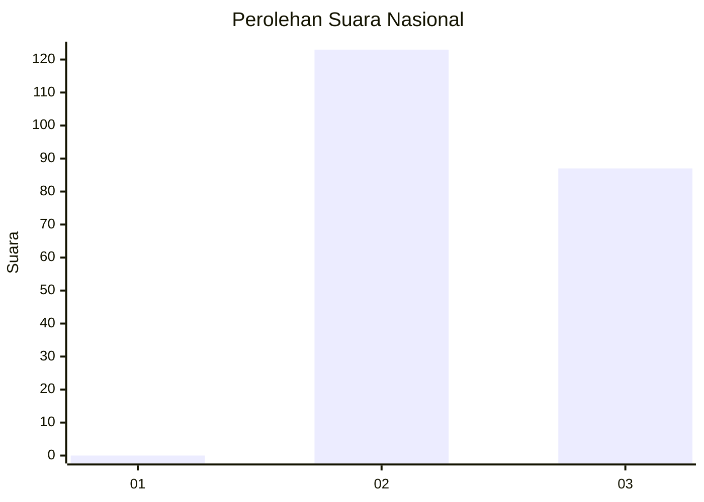
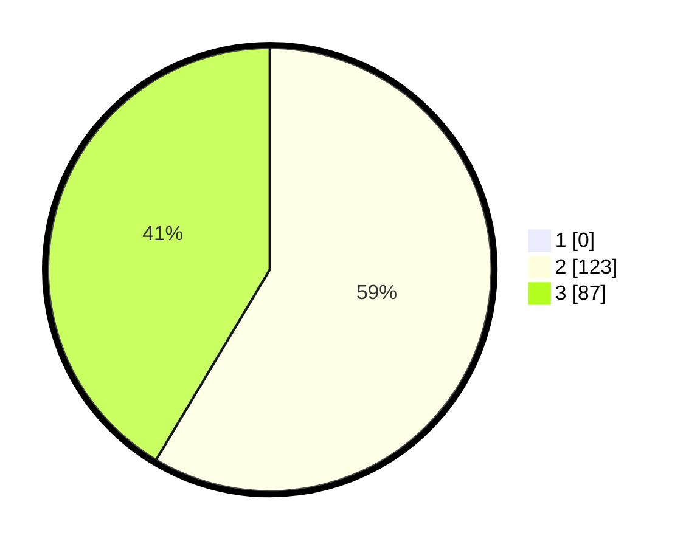

# Hasil

## Grafik

## Tabel

| No. | Nama Paslon    | Suara | Suara (raw) | Persentase |
|:--- |:-------------- | -----:| -----------:| ----------:|
| 1   | ANIES MUHAIMIN | 0     | [0][p-1]    | 0,00       |
| 2   | PRABOWO GIBRAN | 123   | [123][p-2]  | 58,57      |
| 3   | GANJAR MAHFUD  | 87    | [87][p-3]   | 41,43      |

[p-1]: https://github.com/gigit-pemilu/pemilu-2024/blob/main/pilpres/hitung-suara/sub/51-bali/sub/08-buleleng/sub/07-sawan/sub/2009-jagaraga/sub/004-tps/sub/paslon-1.txt
[p-2]: https://github.com/gigit-pemilu/pemilu-2024/blob/main/pilpres/hitung-suara/sub/51-bali/sub/08-buleleng/sub/07-sawan/sub/2009-jagaraga/sub/004-tps/sub/paslon-2.txt
[p-3]: https://github.com/gigit-pemilu/pemilu-2024/blob/main/pilpres/hitung-suara/sub/51-bali/sub/08-buleleng/sub/07-sawan/sub/2009-jagaraga/sub/004-tps/sub/paslon-3.txt

## Foto C Plano

https://sirekap-obj-formc.kpu.go.id/0197/pemilu/ppwp/51/08/07/20/09/5108072009004-20240214-233756--25343d7e-2a36-4ace-a973-defd09e05efd.jpg

https://sirekap-obj-formc.kpu.go.id/0197/pemilu/ppwp/51/08/07/20/09/5108072009004-20240214-233559--a5f180bb-0432-4259-8e24-2dfdec16b86d.jpg

https://sirekap-obj-formc.kpu.go.id/0197/pemilu/ppwp/51/08/07/20/09/5108072009004-20240214-234059--08d3e83b-60c4-43d9-bdc0-8a53d51c8183.jpg

## Metadata

| Key        | Value               |
| ---------- | ------------------- |
| Time Stamp | 2024-02-15 16:00:26 |

