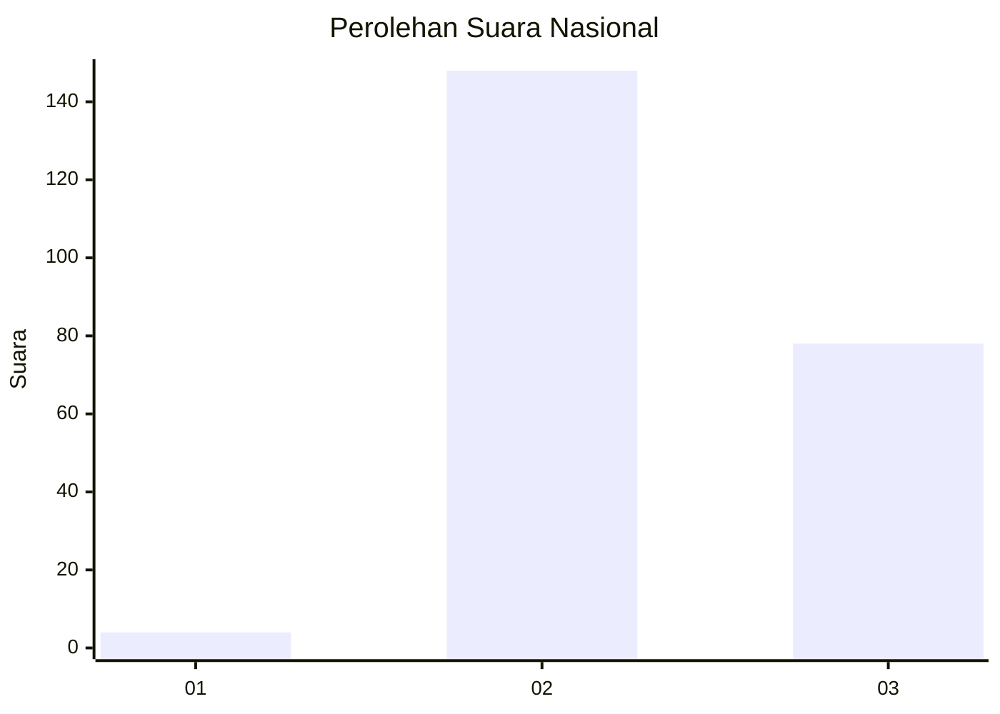
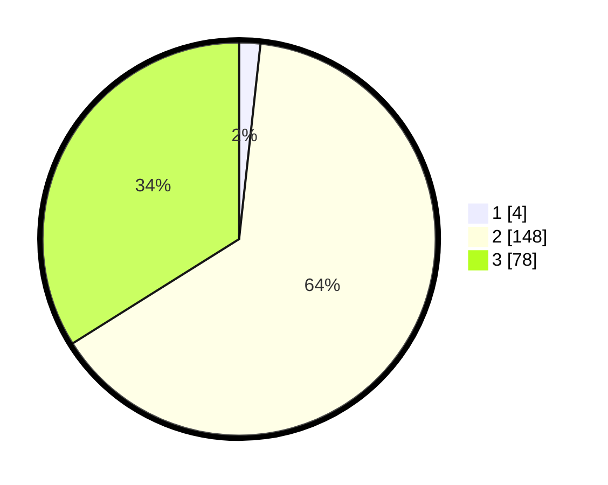

# Hasil

## Grafik

## Tabel

| No. | Nama Paslon    | Suara | Suara (raw) | Persentase |
|:--- |:-------------- | -----:| -----------:| ----------:|
| 1   | ANIES MUHAIMIN | 4     | [4][p-1]    | 1,74       |
| 2   | PRABOWO GIBRAN | 148   | [148][p-2]  | 64,35      |
| 3   | GANJAR MAHFUD  | 78    | [78][p-3]   | 33,91      |

[p-1]: https://github.com/gigit-pemilu/pemilu-2024/blob/main/pilpres/hitung-suara/sub/51-bali/sub/08-buleleng/sub/07-sawan/sub/2009-jagaraga/sub/006-tps/sub/paslon-1.txt
[p-2]: https://github.com/gigit-pemilu/pemilu-2024/blob/main/pilpres/hitung-suara/sub/51-bali/sub/08-buleleng/sub/07-sawan/sub/2009-jagaraga/sub/006-tps/sub/paslon-2.txt
[p-3]: https://github.com/gigit-pemilu/pemilu-2024/blob/main/pilpres/hitung-suara/sub/51-bali/sub/08-buleleng/sub/07-sawan/sub/2009-jagaraga/sub/006-tps/sub/paslon-3.txt

## Foto C Plano

https://sirekap-obj-formc.kpu.go.id/1bdb/pemilu/ppwp/51/08/07/20/09/5108072009006-20240214-221206--2bedb954-e6fe-46df-b1cc-22d5a1cda6a7.jpg

https://sirekap-obj-formc.kpu.go.id/1bdb/pemilu/ppwp/51/08/07/20/09/5108072009006-20240215-012020--1e7c4724-b1ad-4fa8-9fda-0fbf034c9262.jpg

https://sirekap-obj-formc.kpu.go.id/1bdb/pemilu/ppwp/51/08/07/20/09/5108072009006-20240214-222158--bbedf059-bd5f-4b8a-914d-cc79b83d384b.jpg

## Metadata

| Key        | Value               |
| ---------- | ------------------- |
| Time Stamp | 2024-02-15 15:00:29 |

