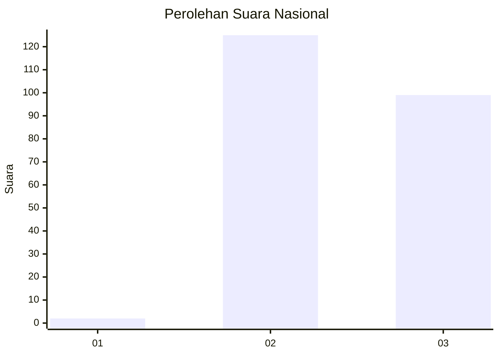
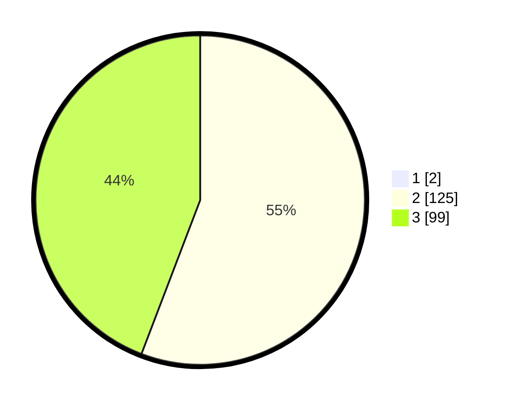

# Hasil

## Grafik

## Tabel

| No. | Nama Paslon    | Suara | Suara (raw) | Persentase |
|:--- |:-------------- | -----:| -----------:| ----------:|
| 1   | ANIES MUHAIMIN | 2     | [2][p-1]    | 0,88       |
| 2   | PRABOWO GIBRAN | 125   | [125][p-2]  | 55,31      |
| 3   | GANJAR MAHFUD  | 99    | [99][p-3]   | 43,81      |

[p-1]: https://github.com/gigit-pemilu/pemilu-2024/blob/main/pilpres/hitung-suara/sub/51-bali/sub/08-buleleng/sub/07-sawan/sub/2009-jagaraga/sub/007-tps/sub/paslon-1.txt
[p-2]: https://github.com/gigit-pemilu/pemilu-2024/blob/main/pilpres/hitung-suara/sub/51-bali/sub/08-buleleng/sub/07-sawan/sub/2009-jagaraga/sub/007-tps/sub/paslon-2.txt
[p-3]: https://github.com/gigit-pemilu/pemilu-2024/blob/main/pilpres/hitung-suara/sub/51-bali/sub/08-buleleng/sub/07-sawan/sub/2009-jagaraga/sub/007-tps/sub/paslon-3.txt

## Foto C Plano

https://sirekap-obj-formc.kpu.go.id/97f5/pemilu/ppwp/51/08/07/20/09/5108072009007-20240214-221538--4623c478-5ab9-4045-8faa-c607931a77d3.jpg

https://sirekap-obj-formc.kpu.go.id/97f5/pemilu/ppwp/51/08/07/20/09/5108072009007-20240214-224300--14e2754c-47ec-48ba-9da3-c6d9de040ebf.jpg

https://sirekap-obj-formc.kpu.go.id/97f5/pemilu/ppwp/51/08/07/20/09/5108072009007-20240214-224535--2b9afa61-a5fa-47aa-8215-46646c96ba82.jpg

## Metadata

| Key        | Value               |
| ---------- | ------------------- |
| Time Stamp | 2024-02-24 22:31:28 |

