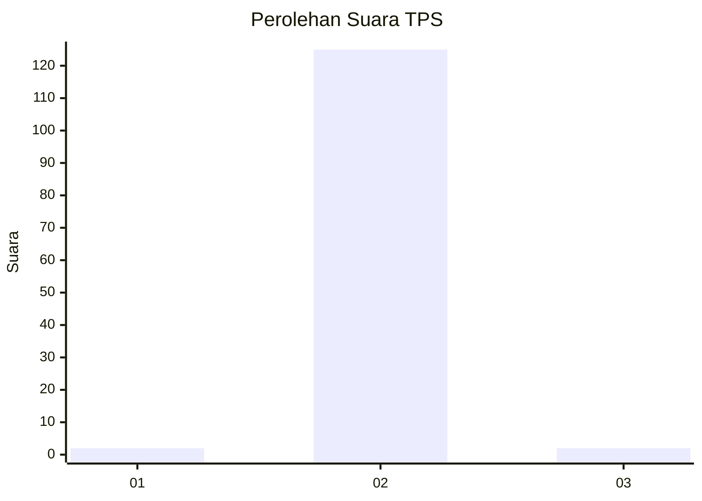
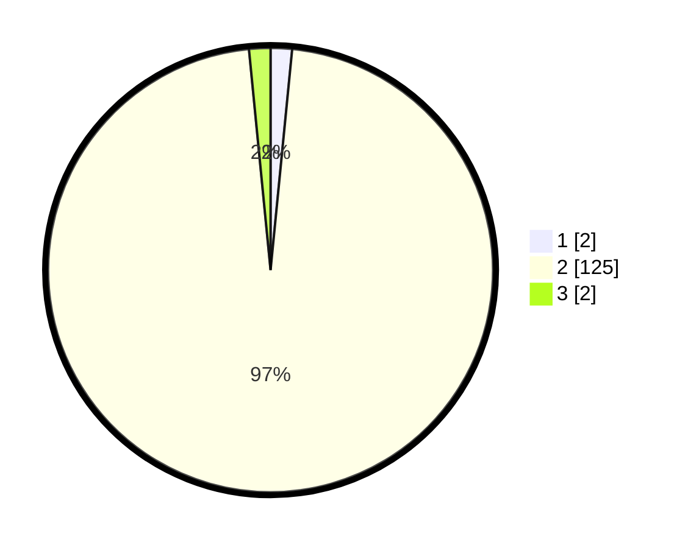

# Hasil

## Grafik

## Tabel

| No. | Nama Paslon    | Suara | Suara (raw) | Persentase |
|:--- |:-------------- | -----:| -----------:| ----------:|
| 1   | ANIES MUHAIMIN | 2     | [2][p-1]    | 1,55       |
| 2   | PRABOWO GIBRAN | 125   | [125][p-2]  | 96,90      |
| 3   | GANJAR MAHFUD  | 2     | [2][p-3]    | 1,55       |

[p-1]: https://github.com/gigit-pemilu/pemilu-2024-51-bali/blob/main/pilpres/hitung-suara/sub/51-bali/sub/08-buleleng/sub/07-sawan/sub/2009-jagaraga/sub/008-tps/sub/paslon-1.txt
[p-2]: https://github.com/gigit-pemilu/pemilu-2024-51-bali/blob/main/pilpres/hitung-suara/sub/51-bali/sub/08-buleleng/sub/07-sawan/sub/2009-jagaraga/sub/008-tps/sub/paslon-2.txt
[p-3]: https://github.com/gigit-pemilu/pemilu-2024-51-bali/blob/main/pilpres/hitung-suara/sub/51-bali/sub/08-buleleng/sub/07-sawan/sub/2009-jagaraga/sub/008-tps/sub/paslon-3.txt

## Foto C Plano

https://sirekap-obj-formc.kpu.go.id/503e/pemilu/ppwp/51/08/07/20/09/5108072009008-20240214-223634--03875a59-b164-40d6-a012-c7f2cd09ec34.jpg

https://sirekap-obj-formc.kpu.go.id/503e/pemilu/ppwp/51/08/07/20/09/5108072009008-20240214-223726--50ad6465-378b-49f4-bd16-49c6be728ed7.jpg

https://sirekap-obj-formc.kpu.go.id/503e/pemilu/ppwp/51/08/07/20/09/5108072009008-20240214-223947--9faceac5-63a0-4991-83ac-6e152beee281.jpg

## Metadata

| Key        | Value               |
| ---------- | ------------------- |
| Time Stamp | 2024-02-24 22:31:28 |

