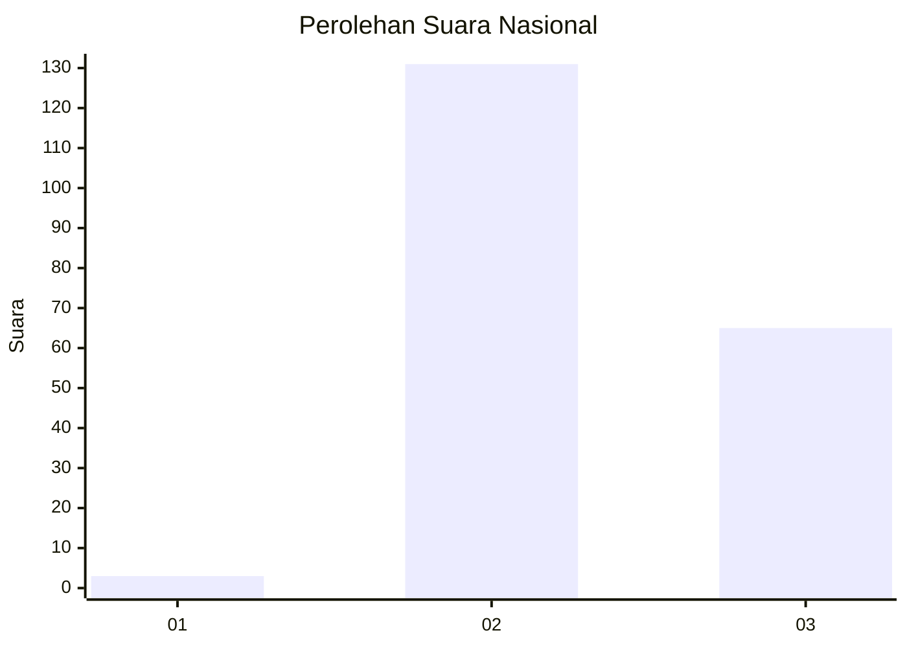
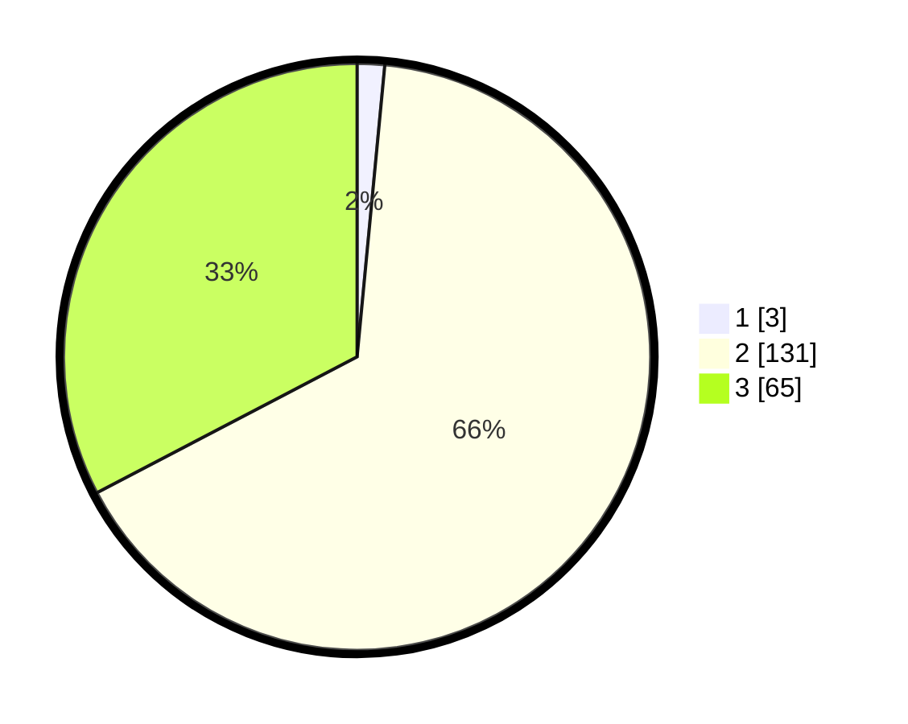

# Hasil

## Grafik

## Tabel

| No. | Nama Paslon    | Suara | Suara (raw) | Persentase |
|:--- |:-------------- | -----:| -----------:| ----------:|
| 1   | ANIES MUHAIMIN | 3     | [3][p-1]    | 1,51       |
| 2   | PRABOWO GIBRAN | 131   | [131][p-2]  | 65,83      |
| 3   | GANJAR MAHFUD  | 65    | [65][p-3]   | 32,66      |

[p-1]: https://github.com/gigit-pemilu/pemilu-2024/blob/main/pilpres/hitung-suara/sub/51-bali/sub/08-buleleng/sub/07-sawan/sub/2009-jagaraga/sub/009-tps/sub/paslon-1.txt
[p-2]: https://github.com/gigit-pemilu/pemilu-2024/blob/main/pilpres/hitung-suara/sub/51-bali/sub/08-buleleng/sub/07-sawan/sub/2009-jagaraga/sub/009-tps/sub/paslon-2.txt
[p-3]: https://github.com/gigit-pemilu/pemilu-2024/blob/main/pilpres/hitung-suara/sub/51-bali/sub/08-buleleng/sub/07-sawan/sub/2009-jagaraga/sub/009-tps/sub/paslon-3.txt

## Foto C Plano

https://sirekap-obj-formc.kpu.go.id/011b/pemilu/ppwp/51/08/07/20/09/5108072009009-20240214-193822--d6257a8c-3706-43b4-ba19-c29b9ee40f81.jpg

https://sirekap-obj-formc.kpu.go.id/011b/pemilu/ppwp/51/08/07/20/09/5108072009009-20240214-193941--d37e69f6-67a1-45e2-a470-be02539f3133.jpg

https://sirekap-obj-formc.kpu.go.id/011b/pemilu/ppwp/51/08/07/20/09/5108072009009-20240214-194103--03aefd39-e51d-465a-ad91-74d138f9ce0e.jpg

## Metadata

| Key        | Value               |
| ---------- | ------------------- |
| Time Stamp | 2024-02-24 22:31:28 |

