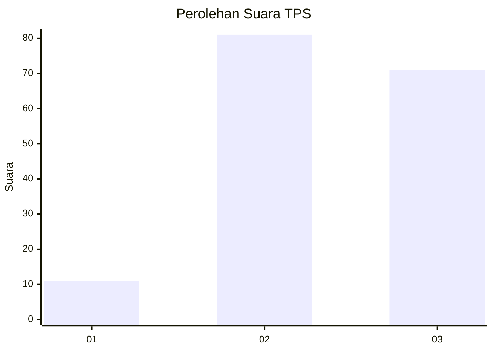
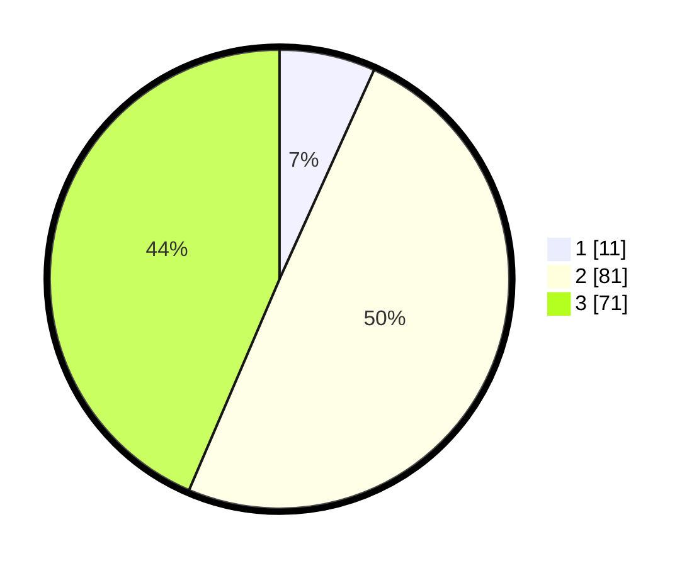

# Hasil

## Grafik

## Tabel

| No. | Nama Paslon    | Suara | Suara (raw) | Persentase |
|:--- |:-------------- | -----:| -----------:| ----------:|
| 1   | ANIES MUHAIMIN | 11    | [11][p-1]   | 6,75       |
| 2   | PRABOWO GIBRAN | 81    | [81][p-2]   | 49,69      |
| 3   | GANJAR MAHFUD  | 71    | [71][p-3]   | 43,56      |

[p-1]: https://github.com/gigit-pemilu/pemilu-2024-51-bali/blob/main/pilpres/hitung-suara/sub/51-bali/sub/08-buleleng/sub/07-sawan/sub/2009-jagaraga/sub/011-tps/sub/paslon-1.txt
[p-2]: https://github.com/gigit-pemilu/pemilu-2024-51-bali/blob/main/pilpres/hitung-suara/sub/51-bali/sub/08-buleleng/sub/07-sawan/sub/2009-jagaraga/sub/011-tps/sub/paslon-2.txt
[p-3]: https://github.com/gigit-pemilu/pemilu-2024-51-bali/blob/main/pilpres/hitung-suara/sub/51-bali/sub/08-buleleng/sub/07-sawan/sub/2009-jagaraga/sub/011-tps/sub/paslon-3.txt

## Foto C Plano

https://sirekap-obj-formc.kpu.go.id/6903/pemilu/ppwp/51/08/07/20/09/5108072009011-20240214-213526--ffd3b40a-e85d-446a-8321-2a9e09b2ce99.jpg

https://sirekap-obj-formc.kpu.go.id/6903/pemilu/ppwp/51/08/07/20/09/5108072009011-20240214-213532--fa11bbb4-4817-41c7-957c-7cafe389c08b.jpg

https://sirekap-obj-formc.kpu.go.id/6903/pemilu/ppwp/51/08/07/20/09/5108072009011-20240214-213538--44fed36b-ffbe-4c70-a43e-6fd728da6850.jpg

## Metadata

| Key        | Value               |
| ---------- | ------------------- |
| Time Stamp | 2024-02-19 06:16:00 |

## DATA PEMILIH TETAP

Jumlah pemilih dalam DPT: **237**.
 * L: **114**.
 * P: **123**.

## DATA PENGGUNA HAK PILIH

Jumlah pengguna hak pilih dalam DPT: **156**.
 * L: **74**.
 * P: **82**.

Jumlah pengguna hak pilih dalam DPTb: **1**.
 * L: **1**.
 * P: **0**.

Jumlah pengguna hak pilih dalam DPK: **9**.
 * L: **6**.
 * P: **3**.

Jumlah pengguna hak pilih: **166**.
 * L: **81**.
 * P: **85**.

## JUMLAH SUARA SAH DAN TIDAK SAH

JUMLAH SELURUH SUARA SAH: **163**.

JUMLAH SUARA TIDAK SAH: **3**.

JUMLAH SELURUH SUARA SAH DAN SUARA TIDAK SAH: **166**.

