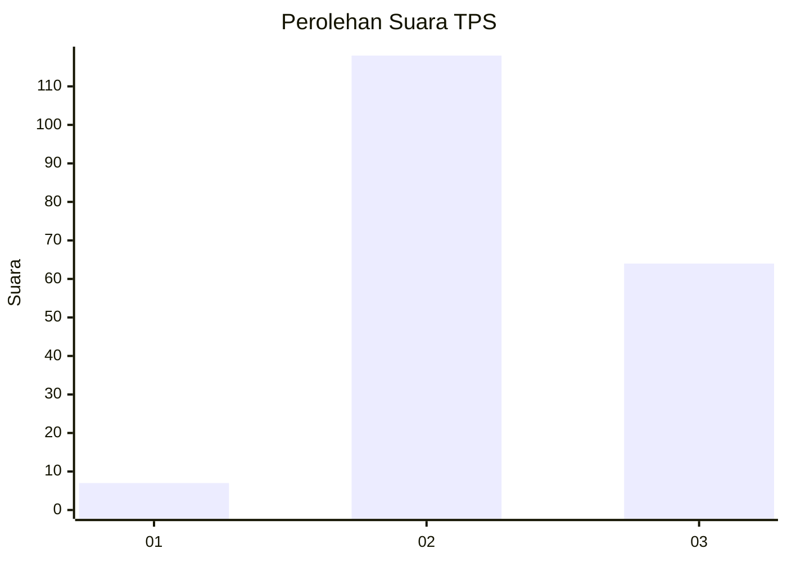
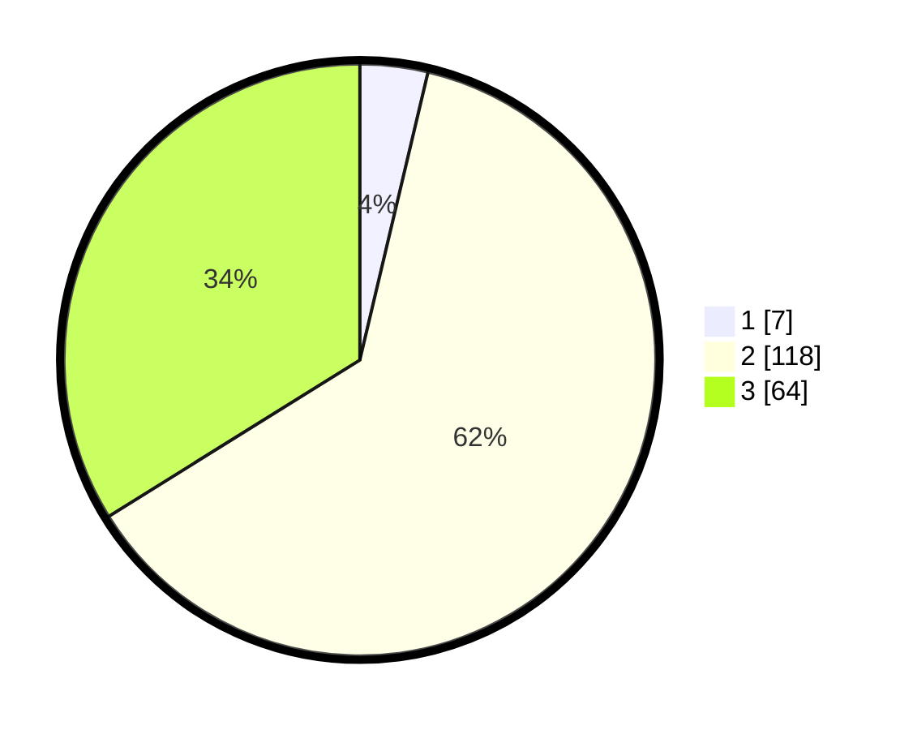

# Hasil

## Grafik

## Tabel

| No. | Nama Paslon    | Suara | Suara (raw) | Persentase |
|:--- |:-------------- | -----:| -----------:| ----------:|
| 1   | ANIES MUHAIMIN | 7     | [7][p-1]    | 3,70       |
| 2   | PRABOWO GIBRAN | 118   | [118][p-2]  | 62,43      |
| 3   | GANJAR MAHFUD  | 64    | [64][p-3]   | 33,86      |

[p-1]: https://github.com/gigit-pemilu/pemilu-2024-51-bali/blob/main/pilpres/hitung-suara/sub/51-bali/sub/08-buleleng/sub/07-sawan/sub/2010-sinabun/sub/002-tps/sub/paslon-1.txt
[p-2]: https://github.com/gigit-pemilu/pemilu-2024-51-bali/blob/main/pilpres/hitung-suara/sub/51-bali/sub/08-buleleng/sub/07-sawan/sub/2010-sinabun/sub/002-tps/sub/paslon-2.txt
[p-3]: https://github.com/gigit-pemilu/pemilu-2024-51-bali/blob/main/pilpres/hitung-suara/sub/51-bali/sub/08-buleleng/sub/07-sawan/sub/2010-sinabun/sub/002-tps/sub/paslon-3.txt

## Foto C Plano

https://sirekap-obj-formc.kpu.go.id/8716/pemilu/ppwp/51/08/07/20/10/5108072010002-20240214-220837--50de6538-1e2d-48b4-b3e8-3b9fb84f394f.jpg

https://sirekap-obj-formc.kpu.go.id/8716/pemilu/ppwp/51/08/07/20/10/5108072010002-20240214-220938--45a1302c-e6ac-4e02-90e5-6fec45e2cdfe.jpg

https://sirekap-obj-formc.kpu.go.id/8716/pemilu/ppwp/51/08/07/20/10/5108072010002-20240214-221050--59f4f7af-657a-4a2a-aa81-47df8e6d8a24.jpg

## Metadata

| Key        | Value               |
| ---------- | ------------------- |
| Time Stamp | 2024-02-24 22:31:28 |

