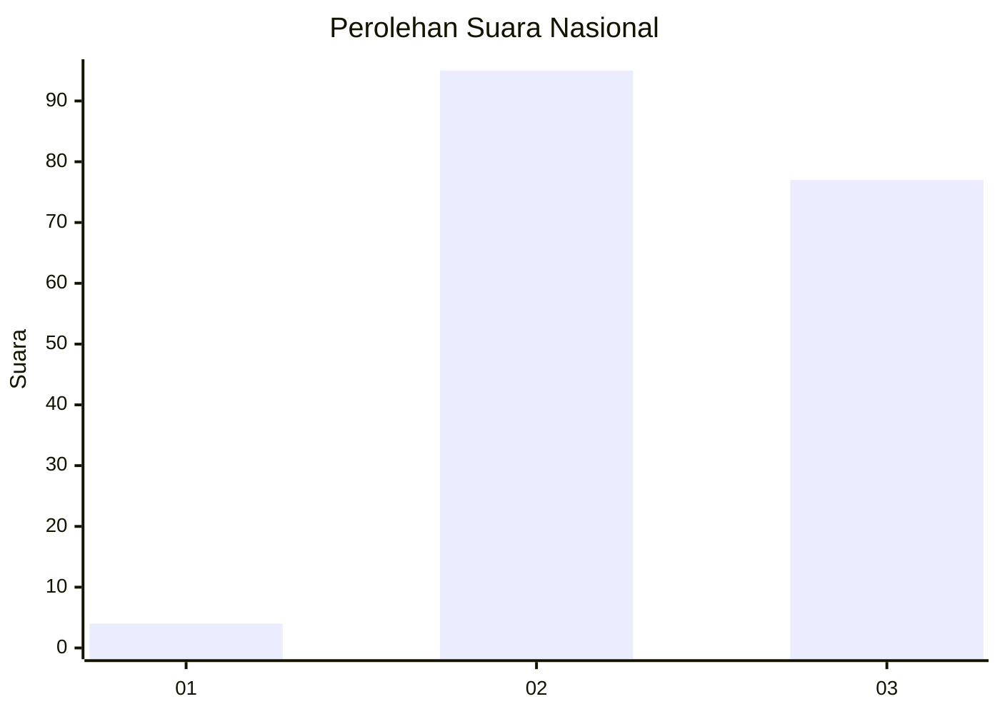
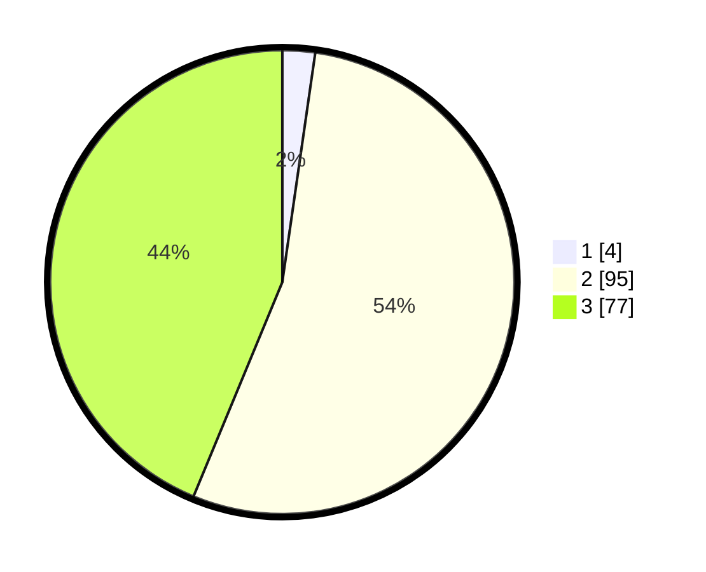

# Hasil

## Grafik

## Tabel

| No. | Nama Paslon    | Suara | Suara (raw) | Persentase |
|:--- |:-------------- | -----:| -----------:| ----------:|
| 1   | ANIES MUHAIMIN | 4     | [4][p-1]    | 2,27       |
| 2   | PRABOWO GIBRAN | 95    | [95][p-2]   | 53,98      |
| 3   | GANJAR MAHFUD  | 77    | [77][p-3]   | 43,75      |

[p-1]: https://github.com/gigit-pemilu/pemilu-2024/blob/main/pilpres/hitung-suara/sub/51-bali/sub/08-buleleng/sub/07-sawan/sub/2010-sinabun/sub/005-tps/sub/paslon-1.txt
[p-2]: https://github.com/gigit-pemilu/pemilu-2024/blob/main/pilpres/hitung-suara/sub/51-bali/sub/08-buleleng/sub/07-sawan/sub/2010-sinabun/sub/005-tps/sub/paslon-2.txt
[p-3]: https://github.com/gigit-pemilu/pemilu-2024/blob/main/pilpres/hitung-suara/sub/51-bali/sub/08-buleleng/sub/07-sawan/sub/2010-sinabun/sub/005-tps/sub/paslon-3.txt

## Foto C Plano

https://sirekap-obj-formc.kpu.go.id/b2db/pemilu/ppwp/51/08/07/20/10/5108072010005-20240214-223006--9d5d4031-a9fa-4b8b-80b0-7c11441b1dcc.jpg

https://sirekap-obj-formc.kpu.go.id/b2db/pemilu/ppwp/51/08/07/20/10/5108072010005-20240215-001604--e2f899a3-4f03-452a-8c37-edd63d00d3c8.jpg

https://sirekap-obj-formc.kpu.go.id/b2db/pemilu/ppwp/51/08/07/20/10/5108072010005-20240215-001718--4db7ce17-c9c1-4989-b66d-7bd0306bfa5e.jpg

## Metadata

| Key        | Value               |
| ---------- | ------------------- |
| Time Stamp | 2024-02-24 22:31:28 |

