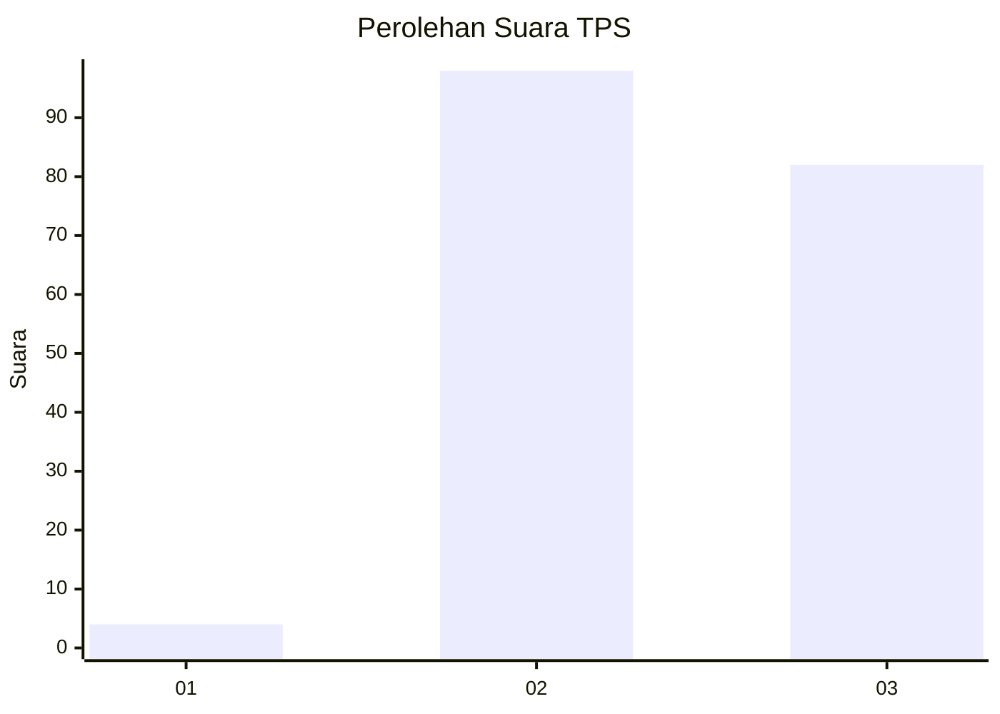
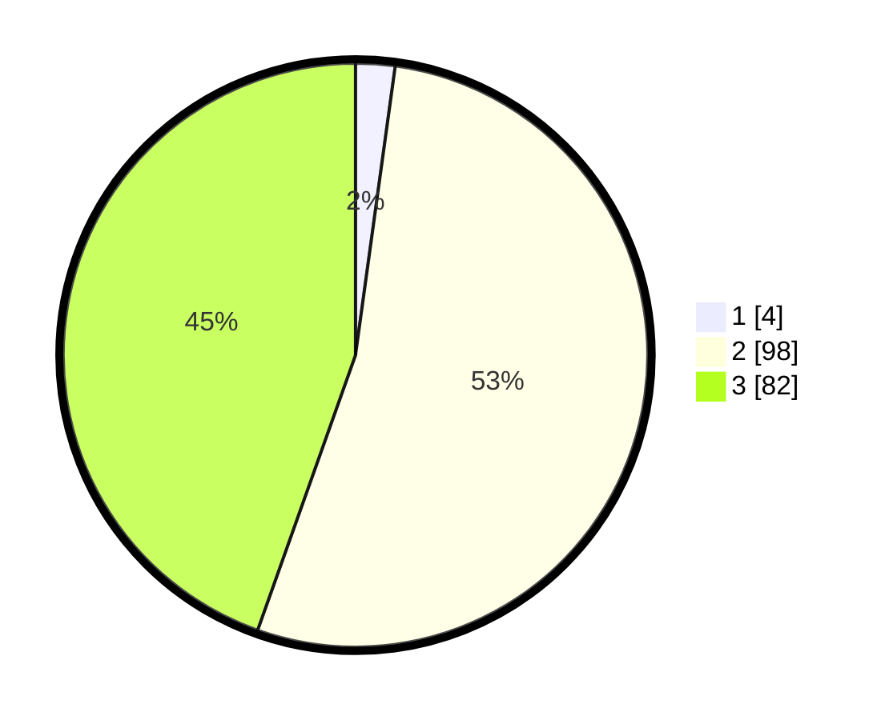

# Hasil

## Grafik

## Tabel

| No. | Nama Paslon    | Suara | Suara (raw) | Persentase |
|:--- |:-------------- | -----:| -----------:| ----------:|
| 1   | ANIES MUHAIMIN | 4     | [4][p-1]    | 2,17       |
| 2   | PRABOWO GIBRAN | 98    | [98][p-2]   | 53,26      |
| 3   | GANJAR MAHFUD  | 82    | [82][p-3]   | 44,57      |

[p-1]: https://github.com/gigit-pemilu/pemilu-2024-51-bali/blob/main/pilpres/hitung-suara/sub/51-bali/sub/08-buleleng/sub/07-sawan/sub/2010-sinabun/sub/008-tps/sub/paslon-1.txt
[p-2]: https://github.com/gigit-pemilu/pemilu-2024-51-bali/blob/main/pilpres/hitung-suara/sub/51-bali/sub/08-buleleng/sub/07-sawan/sub/2010-sinabun/sub/008-tps/sub/paslon-2.txt
[p-3]: https://github.com/gigit-pemilu/pemilu-2024-51-bali/blob/main/pilpres/hitung-suara/sub/51-bali/sub/08-buleleng/sub/07-sawan/sub/2010-sinabun/sub/008-tps/sub/paslon-3.txt

## Foto C Plano

https://sirekap-obj-formc.kpu.go.id/db21/pemilu/ppwp/51/08/07/20/10/5108072010008-20240214-140956--bfbffb2d-964f-4715-8aa3-2cf6e1d6fe72.jpg

https://sirekap-obj-formc.kpu.go.id/db21/pemilu/ppwp/51/08/07/20/10/5108072010008-20240214-225238--b6ddd917-ea88-448c-a126-7804292bc599.jpg

https://sirekap-obj-formc.kpu.go.id/db21/pemilu/ppwp/51/08/07/20/10/5108072010008-20240214-225340--1d899eb4-4506-4a9a-8292-15424498f202.jpg

## Metadata

| Key        | Value               |
| ---------- | ------------------- |
| Time Stamp | 2024-02-24 22:31:28 |

