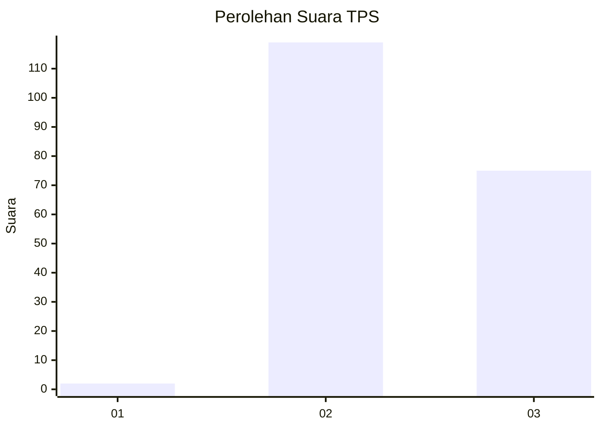
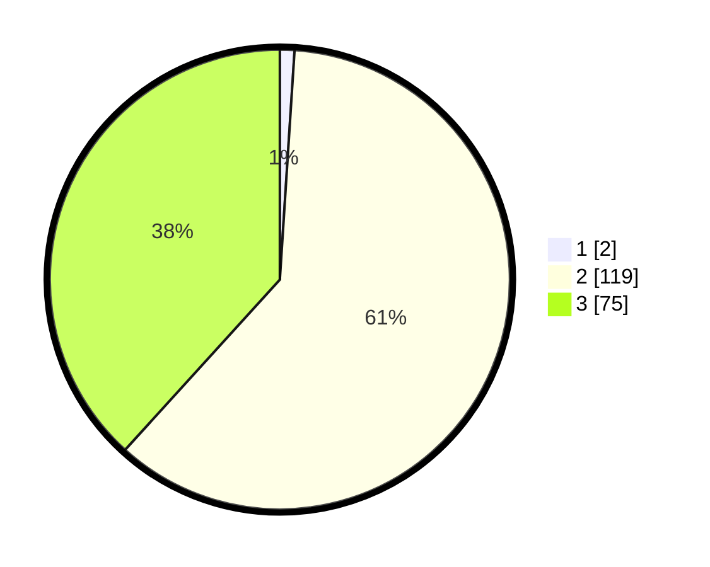

# Hasil

## Grafik

## Tabel

| No. | Nama Paslon    | Suara | Suara (raw) | Persentase |
|:--- |:-------------- | -----:| -----------:| ----------:|
| 1   | ANIES MUHAIMIN | 2     | [2][p-1]    | 1,02       |
| 2   | PRABOWO GIBRAN | 119   | [119][p-2]  | 60,71      |
| 3   | GANJAR MAHFUD  | 75    | [75][p-3]   | 38,27      |

[p-1]: https://github.com/gigit-pemilu/pemilu-2024-51-bali/blob/main/pilpres/hitung-suara/sub/51-bali/sub/08-buleleng/sub/07-sawan/sub/2010-sinabun/sub/012-tps/sub/paslon-1.txt
[p-2]: https://github.com/gigit-pemilu/pemilu-2024-51-bali/blob/main/pilpres/hitung-suara/sub/51-bali/sub/08-buleleng/sub/07-sawan/sub/2010-sinabun/sub/012-tps/sub/paslon-2.txt
[p-3]: https://github.com/gigit-pemilu/pemilu-2024-51-bali/blob/main/pilpres/hitung-suara/sub/51-bali/sub/08-buleleng/sub/07-sawan/sub/2010-sinabun/sub/012-tps/sub/paslon-3.txt

## Foto C Plano

https://sirekap-obj-formc.kpu.go.id/ce76/pemilu/ppwp/51/08/07/20/10/5108072010012-20240214-141006--db17ae9c-bb70-4459-b050-28bea97555be.jpg

https://sirekap-obj-formc.kpu.go.id/ce76/pemilu/ppwp/51/08/07/20/10/5108072010012-20240214-141209--1bcd78ee-df0a-4c34-9858-88039d2aceef.jpg

https://sirekap-obj-formc.kpu.go.id/ce76/pemilu/ppwp/51/08/07/20/10/5108072010012-20240214-141349--9db0d860-8676-4af1-b213-deb6cee47d99.jpg

## Metadata

| Key        | Value               |
| ---------- | ------------------- |
| Time Stamp | 2024-02-14 21:46:01 |

