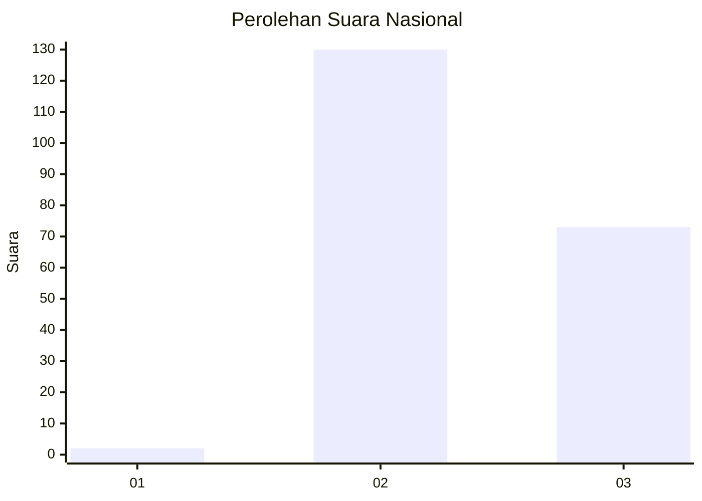
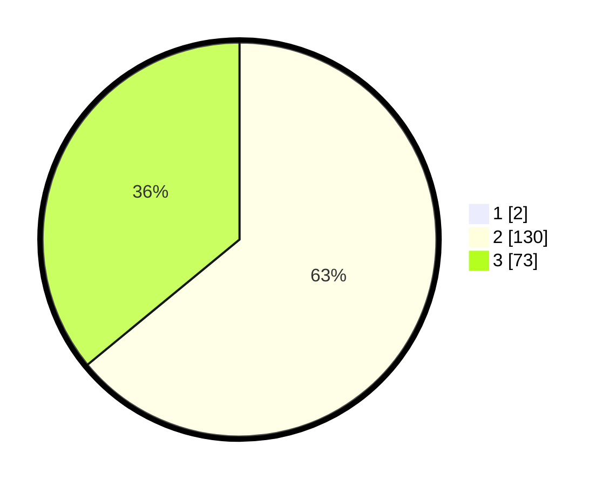

# Hasil

## Grafik

## Tabel

| No. | Nama Paslon    | Suara | Suara (raw) | Persentase |
|:--- |:-------------- | -----:| -----------:| ----------:|
| 1   | ANIES MUHAIMIN | 2     | [2][p-1]    | 0,98       |
| 2   | PRABOWO GIBRAN | 130   | [130][p-2]  | 63,41      |
| 3   | GANJAR MAHFUD  | 73    | [73][p-3]   | 35,61      |

[p-1]: https://github.com/gigit-pemilu/pemilu-2024/blob/main/pilpres/hitung-suara/sub/51-bali/sub/08-buleleng/sub/07-sawan/sub/2010-sinabun/sub/013-tps/sub/paslon-1.txt
[p-2]: https://github.com/gigit-pemilu/pemilu-2024/blob/main/pilpres/hitung-suara/sub/51-bali/sub/08-buleleng/sub/07-sawan/sub/2010-sinabun/sub/013-tps/sub/paslon-2.txt
[p-3]: https://github.com/gigit-pemilu/pemilu-2024/blob/main/pilpres/hitung-suara/sub/51-bali/sub/08-buleleng/sub/07-sawan/sub/2010-sinabun/sub/013-tps/sub/paslon-3.txt

## Foto C Plano

https://sirekap-obj-formc.kpu.go.id/2835/pemilu/ppwp/51/08/07/20/10/5108072010013-20240214-220152--95cb7162-b59a-43d3-9751-c60ff274af5c.jpg

https://sirekap-obj-formc.kpu.go.id/2835/pemilu/ppwp/51/08/07/20/10/5108072010013-20240214-221019--646a638e-e528-4ca4-9da3-08d82e31e64b.jpg

https://sirekap-obj-formc.kpu.go.id/2835/pemilu/ppwp/51/08/07/20/10/5108072010013-20240214-221318--77317099-1211-4513-91cd-7604a81faa09.jpg

## Metadata

| Key        | Value               |
| ---------- | ------------------- |
| Time Stamp | 2024-02-24 22:31:28 |

