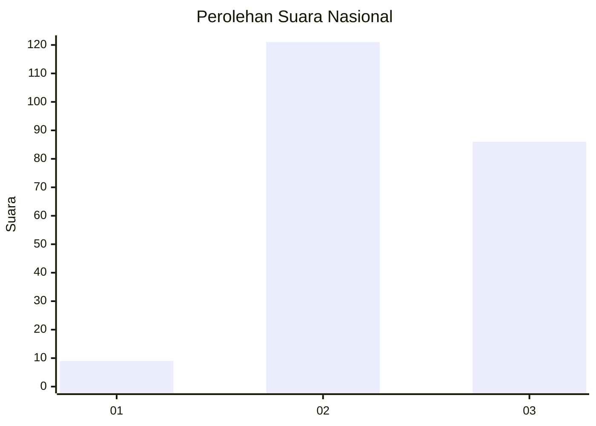
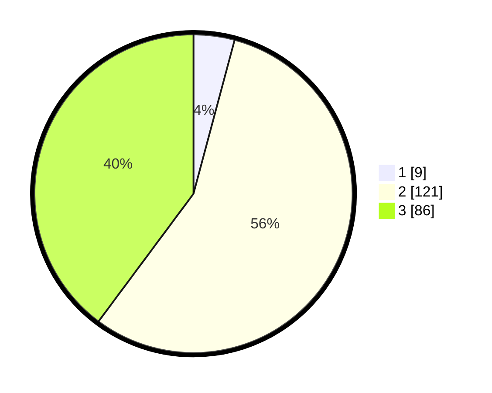

# Hasil

## Grafik

## Tabel

| No. | Nama Paslon    | Suara | Suara (raw) | Persentase |
|:--- |:-------------- | -----:| -----------:| ----------:|
| 1   | ANIES MUHAIMIN | 9     | [9][p-1]    | 4,17       |
| 2   | PRABOWO GIBRAN | 121   | [121][p-2]  | 56,02      |
| 3   | GANJAR MAHFUD  | 86    | [86][p-3]   | 39,81      |

[p-1]: https://github.com/gigit-pemilu/pemilu-2024/blob/main/pilpres/hitung-suara/sub/51-bali/sub/08-buleleng/sub/07-sawan/sub/2010-sinabun/sub/014-tps/sub/paslon-1.txt
[p-2]: https://github.com/gigit-pemilu/pemilu-2024/blob/main/pilpres/hitung-suara/sub/51-bali/sub/08-buleleng/sub/07-sawan/sub/2010-sinabun/sub/014-tps/sub/paslon-2.txt
[p-3]: https://github.com/gigit-pemilu/pemilu-2024/blob/main/pilpres/hitung-suara/sub/51-bali/sub/08-buleleng/sub/07-sawan/sub/2010-sinabun/sub/014-tps/sub/paslon-3.txt

## Foto C Plano

https://sirekap-obj-formc.kpu.go.id/1dfc/pemilu/ppwp/51/08/07/20/10/5108072010014-20240214-141349--5daea0fc-e734-408b-8142-f0c978add5f2.jpg

https://sirekap-obj-formc.kpu.go.id/1dfc/pemilu/ppwp/51/08/07/20/10/5108072010014-20240214-141115--44136a7b-1a4c-4ecb-95ba-f461d0f2336e.jpg

https://sirekap-obj-formc.kpu.go.id/1dfc/pemilu/ppwp/51/08/07/20/10/5108072010014-20240214-141641--fb8dcf5d-b191-4aef-83db-f8f871395d0f.jpg

## Metadata

| Key        | Value               |
| ---------- | ------------------- |
| Time Stamp | 2024-02-14 21:46:01 |

