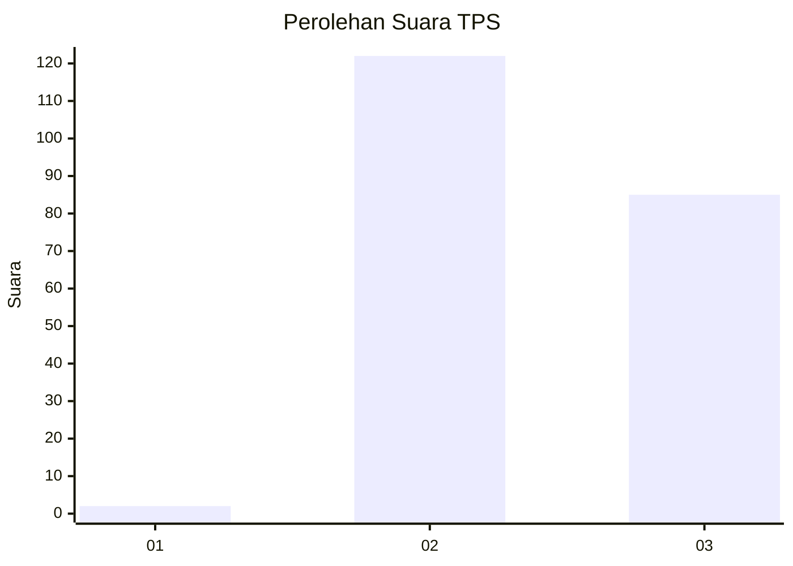
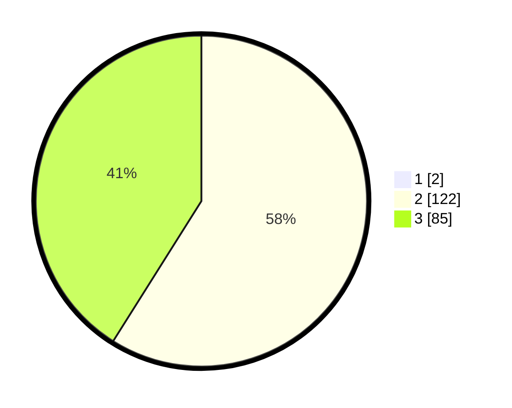

# Hasil

## Grafik

## Tabel

| No. | Nama Paslon    | Suara | Suara (raw) | Persentase |
|:--- |:-------------- | -----:| -----------:| ----------:|
| 1   | ANIES MUHAIMIN | 2     | [2][p-1]    | 0,96       |
| 2   | PRABOWO GIBRAN | 122   | [122][p-2]  | 58,37      |
| 3   | GANJAR MAHFUD  | 85    | [85][p-3]   | 40,67      |

[p-1]: https://github.com/gigit-pemilu/pemilu-2024-51-bali/blob/main/pilpres/hitung-suara/sub/51-bali/sub/08-buleleng/sub/07-sawan/sub/2010-sinabun/sub/015-tps/sub/paslon-1.txt
[p-2]: https://github.com/gigit-pemilu/pemilu-2024-51-bali/blob/main/pilpres/hitung-suara/sub/51-bali/sub/08-buleleng/sub/07-sawan/sub/2010-sinabun/sub/015-tps/sub/paslon-2.txt
[p-3]: https://github.com/gigit-pemilu/pemilu-2024-51-bali/blob/main/pilpres/hitung-suara/sub/51-bali/sub/08-buleleng/sub/07-sawan/sub/2010-sinabun/sub/015-tps/sub/paslon-3.txt

## Foto C Plano

https://sirekap-obj-formc.kpu.go.id/88c1/pemilu/ppwp/51/08/07/20/10/5108072010015-20240214-210616--5156a214-19f1-4c37-9815-ca4ae581a370.jpg

https://sirekap-obj-formc.kpu.go.id/88c1/pemilu/ppwp/51/08/07/20/10/5108072010015-20240214-133037--1b0bdaea-dcbd-4560-8935-9cd1d6b24e40.jpg

https://sirekap-obj-formc.kpu.go.id/88c1/pemilu/ppwp/51/08/07/20/10/5108072010015-20240214-133419--6e73e85f-6890-433b-ae0b-372f313e7969.jpg

## Metadata

| Key        | Value               |
| ---------- | ------------------- |
| Time Stamp | 2024-02-15 00:41:44 |

