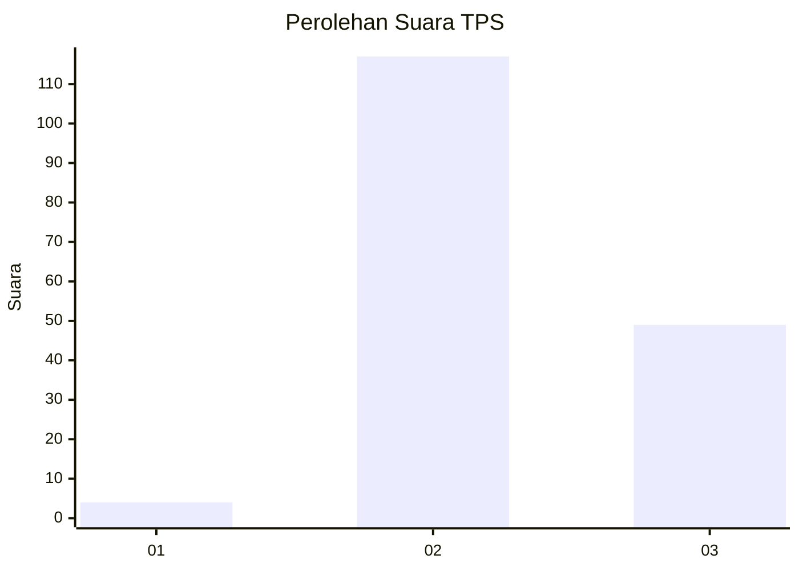

# Hasil

## Grafik

## Tabel

| No. | Nama Paslon    | Suara | Suara (raw) | Persentase |
|:--- |:-------------- | -----:| -----------:| ----------:|
| 1   | ANIES MUHAIMIN | 4     | [4][p-1]    | 2,35       |
| 2   | PRABOWO GIBRAN | 117   | [117][p-2]  | 68,82      |
| 3   | GANJAR MAHFUD  | 49    | [49][p-3]   | 28,82      |

[p-1]: https://github.com/gigit-pemilu/pemilu-2024-51-bali/blob/main/pilpres/hitung-suara/sub/51-bali/sub/08-buleleng/sub/07-sawan/sub/2011-kerobokan/sub/001-tps/sub/paslon-1.txt
[p-2]: https://github.com/gigit-pemilu/pemilu-2024-51-bali/blob/main/pilpres/hitung-suara/sub/51-bali/sub/08-buleleng/sub/07-sawan/sub/2011-kerobokan/sub/001-tps/sub/paslon-2.txt
[p-3]: https://github.com/gigit-pemilu/pemilu-2024-51-bali/blob/main/pilpres/hitung-suara/sub/51-bali/sub/08-buleleng/sub/07-sawan/sub/2011-kerobokan/sub/001-tps/sub/paslon-3.txt

## Foto C Plano

https://sirekap-obj-formc.kpu.go.id/5252/pemilu/ppwp/51/08/07/20/11/5108072011001-20240214-224244--ba9bc11b-4c04-47fe-9f0d-8b51ae7d5170.jpg

https://sirekap-obj-formc.kpu.go.id/5252/pemilu/ppwp/51/08/07/20/11/5108072011001-20240214-224303--c7243863-57b5-4184-b147-cc38b6420de5.jpg

https://sirekap-obj-formc.kpu.go.id/5252/pemilu/ppwp/51/08/07/20/11/5108072011001-20240214-224312--92330bac-8540-40cd-96dc-e82058f15a47.jpg

## Metadata

| Key        | Value               |
| ---------- | ------------------- |
| Time Stamp | 2024-02-24 22:31:28 |

