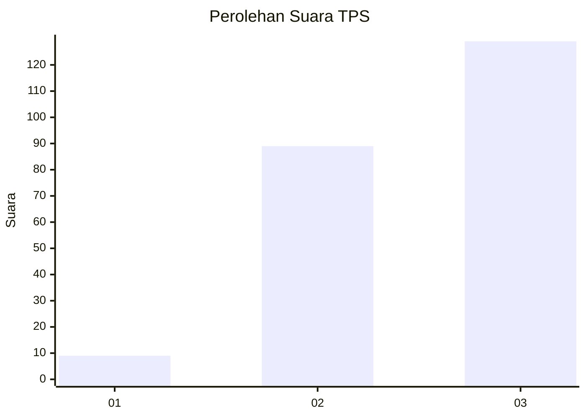
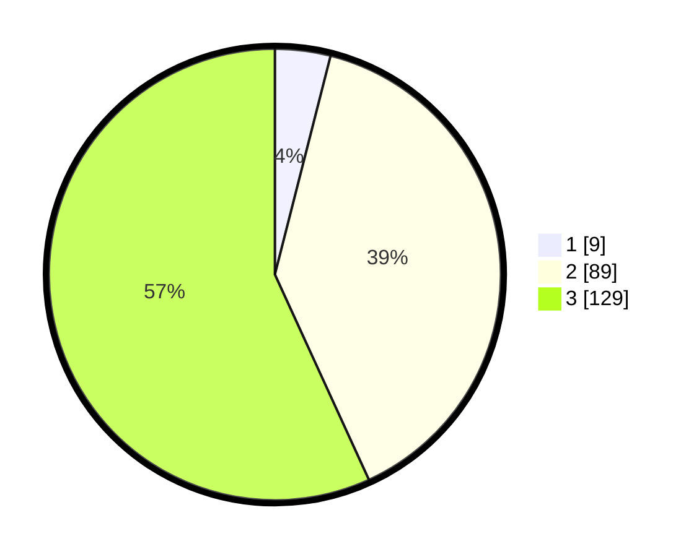

# Hasil

## Grafik

## Tabel

| No. | Nama Paslon    | Suara | Suara (raw) | Persentase |
|:--- |:-------------- | -----:| -----------:| ----------:|
| 1   | ANIES MUHAIMIN | 9     | [9][p-1]    | 3,96       |
| 2   | PRABOWO GIBRAN | 89    | [89][p-2]   | 39,21      |
| 3   | GANJAR MAHFUD  | 129   | [129][p-3]  | 56,83      |

[p-1]: https://github.com/gigit-pemilu/pemilu-2024-51-bali/blob/main/pilpres/hitung-suara/sub/51-bali/sub/08-buleleng/sub/07-sawan/sub/2011-kerobokan/sub/002-tps/sub/paslon-1.txt
[p-2]: https://github.com/gigit-pemilu/pemilu-2024-51-bali/blob/main/pilpres/hitung-suara/sub/51-bali/sub/08-buleleng/sub/07-sawan/sub/2011-kerobokan/sub/002-tps/sub/paslon-2.txt
[p-3]: https://github.com/gigit-pemilu/pemilu-2024-51-bali/blob/main/pilpres/hitung-suara/sub/51-bali/sub/08-buleleng/sub/07-sawan/sub/2011-kerobokan/sub/002-tps/sub/paslon-3.txt

## Foto C Plano

https://sirekap-obj-formc.kpu.go.id/1abf/pemilu/ppwp/51/08/07/20/11/5108072011002-20240215-000159--9c9d63d8-3f4c-4cfa-ae44-43eb2b40c90e.jpg

https://sirekap-obj-formc.kpu.go.id/1abf/pemilu/ppwp/51/08/07/20/11/5108072011002-20240215-000322--c8b2596a-51d3-43ba-b54a-f890e31b566e.jpg

https://sirekap-obj-formc.kpu.go.id/1abf/pemilu/ppwp/51/08/07/20/11/5108072011002-20240215-000436--0c893390-a5b8-47bd-b7ac-6255c3b59145.jpg

## Metadata

| Key        | Value               |
| ---------- | ------------------- |
| Time Stamp | 2024-02-24 22:31:28 |

