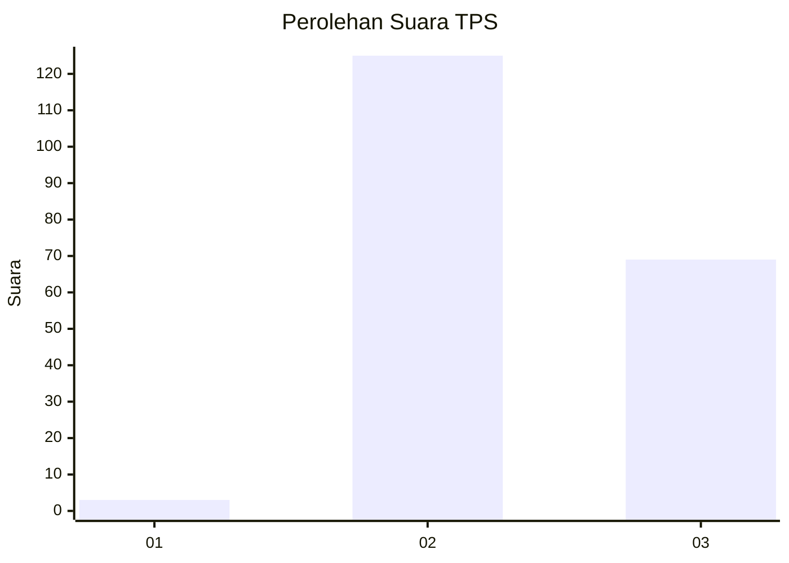
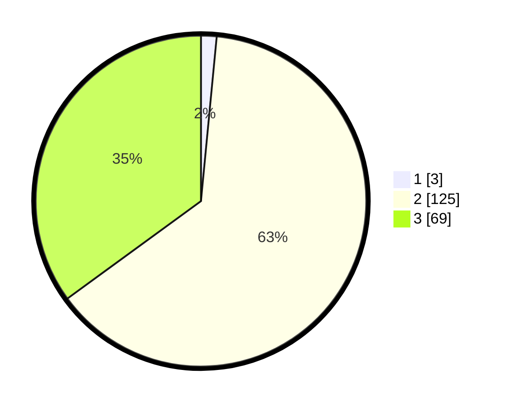

# Hasil

## Grafik

## Tabel

| No. | Nama Paslon    | Suara | Suara (raw) | Persentase |
|:--- |:-------------- | -----:| -----------:| ----------:|
| 1   | ANIES MUHAIMIN | 3     | [3][p-1]    | 1,52       |
| 2   | PRABOWO GIBRAN | 125   | [125][p-2]  | 63,45      |
| 3   | GANJAR MAHFUD  | 69    | [69][p-3]   | 35,03      |

[p-1]: https://github.com/gigit-pemilu/pemilu-2024-51-bali/blob/main/pilpres/hitung-suara/sub/51-bali/sub/08-buleleng/sub/07-sawan/sub/2011-kerobokan/sub/004-tps/sub/paslon-1.txt
[p-2]: https://github.com/gigit-pemilu/pemilu-2024-51-bali/blob/main/pilpres/hitung-suara/sub/51-bali/sub/08-buleleng/sub/07-sawan/sub/2011-kerobokan/sub/004-tps/sub/paslon-2.txt
[p-3]: https://github.com/gigit-pemilu/pemilu-2024-51-bali/blob/main/pilpres/hitung-suara/sub/51-bali/sub/08-buleleng/sub/07-sawan/sub/2011-kerobokan/sub/004-tps/sub/paslon-3.txt

## Foto C Plano

https://sirekap-obj-formc.kpu.go.id/3122/pemilu/ppwp/51/08/07/20/11/5108072011004-20240214-213119--d021d51c-a163-4d06-8d4e-90b04ad155c5.jpg

https://sirekap-obj-formc.kpu.go.id/3122/pemilu/ppwp/51/08/07/20/11/5108072011004-20240214-213136--1e454c8a-a6cc-47dc-b36b-f9b41f2be6e1.jpg

https://sirekap-obj-formc.kpu.go.id/3122/pemilu/ppwp/51/08/07/20/11/5108072011004-20240214-213143--eea13512-2878-4ddc-8a07-c7f214e6ef94.jpg

## Metadata

| Key        | Value               |
| ---------- | ------------------- |
| Time Stamp | 2024-02-24 22:31:28 |

