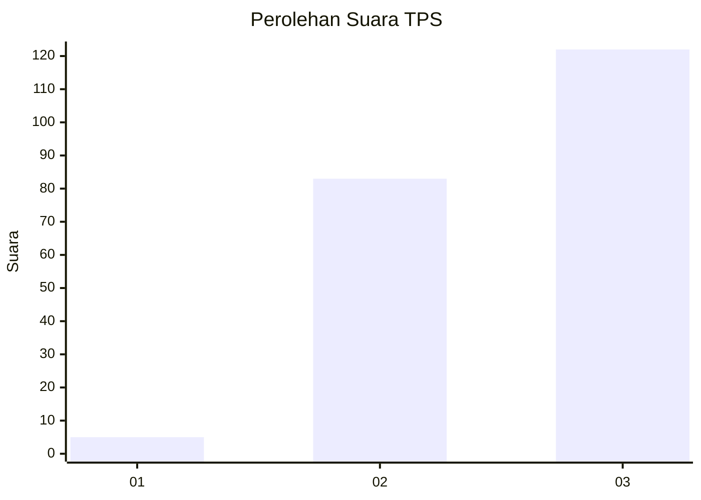
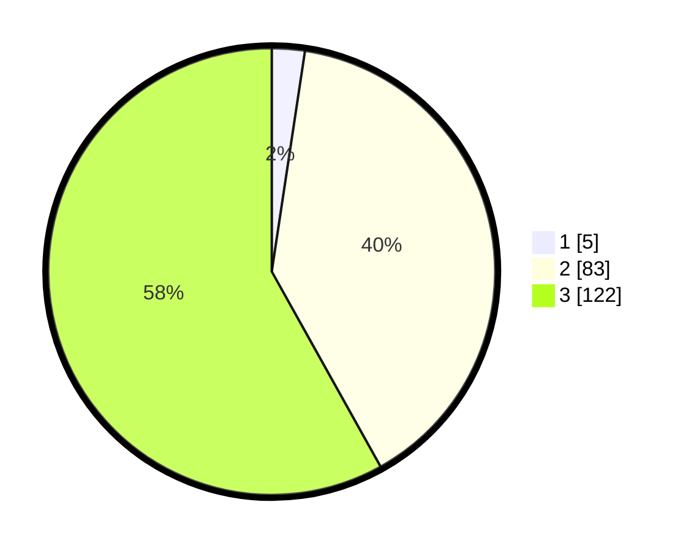

# Hasil

## Grafik

## Tabel

| No. | Nama Paslon    | Suara | Suara (raw) | Persentase |
|:--- |:-------------- | -----:| -----------:| ----------:|
| 1   | ANIES MUHAIMIN | 5     | [5][p-1]    | 2,38       |
| 2   | PRABOWO GIBRAN | 83    | [83][p-2]   | 39,52      |
| 3   | GANJAR MAHFUD  | 122   | [122][p-3]  | 58,10      |

[p-1]: https://github.com/gigit-pemilu/pemilu-2024-51-bali/blob/main/pilpres/hitung-suara/sub/51-bali/sub/08-buleleng/sub/07-sawan/sub/2011-kerobokan/sub/007-tps/sub/paslon-1.txt
[p-2]: https://github.com/gigit-pemilu/pemilu-2024-51-bali/blob/main/pilpres/hitung-suara/sub/51-bali/sub/08-buleleng/sub/07-sawan/sub/2011-kerobokan/sub/007-tps/sub/paslon-2.txt
[p-3]: https://github.com/gigit-pemilu/pemilu-2024-51-bali/blob/main/pilpres/hitung-suara/sub/51-bali/sub/08-buleleng/sub/07-sawan/sub/2011-kerobokan/sub/007-tps/sub/paslon-3.txt

## Foto C Plano

https://sirekap-obj-formc.kpu.go.id/2197/pemilu/ppwp/51/08/07/20/11/5108072011007-20240214-222635--2941bec8-f21b-4cad-a687-64f0f71f288e.jpg

https://sirekap-obj-formc.kpu.go.id/2197/pemilu/ppwp/51/08/07/20/11/5108072011007-20240214-222803--d5cb433a-5c66-4f61-bdc0-5635551a6b30.jpg

https://sirekap-obj-formc.kpu.go.id/2197/pemilu/ppwp/51/08/07/20/11/5108072011007-20240214-222926--0e303c32-2ea3-4d8d-88e4-d3104b015ccb.jpg

## Metadata

| Key        | Value               |
| ---------- | ------------------- |
| Time Stamp | 2024-02-24 22:31:28 |

