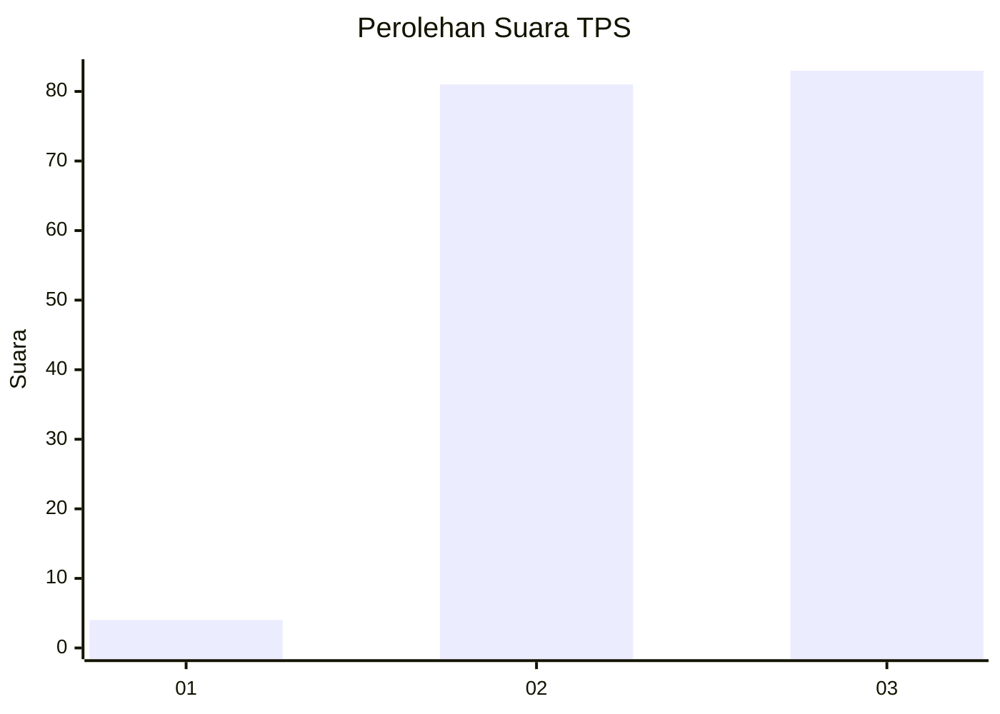
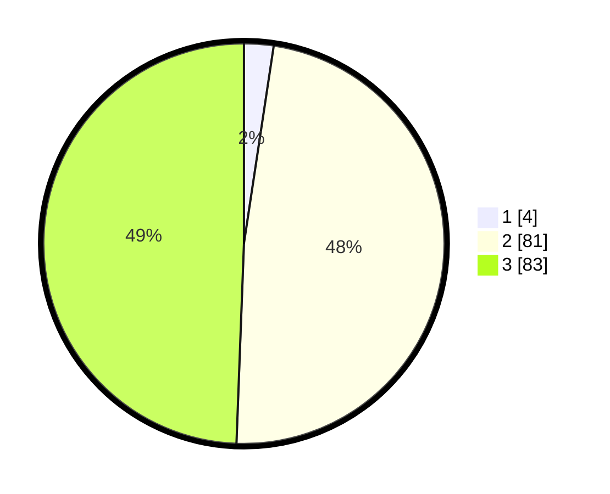

# Hasil

## Grafik

## Tabel

| No. | Nama Paslon    | Suara | Suara (raw) | Persentase |
|:--- |:-------------- | -----:| -----------:| ----------:|
| 1   | ANIES MUHAIMIN | 4     | [4][p-1]    | 2,38       |
| 2   | PRABOWO GIBRAN | 81    | [81][p-2]   | 48,21      |
| 3   | GANJAR MAHFUD  | 83    | [83][p-3]   | 49,40      |

[p-1]: https://github.com/gigit-pemilu/pemilu-2024-51-bali/blob/main/pilpres/hitung-suara/sub/51-bali/sub/08-buleleng/sub/07-sawan/sub/2012-sangsit/sub/011-tps/sub/paslon-1.txt
[p-2]: https://github.com/gigit-pemilu/pemilu-2024-51-bali/blob/main/pilpres/hitung-suara/sub/51-bali/sub/08-buleleng/sub/07-sawan/sub/2012-sangsit/sub/011-tps/sub/paslon-2.txt
[p-3]: https://github.com/gigit-pemilu/pemilu-2024-51-bali/blob/main/pilpres/hitung-suara/sub/51-bali/sub/08-buleleng/sub/07-sawan/sub/2012-sangsit/sub/011-tps/sub/paslon-3.txt

## Foto C Plano

https://sirekap-obj-formc.kpu.go.id/39dd/pemilu/ppwp/51/08/07/20/12/5108072012011-20240214-233757--ce0df2b1-6433-4199-8632-b26760130fb5.jpg

https://sirekap-obj-formc.kpu.go.id/39dd/pemilu/ppwp/51/08/07/20/12/5108072012011-20240214-234053--a69ed5c1-474e-4be4-a456-bd75e16bc47e.jpg

https://sirekap-obj-formc.kpu.go.id/39dd/pemilu/ppwp/51/08/07/20/12/5108072012011-20240214-234247--0ca32ee7-18b8-463c-b5eb-474ff208957f.jpg

## Metadata

| Key        | Value               |
| ---------- | ------------------- |
| Time Stamp | 2024-02-15 21:01:18 |

