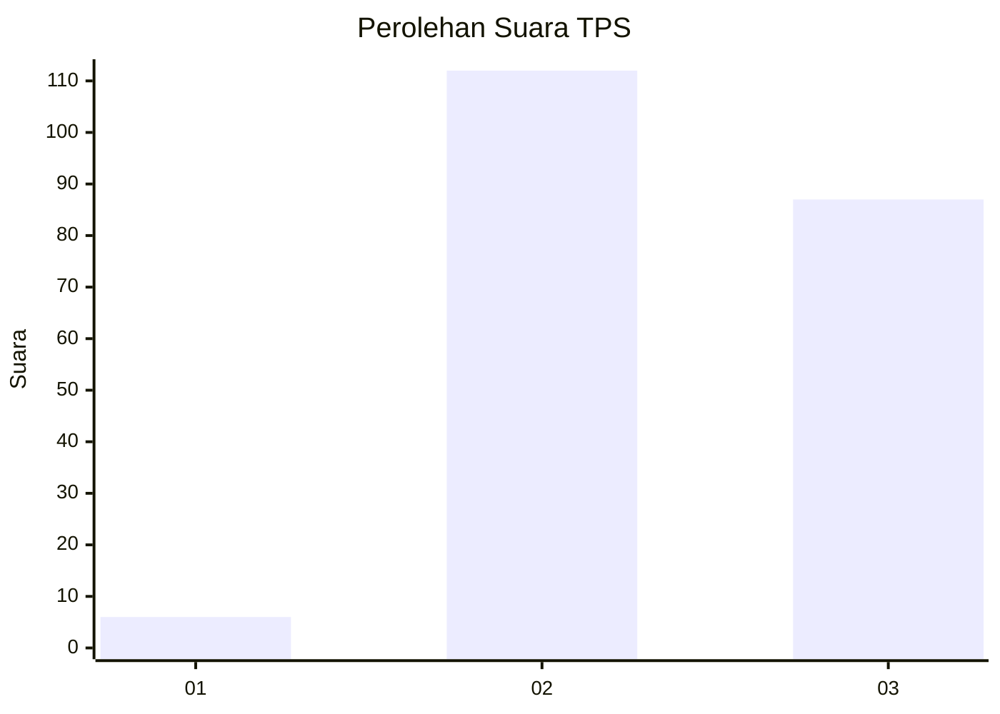
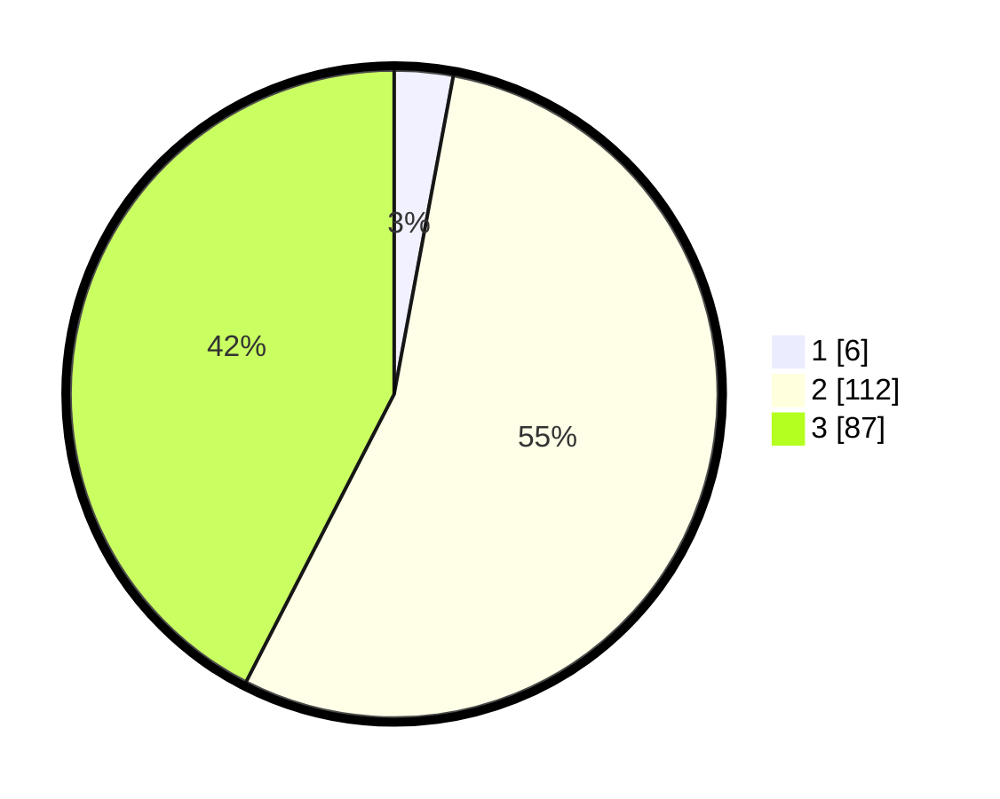

# Hasil

## Grafik

## Tabel

| No. | Nama Paslon    | Suara | Suara (raw) | Persentase |
|:--- |:-------------- | -----:| -----------:| ----------:|
| 1   | ANIES MUHAIMIN | 6     | [6][p-1]    | 2,93       |
| 2   | PRABOWO GIBRAN | 112   | [112][p-2]  | 54,63      |
| 3   | GANJAR MAHFUD  | 87    | [87][p-3]   | 42,44      |

[p-1]: https://github.com/gigit-pemilu/pemilu-2024-51-bali/blob/main/pilpres/hitung-suara/sub/51-bali/sub/08-buleleng/sub/07-sawan/sub/2012-sangsit/sub/017-tps/sub/paslon-1.txt
[p-2]: https://github.com/gigit-pemilu/pemilu-2024-51-bali/blob/main/pilpres/hitung-suara/sub/51-bali/sub/08-buleleng/sub/07-sawan/sub/2012-sangsit/sub/017-tps/sub/paslon-2.txt
[p-3]: https://github.com/gigit-pemilu/pemilu-2024-51-bali/blob/main/pilpres/hitung-suara/sub/51-bali/sub/08-buleleng/sub/07-sawan/sub/2012-sangsit/sub/017-tps/sub/paslon-3.txt

## Foto C Plano

https://sirekap-obj-formc.kpu.go.id/83c0/pemilu/ppwp/51/08/07/20/12/5108072012017-20240214-214458--7f5598f0-7d1f-4caa-a8c0-dd973dd6e81e.jpg

https://sirekap-obj-formc.kpu.go.id/83c0/pemilu/ppwp/51/08/07/20/12/5108072012017-20240214-214818--3aff7eb8-999b-44c7-98d5-4eebf2f4a588.jpg

https://sirekap-obj-formc.kpu.go.id/83c0/pemilu/ppwp/51/08/07/20/12/5108072012017-20240214-214905--c846c70a-1a83-4dfe-9438-5b33593a3b58.jpg

## Metadata

| Key        | Value               |
| ---------- | ------------------- |
| Time Stamp | 2024-02-24 22:31:28 |

