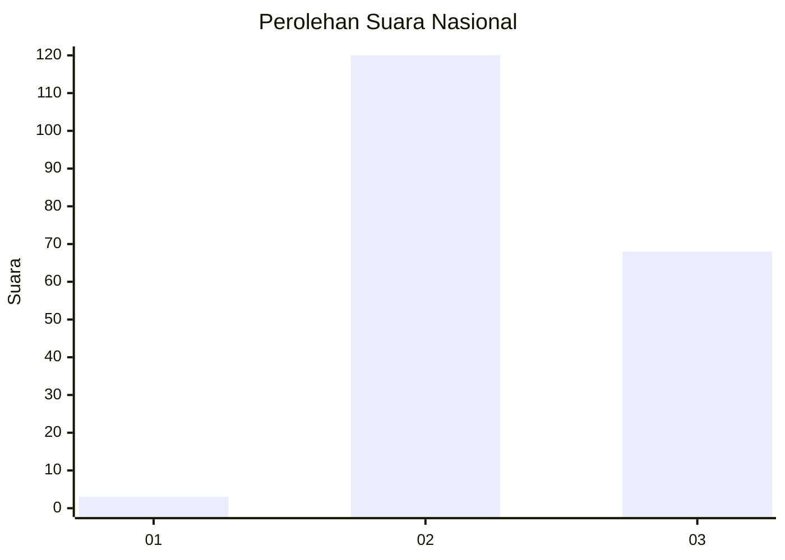
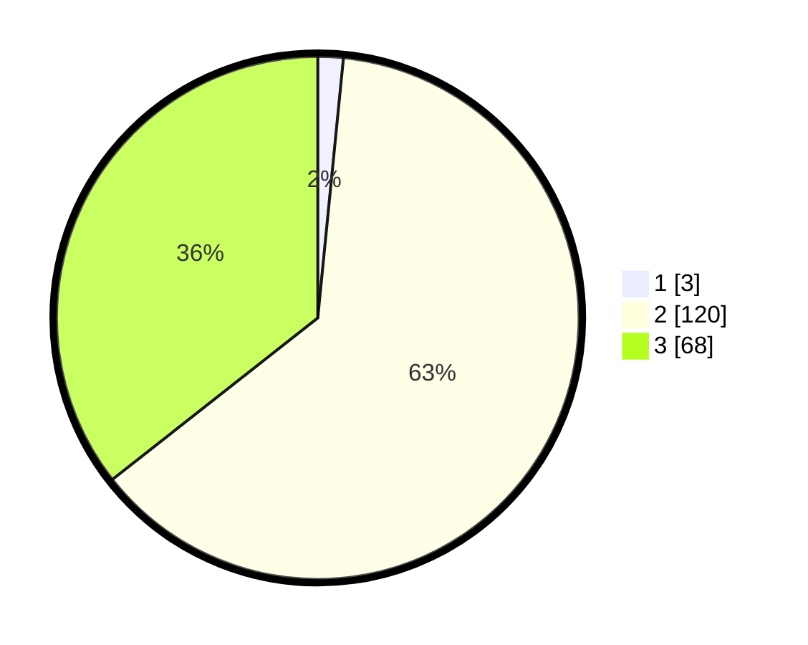

# Hasil

## Grafik

## Tabel

| No. | Nama Paslon    | Suara | Suara (raw) | Persentase |
|:--- |:-------------- | -----:| -----------:| ----------:|
| 1   | ANIES MUHAIMIN | 3     | [3][p-1]    | 1,57       |
| 2   | PRABOWO GIBRAN | 120   | [120][p-2]  | 62,83      |
| 3   | GANJAR MAHFUD  | 68    | [68][p-3]   | 35,60      |

[p-1]: https://github.com/gigit-pemilu/pemilu-2024/blob/main/pilpres/hitung-suara/sub/51-bali/sub/08-buleleng/sub/07-sawan/sub/2012-sangsit/sub/018-tps/sub/paslon-1.txt
[p-2]: https://github.com/gigit-pemilu/pemilu-2024/blob/main/pilpres/hitung-suara/sub/51-bali/sub/08-buleleng/sub/07-sawan/sub/2012-sangsit/sub/018-tps/sub/paslon-2.txt
[p-3]: https://github.com/gigit-pemilu/pemilu-2024/blob/main/pilpres/hitung-suara/sub/51-bali/sub/08-buleleng/sub/07-sawan/sub/2012-sangsit/sub/018-tps/sub/paslon-3.txt

## Foto C Plano

https://sirekap-obj-formc.kpu.go.id/e34a/pemilu/ppwp/51/08/07/20/12/5108072012018-20240214-224133--24d348f9-ebbe-47ba-b1e9-63ed4ce1adb7.jpg

https://sirekap-obj-formc.kpu.go.id/e34a/pemilu/ppwp/51/08/07/20/12/5108072012018-20240214-224121--85d6e3a0-0fce-4cb6-882e-c99cdc5e75c0.jpg

https://sirekap-obj-formc.kpu.go.id/e34a/pemilu/ppwp/51/08/07/20/12/5108072012018-20240214-224143--2e69cb71-a15c-4be4-a85e-91e3fc5aaef1.jpg

## Metadata

| Key        | Value               |
| ---------- | ------------------- |
| Time Stamp | 2024-02-24 22:31:28 |

