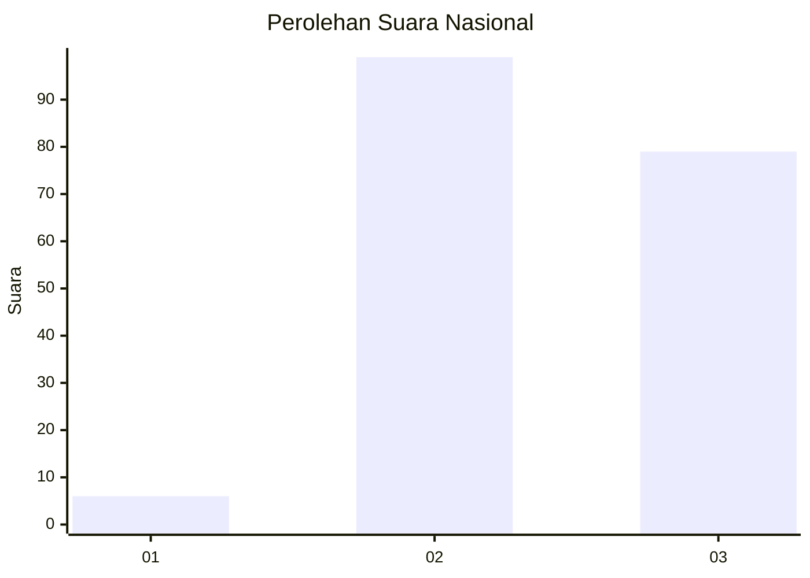
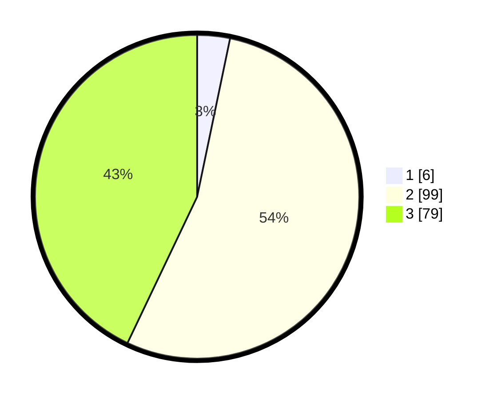

# Hasil

## Grafik

## Tabel

| No. | Nama Paslon    | Suara | Suara (raw) | Persentase |
|:--- |:-------------- | -----:| -----------:| ----------:|
| 1   | ANIES MUHAIMIN | 6     | [6][p-1]    | 3,26       |
| 2   | PRABOWO GIBRAN | 99    | [99][p-2]   | 53,80      |
| 3   | GANJAR MAHFUD  | 79    | [79][p-3]   | 42,93      |

[p-1]: https://github.com/gigit-pemilu/pemilu-2024/blob/main/pilpres/hitung-suara/sub/51-bali/sub/08-buleleng/sub/07-sawan/sub/2012-sangsit/sub/019-tps/sub/paslon-1.txt
[p-2]: https://github.com/gigit-pemilu/pemilu-2024/blob/main/pilpres/hitung-suara/sub/51-bali/sub/08-buleleng/sub/07-sawan/sub/2012-sangsit/sub/019-tps/sub/paslon-2.txt
[p-3]: https://github.com/gigit-pemilu/pemilu-2024/blob/main/pilpres/hitung-suara/sub/51-bali/sub/08-buleleng/sub/07-sawan/sub/2012-sangsit/sub/019-tps/sub/paslon-3.txt

## Foto C Plano

https://sirekap-obj-formc.kpu.go.id/d865/pemilu/ppwp/51/08/07/20/12/5108072012019-20240214-221048--5e0f145d-5676-4391-8b9e-b1be05350a75.jpg

https://sirekap-obj-formc.kpu.go.id/d865/pemilu/ppwp/51/08/07/20/12/5108072012019-20240214-220605--af10b564-cf5b-4a9a-acf6-2d96b14f83f3.jpg

https://sirekap-obj-formc.kpu.go.id/d865/pemilu/ppwp/51/08/07/20/12/5108072012019-20240214-220836--c20425f9-9c49-4967-813d-c5f39b21a228.jpg

## Metadata

| Key        | Value               |
| ---------- | ------------------- |
| Time Stamp | 2024-02-24 22:31:28 |

