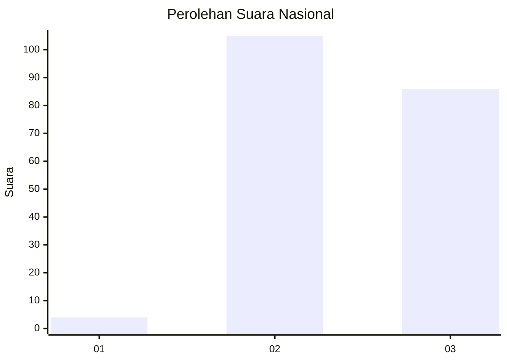
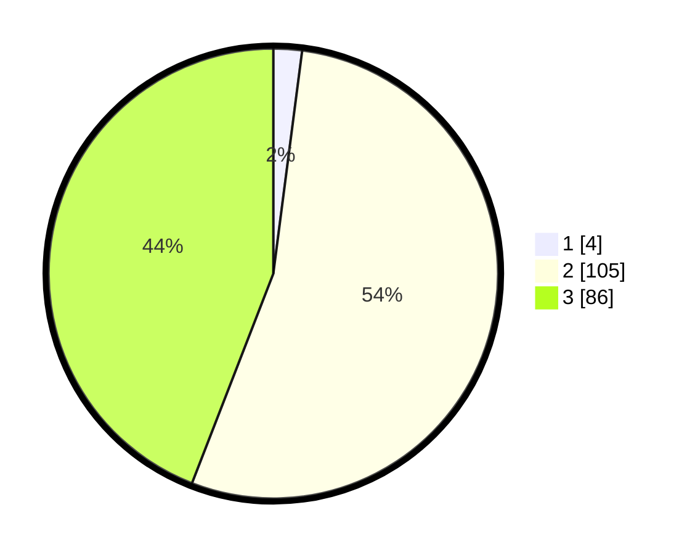

# Hasil

## Grafik

## Tabel

| No. | Nama Paslon    | Suara | Suara (raw) | Persentase |
|:--- |:-------------- | -----:| -----------:| ----------:|
| 1   | ANIES MUHAIMIN | 4     | [4][p-1]    | 2,05       |
| 2   | PRABOWO GIBRAN | 105   | [105][p-2]  | 53,85      |
| 3   | GANJAR MAHFUD  | 86    | [86][p-3]   | 44,10      |

[p-1]: https://github.com/gigit-pemilu/pemilu-2024/blob/main/pilpres/hitung-suara/sub/51-bali/sub/08-buleleng/sub/07-sawan/sub/2012-sangsit/sub/020-tps/sub/paslon-1.txt
[p-2]: https://github.com/gigit-pemilu/pemilu-2024/blob/main/pilpres/hitung-suara/sub/51-bali/sub/08-buleleng/sub/07-sawan/sub/2012-sangsit/sub/020-tps/sub/paslon-2.txt
[p-3]: https://github.com/gigit-pemilu/pemilu-2024/blob/main/pilpres/hitung-suara/sub/51-bali/sub/08-buleleng/sub/07-sawan/sub/2012-sangsit/sub/020-tps/sub/paslon-3.txt

## Foto C Plano

https://sirekap-obj-formc.kpu.go.id/8e0b/pemilu/ppwp/51/08/07/20/12/5108072012020-20240214-141055--ae0065bd-7fac-4bed-a9b1-1f6e5d06623c.jpg

https://sirekap-obj-formc.kpu.go.id/8e0b/pemilu/ppwp/51/08/07/20/12/5108072012020-20240214-141043--6ad1667b-ad6a-48ac-bccf-6e15044d09a9.jpg

https://sirekap-obj-formc.kpu.go.id/8e0b/pemilu/ppwp/51/08/07/20/12/5108072012020-20240214-141206--426bad5b-2ced-4b25-9bcb-ee5777e826fd.jpg

## Metadata

| Key        | Value               |
| ---------- | ------------------- |
| Time Stamp | 2024-02-14 21:46:01 |

