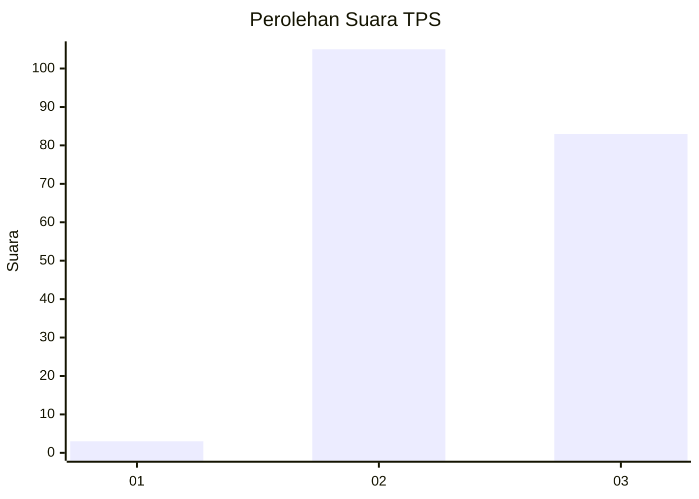
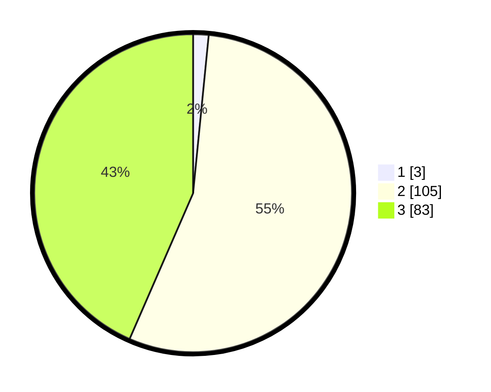

# Hasil

## Grafik

## Tabel

| No. | Nama Paslon    | Suara | Suara (raw) | Persentase |
|:--- |:-------------- | -----:| -----------:| ----------:|
| 1   | ANIES MUHAIMIN | 3     | [3][p-1]    | 1,57       |
| 2   | PRABOWO GIBRAN | 105   | [105][p-2]  | 54,97      |
| 3   | GANJAR MAHFUD  | 83    | [83][p-3]   | 43,46      |

[p-1]: https://github.com/gigit-pemilu/pemilu-2024-51-bali/blob/main/pilpres/hitung-suara/sub/51-bali/sub/08-buleleng/sub/07-sawan/sub/2012-sangsit/sub/022-tps/sub/paslon-1.txt
[p-2]: https://github.com/gigit-pemilu/pemilu-2024-51-bali/blob/main/pilpres/hitung-suara/sub/51-bali/sub/08-buleleng/sub/07-sawan/sub/2012-sangsit/sub/022-tps/sub/paslon-2.txt
[p-3]: https://github.com/gigit-pemilu/pemilu-2024-51-bali/blob/main/pilpres/hitung-suara/sub/51-bali/sub/08-buleleng/sub/07-sawan/sub/2012-sangsit/sub/022-tps/sub/paslon-3.txt

## Foto C Plano

https://sirekap-obj-formc.kpu.go.id/a81c/pemilu/ppwp/51/08/07/20/12/5108072012022-20240214-232514--3276e503-c1df-48fc-bab8-ad0ba48e2245.jpg

https://sirekap-obj-formc.kpu.go.id/a81c/pemilu/ppwp/51/08/07/20/12/5108072012022-20240215-004742--524c0cbf-f3bf-441e-8aa8-2eba21aab5a5.jpg

https://sirekap-obj-formc.kpu.go.id/a81c/pemilu/ppwp/51/08/07/20/12/5108072012022-20240214-232625--5ee90385-2569-460b-be07-13d810777771.jpg

## Metadata

| Key        | Value               |
| ---------- | ------------------- |
| Time Stamp | 2024-02-24 22:31:28 |

