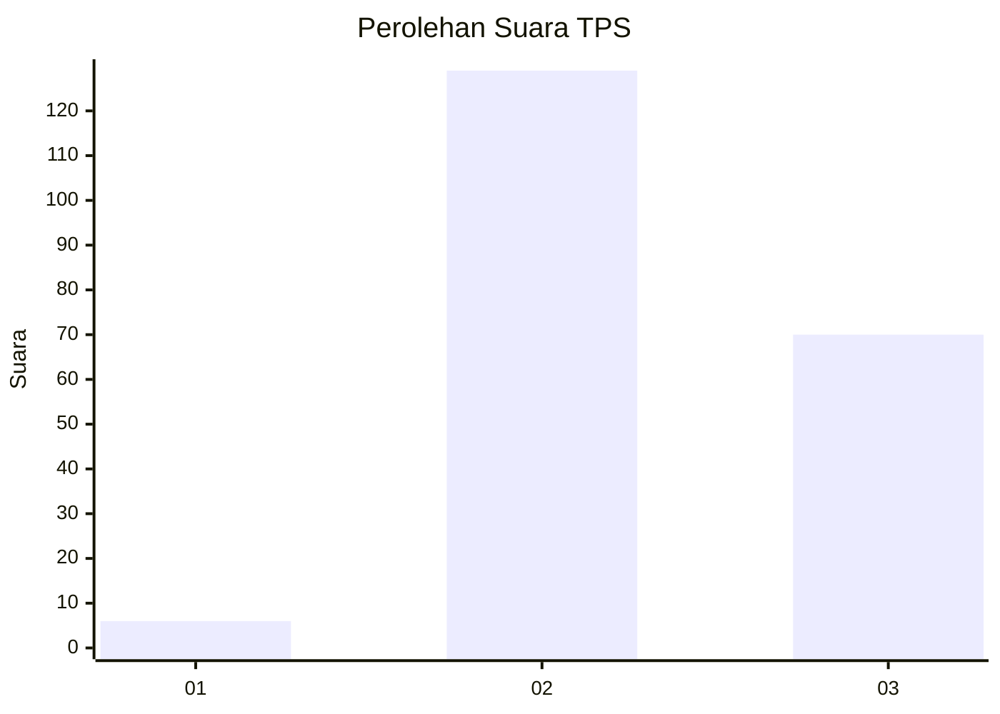
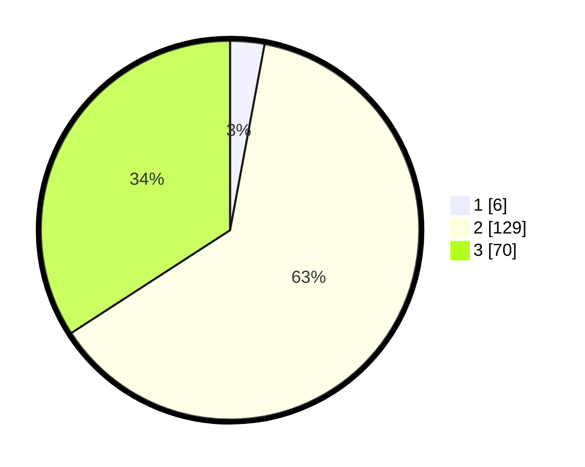

# Hasil

## Grafik

## Tabel

| No. | Nama Paslon    | Suara | Suara (raw) | Persentase |
|:--- |:-------------- | -----:| -----------:| ----------:|
| 1   | ANIES MUHAIMIN | 6     | [6][p-1]    | 2,93       |
| 2   | PRABOWO GIBRAN | 129   | [129][p-2]  | 62,93      |
| 3   | GANJAR MAHFUD  | 70    | [70][p-3]   | 34,15      |

[p-1]: https://github.com/gigit-pemilu/pemilu-2024-51-bali/blob/main/pilpres/hitung-suara/sub/51-bali/sub/08-buleleng/sub/07-sawan/sub/2012-sangsit/sub/023-tps/sub/paslon-1.txt
[p-2]: https://github.com/gigit-pemilu/pemilu-2024-51-bali/blob/main/pilpres/hitung-suara/sub/51-bali/sub/08-buleleng/sub/07-sawan/sub/2012-sangsit/sub/023-tps/sub/paslon-2.txt
[p-3]: https://github.com/gigit-pemilu/pemilu-2024-51-bali/blob/main/pilpres/hitung-suara/sub/51-bali/sub/08-buleleng/sub/07-sawan/sub/2012-sangsit/sub/023-tps/sub/paslon-3.txt

## Foto C Plano

https://sirekap-obj-formc.kpu.go.id/e230/pemilu/ppwp/51/08/07/20/12/5108072012023-20240214-233607--2894d75b-7606-4143-abd9-46c88a57147d.jpg

https://sirekap-obj-formc.kpu.go.id/e230/pemilu/ppwp/51/08/07/20/12/5108072012023-20240214-233809--b41c49c4-277c-4701-83d9-44680fb920f5.jpg

https://sirekap-obj-formc.kpu.go.id/e230/pemilu/ppwp/51/08/07/20/12/5108072012023-20240214-233948--d0e4fc59-97c5-4b8d-81d8-912a68eead0f.jpg

## Metadata

| Key        | Value               |
| ---------- | ------------------- |
| Time Stamp | 2024-02-24 22:31:28 |

