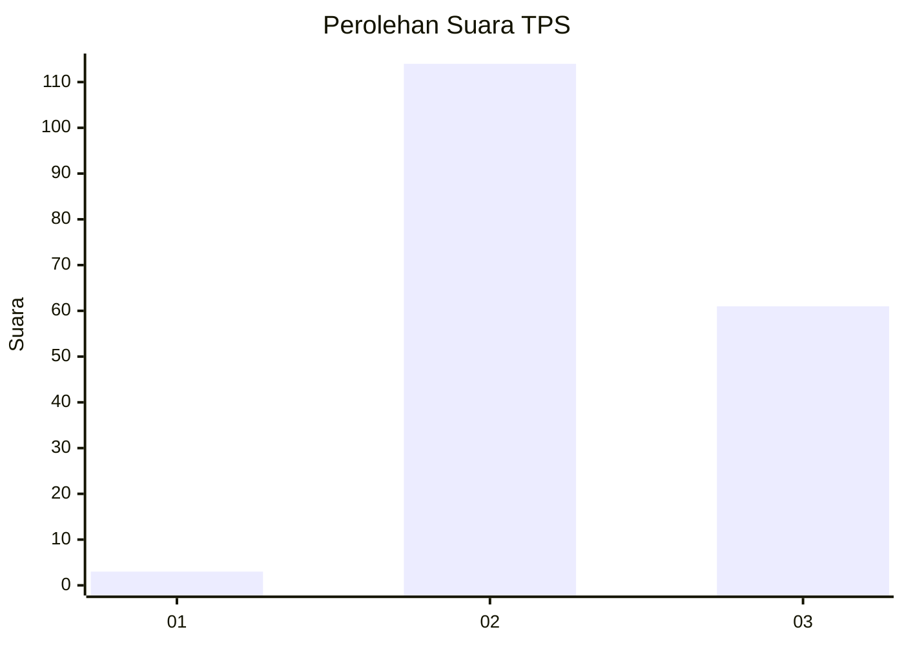
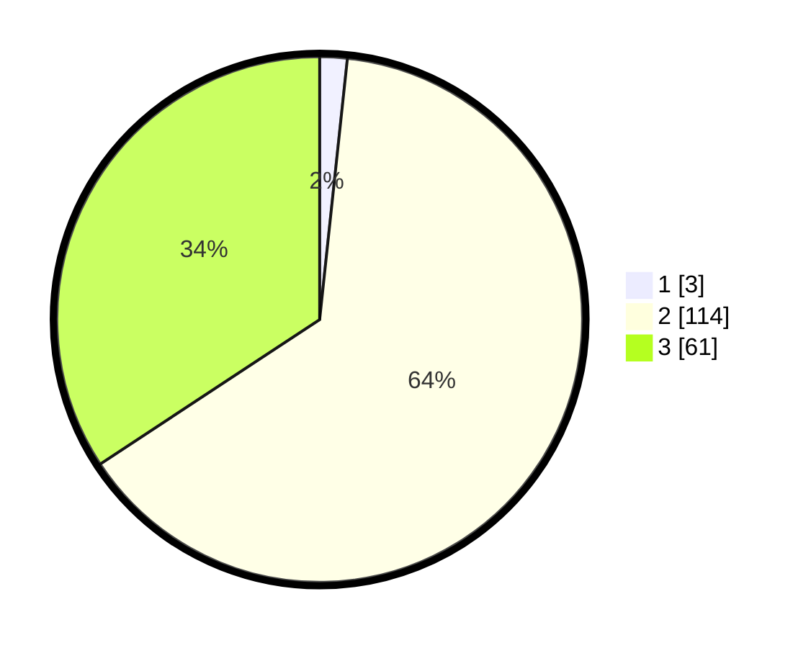

# Hasil

## Grafik

## Tabel

| No. | Nama Paslon    | Suara | Suara (raw) | Persentase |
|:--- |:-------------- | -----:| -----------:| ----------:|
| 1   | ANIES MUHAIMIN | 3     | [3][p-1]    | 1,69       |
| 2   | PRABOWO GIBRAN | 114   | [114][p-2]  | 64,04      |
| 3   | GANJAR MAHFUD  | 61    | [61][p-3]   | 34,27      |

[p-1]: https://github.com/gigit-pemilu/pemilu-2024-51-bali/blob/main/pilpres/hitung-suara/sub/51-bali/sub/08-buleleng/sub/07-sawan/sub/2012-sangsit/sub/025-tps/sub/paslon-1.txt
[p-2]: https://github.com/gigit-pemilu/pemilu-2024-51-bali/blob/main/pilpres/hitung-suara/sub/51-bali/sub/08-buleleng/sub/07-sawan/sub/2012-sangsit/sub/025-tps/sub/paslon-2.txt
[p-3]: https://github.com/gigit-pemilu/pemilu-2024-51-bali/blob/main/pilpres/hitung-suara/sub/51-bali/sub/08-buleleng/sub/07-sawan/sub/2012-sangsit/sub/025-tps/sub/paslon-3.txt

## Foto C Plano

https://sirekap-obj-formc.kpu.go.id/43bd/pemilu/ppwp/51/08/07/20/12/5108072012025-20240214-230535--99c777ac-ef8c-4b4a-b519-5ee896276609.jpg

https://sirekap-obj-formc.kpu.go.id/43bd/pemilu/ppwp/51/08/07/20/12/5108072012025-20240214-230657--197c06be-b7c4-4c59-8ac1-7d5af8536cfa.jpg

https://sirekap-obj-formc.kpu.go.id/43bd/pemilu/ppwp/51/08/07/20/12/5108072012025-20240214-230806--1b82acd8-92e6-4b42-a85e-c5554642b153.jpg

## Metadata

| Key        | Value               |
| ---------- | ------------------- |
| Time Stamp | 2024-02-24 22:31:28 |

